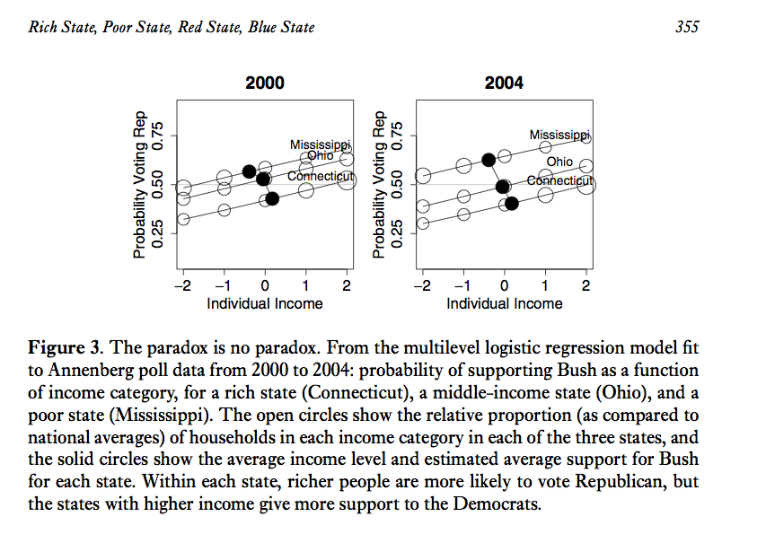

# Introducción

En este curso nos interesa entender y describir patrones de dependencia de
un conjunto de variables aleatorias. Consideraremos algunas de las 
herramientas más populares que se usan para este fin:

* Redes bayesianas (modelos gráficos dirigidos).
* Redes markovianas (modelos gráficos no dirigidos), modelos gráficos 
gaussianos, modelos loglineales.
* Análisis de factores, clases latentes, clustering.
* Modelos de dependencia espacial y temporal.
* Regresión para datos agrupados o jerárquicos (extensión de GLMs).

Por ejemplo:

* En estadística espacial nos interesa entender y modelar qué variables están
asociadas por contiguidad. Por ejemplo: variables de estaciones de medición 
metereológica, ambiental, ocurrencias de crimen en una ciudad, etc.

* Series de tiempo, secuencias de observaciones ordenadas cronológicamente.

* En el estudio de factores relacionados con una enfermedad, muchas veces no 
solamente nos interesa la predicción de quién está en riesgo (por ejemplo, 
probabilidad de cáncer de pulmón),
sino también como se asocian hábitos negativos, predisposiciones y otros 
factores de riesgo. Por ejemplo: ¿qué niveles socioeconómicos fuman más o menos? 
¿a través de que hábitos o factores los niveles socioeconómicos más bajos tienen 
mayor riesgo?

* En medición de logro académico, ¿qué tanto de las calificaciones de los 
alumnos se deben a la escuela (asociación entre calificaciones a nivel de 
escuela) y qué tanto a la habilidad de los alumnos que están en esa escuela?

* Variable latente, por ejemplo datos faltantes.

Veremos métodos que se clasifican como no supervisados en el sentido de que
no queremos predecir ninguna variable particular, y métodos
supervisados (en los cuales nos enfocamos en entender las dependencias de una 
sola variable respuesta de otras entradas, como en machine learning o modelos 
lineales generalizados).

En los primeros temas (modelos gráficos) buscaremos herramientas para expresar 
patrones de dependencia complejos (más allá de covarianzas o correlaciones simples, por ejemplo) entre
varias variables aleatorias.  Los últimos tres temas se refieren a herramientas que se utilizan
en contextos más concretos: variables latentes, datos espacio-temporales, y datos agrupados en jerarquías.

## Patrones complejos de dependencia

Cuando consideramos dos variables aleatorias, tenemos herramientas simples para
describir dependencia:

Por ejemplo, para dos variables numéricas, podemos usar correlaciones. En este ejemplo,
rendimiento de coches y cilindros están negativamente correlacionadas:

```{r}
library(ggplot2)
cor(mpg[,c('cyl','cty')])
```

```{r, fig.height=2.7, fig.width=3.2}
ggplot(mpg, aes(x = cyl, y = cty)) + 
  geom_jitter(position = position_jitter(width = 0.2))
```

Para variables categóricas podemos usar tablas para entender cómo está 
relacionada la transmisión y el tipo de coche,

```{r}
table(mpg$class, mpg$drv)
```

podemos calcular las distribuciones condicionales empíricas dado el tipo de 
coche:

```{r}
round(100 * prop.table(table(mpg$class, mpg$drv), margin = 1))
```

O podemos sacar las condicionales empíricas dado el tipo de transmición:

```{r}
round(100 * prop.table(table(mpg$class, mpg$drv), margin = 2))
```

Sin embargo, cuando tenemos más de dos variables, los patrones de asociación
tienen más riqueza. Como ejemplo, pensemos en un problema ficticio, con tres
variables binarias:
si el jardín está mojado o no, si llovió o no llovió, y si el jardín fue o no 
regado.
Vemos que regar el jardín no está relacionado con que llueva o no:

```{r}
load('data/lluvia.Rdata')
table(lluvia$lluvia, lluvia$regar)
prop.table(table(lluvia$lluvia, lluvia$regar), margin = 1)
```

Pero si condiconamos a que el pasto está mojado, entonces lluvia y regar están
inversamente correlacionados, un ejemplo de porque ocurre es que si el suelo
está mojado y no hay lluvia entonces se regó el jardín,

```{r}
table(lluvia$lluvia, lluvia$regar, lluvia$mojado)
prop.table(table(lluvia$lluvia, lluvia$regar, lluvia$mojado), margin = c(1, 3))
```


Otro ejemplo de dependencia, tomado de Gelman, es un análisis de votantes en
Estados Unidos, votantes más ricos tienden a votar más por el partido 
republicano. Sin embargo, estados más ricos tienden a votar más por demócratas. 
La relación de dependencia se ve en distintas direcciones dependiendo del nivel
que lo veamos (estado o individuo):



### Modelos gráficos

Un modelo gráfico es una red de variables aleatorias donde:

* Nodos representan variables aleatorias.

* Arcos (dirigidos o no) representan dependencia

Los dos esquemas generales para representar dependencias/independiencias 
(condicionales) de forma gráfica son los modelos dirigidos (redes bayesianas) y 
no dirigidos (redes markovianas).

Veamos un ejemplo de un modelo gráfico **no dirigido**.

Consideramos las calificaciones de 88 alumnos (Mardia 1979) en cinco áreas:
vectores (VECT), mecánica (MECH), álgebra (ALG), análisis (ANL) y 
estadística (STAT)). Podemos representar la estrucutra de
covarianza con una gráfica como la siguiente:

```{r, fig.height=4.5, fig.width=4}
library(bnlearn)
data(marks)
head(marks)
library(ggplot2)
library(Hmisc)
marks.graph <- gs(marks)
graphviz.plot(marks.graph)
```

Veremos que este gráfico establece correlaciones entre álgebra, análisis y
estadística, así como entre vectores, mecánica y álgebra. Esto implica, por
ejemplo, mecánica está correlacionada con estadística:

```{r, fig.height=3.5, fig.width=4}
ggplot(marks, aes(x = STAT, y = VECT)) + 
  geom_point() +
  geom_smooth(span=1, method='loess', degree=1)
```

Pero también sugiere que **dada la calificación de álgebra**, estadística y vectores no están correlacionados:

```{r}
marks$ALG_grupos <- cut2(marks$ALG, g = 4)
ggplot(marks, aes(x = STAT, y=VECT)) + facet_wrap(~ALG_grupos) + geom_point() +
  geom_smooth(span=2, method='loess', degree=1)
```

Lo cual no sucede por ejemplo, si estudiamos la asociación entre STAT y ANL
condicionando a ALG:

```{r}
ggplot(marks, aes(x=STAT, y=ANL)) + facet_wrap(~ALG_grupos) + geom_point() +
  geom_smooth(span=2, method='loess', degree=1)
```


En la red que representa la estructura de dependencia de estos datos, el hecho
de que ALG separa a VECT de STAT se interpreta como sigue: si hacemos una regresión de STAT en función
de VECT, controlando por ALG, el coeficiente de VECT es 0. 

Del modelo gráfico obtenemos varias simplificaciones (Whittaker):

* Podemos entender la estructura de estos datos analizando dos grupos de tres
variables cada uno, en lugar de intentar un análisis conjunto de las 5 variables.

* Estamos en una mejor posición para modelar este problema: en un principio,
estábamos en el punto de "todo se relaciona con todo", y esto implica un modelo muy grande y  complejo. Modelos tan grandes muchas veces son imposibles de
tratar con cualquier conjunto de datos de tamaño usual. Las independiencias
condicionales que acabamos de establecer simplifican considerablemente el tipo 
de modelos que debemos considerar.

* Si quisiéramos predecir estadística (EST), por ejemplo, basta con usar álgebra
y análisis. Esto puede permitirnos construir mejores modelos y más fáciles de entender.

* Descubrimos que en un sentido al examen de álgebra es el más importante, pues
podría fundamentar todas las demás. Por otra parte, también aprendimos que hay 
potencialmente dos habilidades adicionales al álgebra que están asociadas a VECT 
y MECH por un lado, y a STAT y ANL por otro.

<br/>


Como ejemplo de **modelos dirigidos** veremos una red de seguros de auto.

En este ejemplo nos interesa entender los patrones de dependencia entre 
variables como edad, calidad de conductor y tipo de accidente:

```{r}
library(bnlearn)
head(insurance)
insurance_dat <- insurance[, c('Age', 'GoodStudent', 'SocioEcon', 'RiskAversion',
                               'Accident','DrivQuality')]
blacklist <- data.frame(from=c('DrivQuality','Accident'), to=c('Age','DrivQuality'))
```

Utilizamos una red bayesiana:

```{r}
insurance_gm <- hc(insurance_dat, blacklist = blacklist)
graphviz.plot(insurance_gm)
insurance.fit <- bn.fit(insurance_gm, data = insurance_dat, method = 'bayes',
                        iss = 1)
#write.net(file = './salidas/insurance.net', insurance.fit)
```

¿Cómo interpretar esta gráfica?
Vemos por ejemplo como mucho de la asociación entre edad y tipo de accidente desaparece cuando condicionamos a calidad de conductor.

```{r}
prop.table(table(insurance$Age, insurance$Accident), margin = 1)
prop.table(table(insurance$Age, insurance$Accident, insurance$DrivQuality), 
           margin = c(1, 3))
```

También podemos entender cómo depende calidad de conductor de edad y aversión al
riesgo (modelo local para DrvQuality):

```{r, fig.height=3.2, fig.width=7}
prop_tab_q <- prop.table(table(insurance$DrivQuality, insurance$RiskAversion,
                               insurance$Age), c(2, 3))
prop_tab_q

df_q <- data.frame(prop_tab_q)
names(df_q) <- c('DrvQuality', 'RiskAversion', 'Age', 'Prop')
ggplot(df_q, aes(x = Age, y = Prop, colour = RiskAversion, 
                 group = RiskAversion)) + 
  geom_line() + facet_wrap(~DrvQuality) +
  geom_point()
```

Otras asociaciones con _DrvQuality_ podemos entenderlas a través de estas
dos variables: edad y aversión al riesgo.
Veremos cómo modelar estas estructuras (además de usar las tablas, que corresponden
a estimación de máxima verosimilitud sin restricciones, podemos usar por ejemplo
GLMs).

### ¿Por qué modelos gráficos? 

* Usando modelos gráficos podemos representar de manera compacta y atractiva
distribuciones de probabilidad entre variables aleatorias.

* Auxiliar en el diseño de modelos.  
  + Fácil combinar información proveniente de los datos con conocimiento de 
  expertos.

* Proveen un marco general para el estudio de modelos más específicos. Muchos
de los modelos probabilísticos multivariados clásicos son casos particulares 
del formalismo general de modelos gráficos (mezclas gaussianas, modelos de 
espacio de estados ocultos, análisis de factores, filtro de Kalman,...).

* Juegan un papel importante en el diseño y análisis de algoritmos de
aprendizaje máquina.

## Repaso de probabilidad

Recordaremos algunos conceptos como distribución conjunta, independencia, 
independencia condicional. 

<div class = "caja">
La **distribución conjunta** sobre un conjunto de variables aleatorias 
$\{X_1,...,X_n\}$, que denotamos $p(x_1,...,x_n)$, asigna probabilidades a todos 
los eventos determinados por el conjunto de variables aleatorias.  

En el caso **discreto bivariado**, dado las variables aleatorias discretas $X$ y 
$Y$, definimos la función de densidad conjunta como $f(x,y)=P(X=x, Y=y)$.
</div>

**Ejemplo.** Consideremos una distribución sobre la población de departamentos 
en renta de Hong Kong, el espacio de resultados es el conjunto de todos los 
departamentos en la población. En muchas ocasiones buscamos resolver preguntas 
que involucran más de una variable aleatoria, en este ejemplo nos interesan:  

+ Renta mensual: toma los valores baja (≤1k), media ((1k,5k]), 
media alta ((5k,12k]) y alta (>12k).  

+ Tipo de departamento: toma 3 valores, público, privado u otros. 

La distribución conjunta de variables aleatorias discretas se puede representar 
por medio de tablas.

<div class="mi-tabla">
Renta/Tipo    |público | privado |otros  
--------------|------|-----|----  
**baja**      |0.17  |0.01 |0.02  
**media**     |0.44  |0.03 |0.01  
**media alta**|0.09  |0.07 |0.01  
**alta**      |0     |0.14 |0.10  
</div>


<div class = "caja">
En el caso **continuo bivariado**, decimos que la función $p(x,y)$ es una 
función de densidad de probabilidad para las variables aleatorias $(X,Y)$ si:
1. $p(x,y) \geq 0$ para toda $(x,y)$.  

2. $\int_{-\infty}^{\infty}p(x,y)dxdy=1$.  

3. Para cualquier conjunto $A \subset \mathbb{R} \times \mathbb{R}$, 
$P((X,Y) \in A) = \int\int_A p(x,y)dxdy$.
</div>

**Ejemplo.** Sean $(X,Y)$ uniformes en el cuadrado unitario, entonces
$$
p(x,y) = \left\{
  \begin{array}{lr}
    1,   &  0\leq x \leq 1,0\leq y \leq 1\\
    0, &  e.o.c.
  \end{array}
\right.
$$

Para encontrar $P(X < \frac{1}{2}, Y<\frac{1}{2})$, esto es la probailidad del evento
$A=\{X<1/2, Y<1/2\}$. La integral de $p$ sobre este subconjunto corresponde, 
en este caso, a calcular el área del conjunto $A$ que es igual a $\frac{1}{4}$.

De la distribución conjunta $p(x_1,...,x_n)$ podemos obtener la distribución de 
únciamente una variable aleatoria $X_j$, donde $X_j \in \{X_1,...,X_n\}$, la 
llamamos la distribución marginal de $X_j$.

<br/>
<div class="caja">
Sea $\{X_1,...,X_n\}$ un conjunto de variables aleatorias con distribución 
conjunta $p(x_1,...,x_n)$, la **distribución marginal** de $X_j$ 
($j \in \{1,...,n\}$) se define como,
$$p_{X_j}(x_j) = \sum_{x_1,...,x_{j-1},x_{j+1},...,x_n}p(x_1,...,x_n)\mbox{ en el caso discreto,}$$
$$p_{X_j}(x_j) = \int_{x_1,...,x_{j-1},x_{j+1},...,x_n}p(x_1,...,x_n)dx_1,...,dx_n\mbox{ en el caso continuo}$$
</div>

<br/>


**Ejemplo.** Retomando el problema de los departamentos, ¿Cuál es la 
probabilidad de que un departamento elegido al azar tenga renta baja?

<!--

Renta/Tipo    |público | privado |otros |p(Renta)  
--------------|:--------|:---------|:------|:-------  
**baja**      |0.17    |0.01     |0.02   | **0.2**
**media**     |0.44    |0.03     |0.01   | **0.48**
**media alta**|0.09    |0.07     |0.01   | **0.17**
**alta**      |0       |0.14     |0.10   |**0.15**
**p(Tipo)**   |**0.7** |**0.25** |**0.5**|**1**  
-->

### Probabilidad condicional

<div class="caja">
Sean $A$, $B$ dos eventos, con $P(B)>0$, la probabilidad 
condicional de $A$ dado $B$ es

$$P(A|B)=\frac{P(AB)}{P(B)}$$
</div>

**Ejemplo.** ¿Cuál es la probabilidad de que un departamento privado tenga
renta _baja_?  ¿Cómo se compara con la probabilidad de que la renta sea baja 
(desconozco el tipo de departamento)?

La noción de probabilidad condicional se extiende a distribuciones 
condicionales:

<div class="caja">
Sean $X$, $Y$ dos variables aleatorias con función de densidad conjunta 
$p(x,y)$, entonces la **función de densidad condicional** de $X$ dado $Y=y$, 
para toda $y$ tal que $p_Y(y) > 0$, se define como
$$p_{X\vert Y}(x\vert y) = \frac{p(x, y)}{p_Y(y).}$$
</div>
<br/>

**Ejemplo.** ¿Cuál es la distribución condicional de _renta_ dado tipo 
_privado_? Para obtener toda la distribución condicional calculamos los dos casos 
restantes (renta media, media alta y alta).
<br/>

Vale la pena destacar que una distribución condicional es una distribución de 
probabilidad. En el ejemplo anterior, notemos que cada renglón de la tabla
probabilidades suman uno, son no negativas y menores que uno.

#### Probabilidad Total

<div class ="caja">
Sean $E$, $F$ dos eventos entonces, 
$$P(E) = P(E\vert F)P(F) + P(E\vert F^c)P(F^c).$$
De manera más general, sean $F_i$ $i = 1,...,n$ eventos mutuamente excluyentes cuya unión es el espacio muestral, entonces
$$P(E) = \sum_{i=1}^n P(E\vert F_i)P(F_i).$$
</div>

**Ejemplo.** Supongamos que una aseguradora clasifica a la gente en tres grupos 
de acuerdo a su nivel de riesgo: _bajo_, _medio_ y _alto_. De acuerdo a los registros, 
las probabilidades de incurrir en un accidente en un laspo de un año son $0.05$,
$0.15$ y $0.30$ respectivamente. Si el $20\%$ de la población se clasifica en riesgo 
bajo, $50\%$ en medio y $30\%$ en alto, ¿qué proporción de la población tiene un
accidente en un año dado?

Para variables aleatorias tenemos:

<div class="caja">
Sean $X$, $Y$ dos variables aleatorias, podemos expresar la distribución 
marginal de $X$ como:
$$p_X(x) = \sum_{y} p_{X \vert Y}(x\vert y)p_Y(y).$$
</div>
<br/>

 Supongamos que ruedo un dado, si observo un número
par lanzo una moneda justa 
(la probabilidad de observar águila es la misma que la de observar sol), si el 
dado muestra un número impar lanzo una moneda sesgada en la que la probabilidad 
de observar águila es $0.9$. Si observo sol, ¿Cuál es la probabilidad de que 
haya lanzado la moneda sesgada?

El ejercicio anterior introduce la noción de probabilidad inversa: inicialmente 
conozco la probabilidad de observar sol condicional a que la moneda es sesgada 
pero ahora me interesa conocer la probabilidad de que haya lanzado una moneda
sesgada una vez que observé un sol en el volado.

#### Regla de Bayes {-}
La regla de Bayes es una consecuencia de la definición de probabilidad 
condicional.

<div class="caja">
Sean $F_i$ y $i = 1,...,n$ eventos mutuamente excluyentes cuya unión es el espacio
muestral, entonces
$$P(F_j\vert E) = \frac{P(E\vert F_j)P(F_j)}{\sum_{i=1}^n P(E\vert F_i)P(F_i)}$$
esta identidad se conoce como la **regla de Bayes**.
</div>

**Ejemplo.** En el contexto del ejemplo de los seguros ahora nos hacemos la
siguiente pregunta: si un asegurado tuvo accidentes en 2013, ¿cuál es la 
probabilidad de que clasifique en riesgo bajo?

<!--
$$P(B\vert Accidente) = \frac{P(Accidente\vert B)P(B)}{P(Accidente\vert B)P(B) + P(Accidente\vert M)P(M) + P(Accidente\vert A)P(A)}$$
Notemos que el denominador corresponde a la probabilidad de accidente que calculamos previamente ($P(Accidente) = 0.175$), 
$$P(B\vert Accidente) = \frac{0.05\cdot 0.20}{0.175} \approx .057$$
La nueva información implica que actualizemos de $P(B)= 0.20$ a $P(B\vert Accidente)=0.057$.
-->

 [La intuición es engañosa](http://www.amazon.com/The-Drunkards-Walk-Randomness-Rules/dp/0307275175): 
En estudios en Alemania y EUA, investigadores
le pidieron a médicos que estimaran la probabilidad de que una mujer 
asintomática entre los $40$ y $50$ años tuviera cáncer de mama si su mamograma 
era positivo. Se les explicó que el $7\%$ de los mamogramas indican cáncer cuando
no lo hay (falsos positivos). Adicional mente, se le explicó a los médicos que 
la incidencia de cáncer de mama en ese grupo de edad es $0.8\%$ y la tasa de 
falsos negativos de $10\%$. En Alemania, un tercio de los médicos determinaron
que la probabilidad era cercana al $90\%$ y la mediana de las estimaciones fue
$70\%$. En EUA $95$ de $100$ médicos estimaron que la probabilidad rondaba el $75\%$.
¿Cómo determinas la probabilidad de que una mujer con mamograma positivo tenga
cáncer?


Al igual que con probabilidad condicional, la Regla de Bayes tiene una 
definición análoga para variables aleatorias. 

<div class="caja">
Sean $X$, $Y$ dos variables aleatorias, 
$$p_{X\vert Y}(x\vert y) = \frac{p_{Y\vert X}(y\vert x)p_X(x)}{p_Y(y)}.$$
</div>


 Supongamos ahora que una compañía de
seguros divide a la gente en dos clases: propensos a accidente (30\% de las 
personas) y no propensos a accidente. En un año dado aquellos propensos a 
accidentes sufren un accidente con probabilidad 0.4, mientras que los del otro 
grupo sufren un accidente con probabilidad 0.2. ¿Cuál es la probabilidad de que 
un asegurado tenga un accidente en su segundo año condicional a que sufrió un
accidente en el primer año?

<div class="caja">
Una consecuencia de la regla de Bayes es que cualquier distribución multivariada
sobre $n$ variables $X_1,X_2,...X_n$ se puede expresar como:

$$p(x_1,x_2,...x_n) = p_{X_1}(x_1)p_{X_2\vert X_1}(x_2\vert x_1)p_{X_3\vert X_1X_2}(x_3\vert x_1x_2)···p_{X_n\vert X_1...X_{n-1}}(x_n\vert x_1...x_{n-1})$$
esta igualdad se conoce como **regla de la cadena**.
</div>

Nótese que esta regla funciona para cualquier ordenamiento de las variables aleatorias.


### Independencia

<div class="caja">
Los eventos $E$, $F$ son independientes sí y solo sí 
$$P(EF) = P(E)P(F)$$
</div>

De la definición de independencia se sigue que $P(E\vert F) = P(E)$. Esto es, 
los eventos $E$ y $F$ son independientes si saber que uno de ellos ocurrió no 
afecta la probabilidad del otro. Utilizaremos la notación $E\perp F$ que se lee "$E$ es independiente de $F$".

<div class="caja">
Dos variables aleatorias $X$, $Y$, son independientes sí y sólo sí
$$p(x,y) = p_X(x)p_Y(y)$$
</div>
<br/>

Más aún, $X$ y $Y$ son independientes sí y sólo sí $p(x,y)  \propto g(x)h(y)$, 
por lo que para demostrar independecia podemos omitir las constantes en la 
factorización de las densidades

Similar a la independencia en eventos, la independencia de variables aleatorias implica que $p_{X\vert Y}(x\vert y) = p_X(x)$, esto es, $Y = y$ no provee 
información sobre $X$. 
  
**Ejemplo.** Consideremos la función de densidad conjunta $p(x,y) = \frac{1}{384} x^2y^4e^{-y-(x/2)}$, $x>0$, $y>0$, ¿$X$ y $Y$ son independientes?

Podemos definir
$$
g(x) = \left\{
  \begin{array}{lr}
    x^2e^{-x/2} & : x > 0\\
    0 & : x \le 0
  \end{array}
\right.
$$
y
$$
h(y) = \left\{
  \begin{array}{lr}
    y^4e^{-y} & : y > 0\\
    0 & : y \le 0
  \end{array}
\right.
$$
entonces $p(x,y) \propto g(x)h(y)$, para toda $x$, $y$ $\in \mathbb{R}$ y 
concluímos que $X$ y $Y$ son independientes.

**Ejemplo.*. Si la densidad conjunta de $X$ y $Y$ está dada por: 
$$
p(x, y) = \left\{
  \begin{array}{lr}
    2 & : 0 < x < y, 0 < y < 1\\
    0 & : e.o.c.
  \end{array}
\right.
$$

¿$X$ y $Y$ son independientes?


**Ejercicio**. Recordando el ejemplo de departamentos en Hong Kong, veamos si 
Renta y Tipo son independientes, para esto comparemos $p(renta|tipo)$ y 
$p(renta)$.

### Independencia condicional

La independencia de eventos o variables aleatorias es poco común en la práctica, 
más frecuente es el caso en que dos eventos son independientes dado un tercer 
evento. 

**Ejemplo.** En una competencia de velocidad, cada atleta 
se somete a dos pruebas de dopaje que buscan detectar si el deportista ingirió 
una substania prohibida. La prueba A consiste en un examen de sangre y la prueba 
B en un exámen de orina, cada prueba se realiza en un laboratorio distinto y no 
hay intercambio de información entre los laboratorios. Es razonable pensar 
que los resultados de los dos exámenes no son independientes. Ahora, supongamos 
que sabemos que el atleta consumió la substancia prohibida, en este caso 
podemos argumentar que conocer el resultado de la prueba A no cambia la 
probabilidad de que el atleta salga positivo en la prueba B. Decimos que 
el resultado de la prueba B es condicionalmente independiente del resultado
de la prueba A dado que el atleta consumió la substancia.

<div class="caja">
Sean $A$, $B$ y $C$, tres eventos decimos que $A$ es independiente de $B$ 
condicional a $C$ ($A \perp B \vert C$) si, 
$$ P(A,B\vert C) = P(A\vert C)P(B\vert C)$$
</div>


Similar al caso de independencia, $A$ y $B$ son condicionalmente independientes 
dado $C$ sí y solo sí $P(A \vert B,C) = P(A \vert C)$, esto es, una vez que
conocemos el valor de $C$, $B$ no proporciona información adicional sobre $A$. 

**Ejemplo.** Retomemos el ejercicio de asegurados. En la solución de este 
ejercicio utilizamos que $P(A_2|AA_1) = 0.4$ y que $P(A_2|A^cA_1) = 0.2$, al
establecer esa igualdad estamos asumiendo que $A_2$ (el asegurado tiene un 
accidente en el año 2) y $A_1$ (el asegurado tiene un accidente en el año 1) son
eventos condicionalmente independientes dado $A$ (el asegurado es propenso a
accidentes): $P(A_2|AA_1) = P(A_2|A) = 0.4$ y $P(A_2|A^cA_1) = P(A_2|A^c) = 0.2$.

En el caso de variables aleatorias definimos independencia condicional como 
sigue.

<div class="caja">
Sean $X$, $Y$ y $Z$, tres variables aleatorias decimos que $X$ es independiente 
de $Y$ condicional a $Z$ ($X \perp Y \vert Z$) si y sólo sí, 
$$p(x,y\vert z) = p_{X\vert Z}(x\vert z)p_{Y\vert Z}(y\vert z).$$
</div>

Y tenemos que $X$ es independiente de $Y$ condicional a $Z$ sí y sólo sí, 
$p(x,y,z) \propto g(x,z)h(y,z)$.

**Ejemplo**. Supongamos que ruedo un dado, si observo un número par realizo dos 
lanzamientos de una moneda justa (la probabilidad de observar águila es la misma 
que la de observar sol), si el dado muestra un número impar realizo dos 
lanzamientos de una moneda sesgada en la que la probabilidad de observar águila
es 0.9. Denotemos por $Z$ la variable aleatoria asociada a la selección de la 
moneda, $X_1$ la correspondiente al primer lanzamiento y $X_2$ la 
correspondiente al segundo. Entonces, $X_1$ y $X_2$ no son independientes, sin
embargo, son condicionalmente independientes ($X_1 \perp X_2 \vert Z$), puesto 
que una vez que se que moneda voy a lanzar el resultado del primer lanzamiento 
no aporta información adicional para el segundo lanzamiento. Calcularemos la distribución conjunta y la distribución condicional de $X_2$ dado $X_1$.

La distribución conjunta esta determinada por la siguiente tabla:

<div class="mi-tabla">
 Z    | X1 | X2 | P(Z,X1,X2)  
------|:----|:----|:-----------
justa | a  | a  | 0.125
justa | a  | s  | 0.125
justa | s  | a  | 0.125 
justa | s  | s  | 0.125 
ses   | a  | a  | 0.405 
ses   | a  | s  | 0.045 
ses   | s  | a  | 0.045 
ses   | s  | s  | 0.005 
</div>

La distribución condicional $p(X_2|X_1)$ es,

<div class="mi-tabla">
X1/X2|  a  |  s  |.
-----|-----|-----|---
**a**|0.757|0.243|1
**s**|0.567|0.433|1
</div>

y la distribución condicional $p(X_2|X_1,Z)=p(X_2|Z)$ es,

<div class="mi-tabla">
X1/X2| Z | a  |  s  |.
-----|---|-----|-----|---
**a**|par|0.5|0.5|1
**s**|par|0.5|0.5|1
**a**|impar|0.9|0.1|1
**s**|impar|0.9|0.1|1
</div>

En este punto es claro que $X \perp Y \vert Z$ no implica $X \perp Y$, pues 
como vimos en el ejemplo de las monedas $X_1 \perp X_2 \vert Z$ pero 
$X_1 \not \perp X_2$. Más aún, $X \perp Y$ tampoco implica $X \perp Y \vert Z$.

<div class="caja">
La independencia condicional tiene importantes consecuencias, por ejemplo, si $X$ 
es independiente de $Y$ dado $Z$ entonces, 
$$p(x,y,z) = p_Z(z)p_{X\vert Z}(x\vert z)p_{Y\vert Z}(y\vert z).$$
</div>

Esta expresión de la densidad conjunta es similar a la que obtendríamos usando 
la regla de la cadena; sin embargo, el número de parámetros necesarios bajo esta 
representación es menor lo que facilita la estimación.

**Ejemplo (discusión).** Consideremos que nos interesa entender la relación 
entre 3 variables categóricas cada una con 4 niveles. Para describir la conjunta 
$p(x,y,z)$ necesitamos $63=4 \cdot 4 \cdot 4 -1$ parámetros (menos 1 pues las 
probabilidades deben sumar uno), pues tenemos que dar una probabiilidad
para cada combinación de valores de $X,Y,Z$. 

También podemos usar la regla del
producto para contar:

$$p(x,y,z) = p_Z(z)p_{X\vert Z}(x\vert z)p_{Y\vert X,Z}(y\vert x,z)$$

* Para la marginal de $Z$ requerimos 4-1=3 parámetros,  
* la condiconal de X dado Z requiere 4(4-1)=12 parámetros,  
* finalmente la condicional de $Y$ dada $X$ y $Z$ requiere 4(4)(4-1)=48
parámetros, resultando un total de 3+12+48=63 parámetros.

¿Qué pasa si todas las variables son independientes? Quedamos con un problema
mucho más fácil, pues entonces

$$p(x,y,z) = p_Z(z)p_{X}(x)p_{Y}(y)$$

* requiere 3 parámetros para $p_Z$,  
* 3 para $p_X$ y 3 para $p_Y$, que dan un total de 9 parámetros (en lugar de 
63).

Aunque la independencia de todas las variables generalmente no se da, ¿qué pasa
por ejemplo si $Y$ y $Z$ son condicionalmente independientes dada $X$? 

$$p(x,y,z) = p_Z(z)p_{X\vert Z}(x\vert z)p_{Y\vert X}(y\vert x).$$

* requiere 3 parámetros para $p_Z$,  
* 4(4-1)=12 para $p_{X|Z}$ y 12 para $p_{Y|Z}$, que dan un total de 27 
parámetros (en lugar de 63).

En general, podemos construir modelos más parsimoniosos cuando identificamos y
explotamos independencias condicionales.  Esto incluso puede determinar 
si un problema es tratable o no. Por ejemplo, si tenemos $n$ variables con $r$
niveles cada una, la conjunta tiene tamaño $r^n-1$. Si $n=20$ y $r=4$ (no tan 
raro), entonces necesitamos al menos un millón de millones de celdas para 
definir una conjunta general. Estimar esos parámetros requeriría muestras
astronómicas.

Por otra parte, si el problema es relativamente ralo en sus dependencias (lo 
cual sucede en muchos problemas reales), entonces es factible entender, modelar 
y calcular con la conjunta implícita en un conjunto de distribuciones 
condicionales que determina la conjunta.


