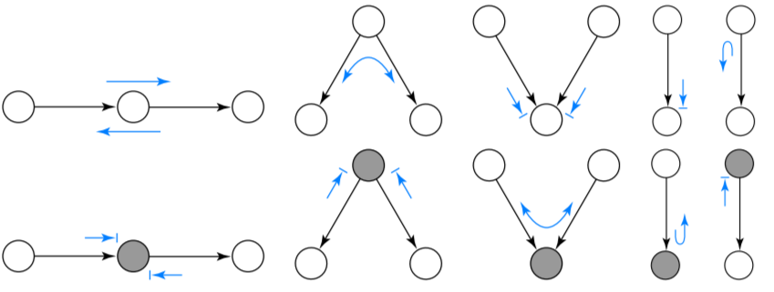
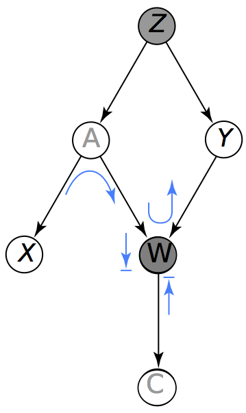
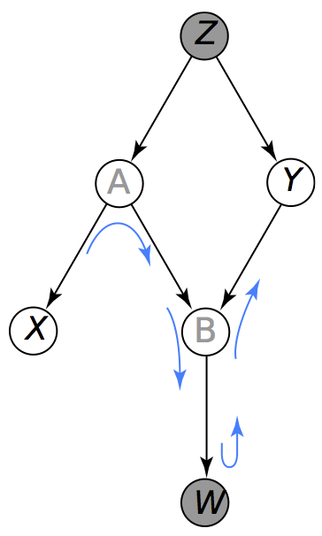
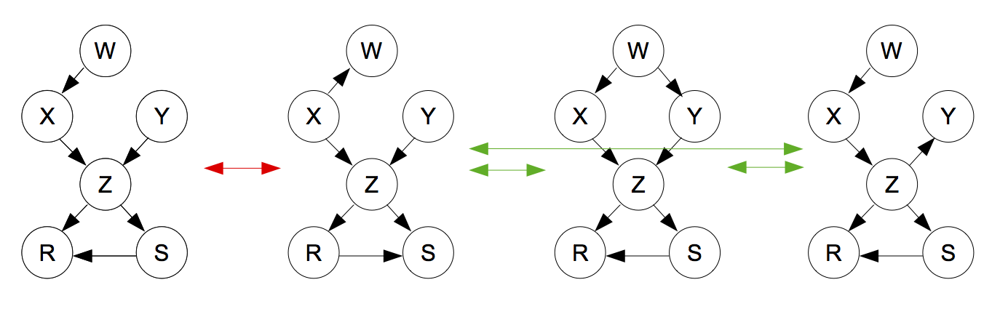

```{r include=FALSE, cache=FALSE}
library(tidyverse)
knitr::opts_chunk$set(
    comment = "#>",
    collapse = TRUE,
    fig.align = "center", 
    error = FALSE
)
comma <- function(x) format(x, digits = 2, big.mark = ",")
ggplot2::theme_set(ggplot2::theme_light())
```
```{r include=FALSE, cache=FALSE}
library(tidyverse)
knitr::opts_chunk$set(
    comment = "#>",
    collapse = TRUE,
    fig.align = "center", 
    error = FALSE
)
comma <- function(x) format(x, digits = 2, big.mark = ",")
ggplot2::theme_set(ggplot2::theme_light())
```
# Redes bayesianas

Los paquetes que usaremos en esta sección son:

* CRAN: tidyverse (dplyr, ggplot2, purrr), bnlearn, 
BiocManager, igraph, gRain.

```
install.packages(c("tidyverse", "bnlearn", "BiocManager", "igraph, "gRain"))
```

* Bioconductor: Rgraphviz, RBGL

```
install.packages("BiocManager")
BiocManager::install("Rgraphviz")
```

Y las referencias son @koller, @ross y @wasserman.

## Intoducción: Modelos gráficos

Un modelo gráfico es una red de variables aleatorias donde:

* Nodos representan variables aleatorias.

* Arcos (dirigidos o no) representan dependencia

Los dos esquemas generales para representar dependencias/independiencias 
(condicionales) de forma gráfica son los modelos dirigidos (redes bayesianas) y 
no dirigidos (redes markovianas).

Nos enfocaremos en **modelos dirigidos** veamos un ejemplo de una red de seguros 
de auto.

En este ejemplo nos interesa entender los patrones de dependencia entre 
variables como edad, calidad de conductor y tipo de accidente:

```{r echo=FALSE, message=FALSE}
library(bnlearn)

head(insurance)
insurance_dat <- insurance_dat <- insurance[, c('Age', 'GoodStudent', 
    'SocioEcon', 'RiskAversion', 'Accident','DrivQuality')]

blacklist <- data.frame(from = c('DrivQuality','Accident'), 
    to = c('Age','DrivQuality'))
```

Aprendemos la estructura de la red:

```{r}
insurance_gm <- hc(insurance_dat, blacklist = blacklist)
plot(insurance_gm)
insurance.fit <- bn.fit(insurance_gm, data = insurance_dat, 
                        method = 'bayes', iss = 1)
```

¿Cómo interpretar esta gráfica?

Vemos por ejemplo como mucho de la asociación entre edad y tipo de accidente 
desaparece cuando condicionamos a calidad de conductor.

```{r}
prop.table(table(insurance$Age, insurance$Accident), margin = 1)
prop.table(table(insurance$Age, insurance$Accident, insurance$DrivQuality), 
           margin = c(1, 3))
```

También podemos entender cómo depende calidad de conductor de edad y aversión al 
riesgo (modelo local para DrvQuality):

```{r, fig.height=3.2, fig.width=7}
prop_tab_q <- prop.table(table(insurance$DrivQuality, insurance$RiskAversion, insurance$Age), c(2, 3))
prop_tab_q

df_q <- data.frame(prop_tab_q)
names(df_q) <- c('DrvQuality', 'RiskAversion', 'Age', 'Prop')
ggplot(df_q, aes(x = Age, y = Prop, colour = RiskAversion, 
                 group = RiskAversion)) + 
  geom_line() + facet_wrap(~DrvQuality) +
  geom_point()
```

Otras asociaciones con _DrvQuality_ podemos entenderlas a través de estas
dos variables: edad y aversión al riesgo.
Veremos cómo modelar estas estructuras (además de usar las tablas, que corresponden
a estimación de máxima verosimilitud sin restricciones, podemos usar por ejemplo
GLMs).

#### ¿Por qué modelos gráficos?  {-}

* Usando modelos gráficos podemos representar de manera compacta y atractiva
distribuciones de probabilidad entre variables aleatorias.

* Auxiliar en el diseño de modelos.  
  + Fácil combinar información proveniente de los datos con conocimiento de 
  expertos.

* Proveen un marco general para el estudio de modelos más específicos. Muchos
de los modelos probabilísticos multivariados clásicos son casos particulares 
del formalismo general de modelos gráficos (mezclas gaussianas, modelos de 
espacio de estados ocultos, análisis de factores, filtro de Kalman,...).

* Juegan un papel importante en el diseño y análisis de algoritmos de
aprendizaje máquina.

## Gráficas dirigidas

Una gráfica dirigida ${\mathcal G}$ es un conjunto de vértices junto con
un subconjunto de aristas dirigidas (pares ordenados de vértices). 
En nuestro caso, cada vértice corresponde a una variable aleatoria, y cada
arista dirigida representa una asociación probabilística entre las variables 
(vértices) que conecta. Nos interesan en particular las **gráficas dirigidas 
acíclicas** (GADs), estas son aquellas que no tienen caminos dirigidos partiendo 
de un vértice y regresando al mismo (ciclos).


**Ejemplo.**

```{r, fig.height=4, fig.width = 5, warning=FALSE}
library(igraph, warn.conflicts = FALSE)
gr <- graph(c(1, 2, 3, 2, 3, 4))
plot(gr, 
  vertex.label = c('Dieta', 'Enf. corazón', 'Fuma', 'Tos'), 
  layout = matrix(c(0, 0.5, 2, 0, 4, 0.5, 6, 0), byrow = TRUE, ncol = 2),
  vertex.size = 23, vertex.color = 'salmon', vertex.label.cex = 1.2,
  vertex.label.color = 'gray40', vertex.frame.color = NA, asp = 0.5, 
  edge.arrow.size = 1)
```

Nos interesan estas gráficas por lo que pueden representar acerca de la 
estructura de la distribución conjunta de las variables. Recordemos que 
la distribución conjunta es el modelo completo del fenómeno, a partir de la cual
podemos contestar cualquier pregunta de inferencia, asociación, independencia, 
etc.

En las siguientes secciones explicaremos dos enfoques para 
interpretar una gráfica dirigida probabilísticamente (en términos de la 
distribución conjunta).

* Por una parte la gráfica define un esqueleto que sirve para 
representar de manera compacta una distribución de dimensión alta, esto es:
En lugar de codificar la probabilidad de todos los posibles valores de las 
variables en nuestro dominio, podemos separar la distribución en factores
más chicos, cada uno sobre un conjunto de posibilidades mucho más chico. Una
vez que definimos los factores podemos definir la distribución conjunta como
el producto de los factores.

* La segunda perspectiva es que la gráfica es una representación compacta 
de un conjunto de independencias que se sostienen en la distribución (la 
distribución que codifica nuestras creencias de una situación particular).


### Probabilidad conjunta y factorizaciones

<div class="caja">
Siempre es posible representar a una distribución conjunta como un
producto de condicionales de una sola variable. Dado un ordenamiento
$X_1,X_2,\ldots, X_k$, podemos escribir (por la regla del producto)
$$p(x_1,\ldots, x_k)=p(x_1)p(x_2|x_1)p(x_3|x_1,x_2)\cdots p(x_k|x_1,\ldots, x_{k-1}).$$
</div>

<br/>
Por ejemplo, si tenemos tres variables $X_1,X_2,X_3$ podemos usar la regla del
producto para obtener

$$p(x_1,x_2,x_3)= p(x_1)p(x_2|x_1)p(x_3|x_1,x_2),$$

también podemos ordenar las variables de manera distinta y escribir:

$$p(x_1,x_2,x_3)= p(x_3)p(x_1|x_3)p(x_2|x_1,x_3).$$

Estas son representaciones válidas para la conjunta de $X_1,X_2,X_3$. 
Para modelar $X_1,X_2,X_3$ podríamos entonces estimar primero la marginal
de $X_3$, después entender la condicional de $X_1$ dada $X_3$ y finalmente
la condicional de $X_2$ dado $X_1$ y $X_3$. Algunas representaciones
son más fáciles para trabajar, calcular y entender que otras.

**Ejemplo.** Si sacamos sucesivamente tres cartas de una baraja y registramos
si son rojas o negras, lo más fácil es definir $X_i$ = color de la $i$-ésima 
carta, y entonces si buscamos calcular 
$$p(X_1=roja, X_2=roja, X_3=negra),$$
simplemente calculamos: 
$$P(X_1=roja)=26/52, P(X_2=roja|X_1=roja)=25/51$$ 
y finalmente 
$$P(X_3=negra|X_1=roja,X_2=roja)=25/50,$$ 
de modo que la probabilidad que nos interesa es 
$$\frac{26\cdot 25\cdot 26}{52\cdot 51\cdot 50}.$$

Otro caso en que la factorización que escogemos es importante, es cuando existen
independencias condicionales, la factorización puede resultar en un modelo más
compacto o más conveniente.

**Ejemplo.** Si $X_2$ y $X_3$ son independentes y $X_2$ es condicionalmente
independiente de $X_1$ dado $X_3$, podemos comenzar con la segunda factorización

$$p(x_1,x_2,x_3)= p(x_3)p(x_1)p(x_2|x_1,x_3),$$ 

y finalmente 

$$p(x_1,x_2,x_3)=p(x_3)p(x_1)p(x_2|x_3)$$

el cual es un modelo considerablemente más simple que el original pues
incluye dos marginales y sólo es necesario modelar cómo depende $x_2$ de $x_3$. 
Esto lo expresamos en el siguiente resultado:

<div class="caja">
Una factorización de la conjunta puede ser entendida como una parametrización
particular de la conjunta a través de sus distribuciones condicionales.
</div>

<br/>

**Ejemplo.** Supongamos la factorización $p(x,y)=p(x)p(y|x)$, y que $x$ y $y$ 
son variables binarias que toman los valores $0$ y $1$. La parametrización usual
para $p(x,y)$ está dada por $p_{00},p_{01},p_{10},p_{11}$ donde
$p(x,y)=p_{xy}$ y $p_{00} +p_{01}+p_{10}+p_{11}=1$ (3 parámetros en total). De 
esta forma tenemos que especificar, por ejemplo, los parámetros 
$p_{00},p_{01},p_{10}$.

Por otra parte, la factorización sugiere los parámetros $p_0,p_{0|1},p_{0|0},$
donde $p_0=p(x=0)$, $p_{0|1}=p(y=0|x=1)$ y $p_{0|0}=p(y=0|x=0)$. Los otros 
parámetros están dados por $p_1=1-p_0$, $p_{1|0}=1-p_{0|0}$ y 
$p_{1|1}=1-p_{0|1}$.

<br/>

<div class="caja">
Nótese que la idea general es 

1. Usar la regla de la cadena, lo que siempre nos da una expresión válida para 
la conjunta, y en la cual aparece la condicional de cada variable una sola vez 
para una ordenamiento adecuado de las variables.  

2. Simplificar la expresión obtenida usando las independencias condicionales
que suponemos.  

3. Hacer los cálculos/inferencia, etc. usando la parametrización de 
condicionales.
</div>


### Factorizaciones de la conjunta y gráficas dirigidas.

<div class="clicker">
```{r, echo=FALSE, warning=FALSE}
gr <- graph(c(1, 3, 2, 3, 2, 4, 3, 5))
plot(gr,
  vertex.label = c('Dificultad', 'Inteligencia', 'Calificación', 'GRE',
    'Recomendación'), 
  layout = matrix(c(-1, 2, 1, 2, 0, 1, 2, 1, 0, 0), byrow = TRUE, ncol = 2),
  vertex.size = 20, vertex.color = 'salmon', vertex.label.cex = 1.2,
  vertex.label.color = 'gray40', vertex.frame.color = NA, asp = 0.5, 
  edge.arrow.size = 1)
```

3. ¿Qué factorización crees que es apropiada para la distribución conjunta 
$p(d, i, c, g, r)$?

a) $p(d)p(i)p(c|i)p(c|d)$
b) $p(d)p(i)p(c|i,d)p(g|i)p(r|c)$
c) $p(d)p(i)p(c)p(g)p(r)$
d) $p(d|c)p(i|c,g)p(c|r)p(g)p(r)$  
e) Ninguna de las anteriores.
</div>

<br/>

En primer lugar, las _gráficas dirigidas acíclicas_ asociadas a una distribución
conjunta dan una factorización particular $p$ para la conjunta. 

Sea ${\mathcal G}$ una gráfica dirigida con vértices $X_1,X_2,...,X_k$, 
denotamos por $Pa(x_i)$ a todos los padres de $X_i$ en ${\mathcal G}$.

<br/>

<div class="caja">
Sea $p$ una distribución conjunta para $X_1,X_2,\ldots, X_k$. Decimos que
${\mathcal G}$ **representa** a $p$ cuando la conjunta se factoriza como
$$p(x_1,x_2,\ldots, x_n)=\prod_{i=1}^k p(x_i|Pa(x_i)).$$ 

El conjunto de distribuciones que son representadas por ${\mathcal G}$ lo 
denotamos por $M({\mathcal G})$ (llamadas distribuciones markovianas con 
respecto a $\mathcal G$).
</div>

<div class="caja">
Nótese que una gráfica acíclica no dirigida (GAD) *no* establece una 
distribución particular, sino un conjunto de posibles distribuciones: todas 
las distribuciones que se factorizan bajo ${\mathcal G}$.
</div>

<br/>

**Nota.** La factorización del lado derecho del resultado
$$p(x_1,x_2,\ldots, x_n)=\prod_{i=1}^k p(x_i|Pa(x_i))$$
siempre es una distribución de probabilidad. Por ejemplo, si consideramos
la siguiente factorización de $p(x,u,d,f,e,y,t)$:

$$p(x)p(u)p(d)p(f|d)p(e|f)p(y|f)p(t|d,u).$$ 

Veremos que es una distribución de probabilidad como sigue: en primer lugar,
este producto es no negativo, pues todas son distribuciones condicionales. Basta
demostrar que si sumamos sobre todos los posibles valores de $x,u,d,f,e,y,t$,
entonces esta expresión suma 1:
$$\sum_{x,u,d,f,e,y,t}p(x)p(u)p(d)p(f|d)p(e|f)p(y|f)p(t|d,u) $$
$$\left (\sum_{u,d,f,e,y,t}p(u)p(d)p(f|d)p(y|f)p(t|d,u)\right)\left(\sum_{x}p(x)\right) $$
$$\sum_{u,d,f,t}\left \{ p(u)p(d)p(f|d)p(t|d,u)\sum_y p(y|f)\sum_e p(e|f) \right\}$$
$$\sum_{u,d,f,t}p(u)p(d)p(f|d)p(t|d,u)$$
$$\sum_{u,d,t}\left \{ p(u)p(d)p(t|d,u)\sum_f p(f|d)\right \}$$
$$\sum_{u,d,t}p(u)p(d)p(t|d,u)$$
$$\sum_{u,d}p(u)p(d)$$
$$\sum_{d}p(d)\sum_u p(u)=1$$

**Discusión.** Ordenamiento topológico de vértices en un gráfica dirigida 
acíclica.

En este último ejemplo vimos que el cálculo de la suma total se hace 
_empujando_ primero dentro de la suma los índices de las variables que no tienen
descendientes (o que no aparecen como condicionadoras), y trabajando hacia 
arriba. En términos de la gráfica, trabajamos de los _últimos vértices_ hasta 
los _primeros_.

De hecho, una GAD siempre da un ordenamiento (topológico) de los vértices, 
módulo variables que están al mismo _nivel_. Por ejemplo, en la gráfica de la 
figura anterior, los ordenamientos son $D,I,C,G,R$ o $I,D,C,G,R$. 
¿Qué ordenamiento da la siguiente gráfica?

```{r, fig.height=4, fig.width = 5, warning=FALSE}
 gr <- graph(c(1, 2, 1, 3, 3, 2, 2, 4))
 plot(gr,
  layout = matrix(c(0, 0.5, 0.5, 0, 0, -0.5, 1, 0), byrow = TRUE, ncol = 2),
  vertex.size = 20, vertex.color = 'salmon', vertex.label.cex = 1.2,
  vertex.label.color = 'gray40', vertex.frame.color = NA, asp = 0.5, 
  edge.arrow.size = 1)
```

**Ejemplo: Gráficas cíclicas.** Cuando hay ciclos en una gráfica, no hay una 
manera clara de entender qué factorización produce. Por ejemplo, si tenemos 
tres variables $X$, $Y$,$Z$ asociados con un ciclo $X\rightarrow Y\rightarrow Z\rightarrow X$, esto quizá sugiere una factorización $p(y|x)p(z|y)p(x|z)$. Pero
se puede ver  que esta expresión en general no es una distribución de 
probabilidad.  

```{r, warning=FALSE}
# x: inteligencia, y: examen, z: trabajo
# y|x 
mar_1 <- expand.grid(x = c("i_0", "i_1"), y = c("e_0", "e_1"))
mar_1$p1 <- c(0.95, 0.2, 0.05, 0.8)
# z|y 
mar_2 <- expand.grid(y = c("e_0", "e_1"), z = c("t_0", "t_1"))
mar_2$p2 <- c(0.8, 0.4, 0.2, 0.6) 
# x|z
mar_3 <- expand.grid(z = c("t_0", "t_1"), x = c("i_0", "i_1"))
mar_3$p3 <- c(0.8, 0.4, 0.2, 0.6) 

tab_1 <- inner_join(mar_1, mar_2)
tab_2 <- inner_join(tab_1, mar_3)
tab_2$p <- tab_2$p1 * tab_2$p2 * tab_2$p3
sum(tab_2$p)
```

En el ejemplo anterior vemos que $p(y|x)p(z|y)p(x|z)$ no suma uno. Por otra
parte $p(x)p(y|x)p(z|y,x)$ si suma uno:

```{r}
# x: inteligencia, y: examen, z: trabajo
# x 
mar_1 <- data.frame(x = c("i_0", "i_1"), p1 = c(0.6, 0.4))
# y|x
mar_2 <- expand.grid(x = c("i_0", "i_1"), y = c("e_0", "e_1"))
mar_2$p2 <- c(0.95, 0.2, 0.05, 0.8)
# z|x,y 
mar_3 <- expand.grid(y = c("e_0", "e_1"), x = c("i_0", "i_1"),
                     z = c("t_0", "t_1"))
mar_3$p3 <- c(0.8, 0.6, 0.5, 0.1, 0.2, 0.4, 0.5, 0.9) 

tab_1 <- inner_join(mar_1, mar_2)
tab_2 <- inner_join(tab_1, mar_3)
tab_2$p <- tab_2$p1 * tab_2$p2 * tab_2$p3
sum(tab_2$p)
```

## Redes bayesianas

Ahora podemos definir _red bayesiana_: 

<div class="caja">
Una **red bayesiana** es una gráfica GAD ${\mathcal G}$ junto con una 
distribución de probabilidad particular que se factoriza sobre $G$.
</div>

<br/>

Dado que $p$ se factoriza sobre $\mathcal G$, podemos usar la factorización
para evitar dar explícitamente la conjunta sobre todas las posibles 
combinaciones de las variables. Es decir, podemos usar la parametrización dada 
por la factorización en condicionales.

**Ejemplo.** Sea ${\mathcal G}$ la siguiente gráfica

```{r, warning=FALSE}
gr <- graph(c(1,2,3,2,2,4))
plot(gr,
  vertex.label=c('llueve', 'mojado', 'regar', 'piso'), 
  layout = matrix(c(0, 1, 1, 0, 0, -1, 2, 0), byrow = TRUE, ncol = 2),
  vertex.size = 20, vertex.color = 'salmon', vertex.label.cex = 1.2,
  vertex.label.color = 'gray40', vertex.frame.color = NA, asp = 0.5, 
  edge.arrow.size = 1)
```

La conjunta $p(m,l,r,z)$ ($z$ es piso resbaloso) se factoriza como
$$p(l)p(r)p(m|l,r)p(z|m)$$

En este ejemplo construiremos la red como si fuéramos los expertos. Esta
es una manera de construir redes que ha resultado útil y exitosa en varias 
áreas (por ejemplo diagnóstico).

De forma que podemos construir una red bayesiana simplemente dando los
valores de cada factor. En nuestro ejemplo, empezamos por las marginales de $l$ 
y $r$:

```{r}
llueve <- c('No', 'Sí')
p_llueve <- data.frame(llueve = factor(llueve, levels= c("No", "Sí")), 
  prob_l = c(0.9, 0.1))
p_llueve
regar <- c('Apagado', 'Prendido')
p_regar <- data.frame(regar = factor(regar, levels = c('Apagado', 'Prendido')),
  prob_r = c(0.7, 0.3))
p_regar
```

Ahora establecemos la condicional de mojado dado lluvia y regar:

```{r}
mojado <- c('Mojado','Seco')
# los niveles son todas las combinaciones de los valores de las variables
niveles <- expand.grid(llueve = llueve, regar = regar, mojado = mojado)
# mojado|lluve,regar
p_mojado_lr <- data.frame(niveles, prob_m = NA)
p_mojado_lr$prob_m[1:4] <- c(0.02, 0.6, 0.7, 0.9)
p_mojado_lr$prob_m[5:8]<- 1 - p_mojado_lr$prob_m[1:4]
p_mojado_lr
```

Y finalmente la condicional de piso resbaloso dado piso mojado:

```{r}
p_piso_mojado <- data.frame(expand.grid(
  piso = c('Muy.resbaladizo', 'Resbaladizo', 'Normal'), 
  mojado=c('Mojado','Seco')))
p_piso_mojado
p_piso_mojado$prob_p <- c(0.3, 0.6, 0.1, 0.02, 0.3, 0.68)
p_piso_mojado
```

Con esta información podemos calcular la conjunta. En este caso, como el 
problema es relativamente chico, podemos hacerlo explícitamente para todos los
niveles:

```{r}
p_1 <- inner_join(p_piso_mojado, p_mojado_lr)
p_2 <- inner_join(p_1, p_llueve)
p_conj <- inner_join(p_2, p_regar)
p_conj$prob <- p_conj$prob_p * p_conj$prob_m * p_conj$prob_l * p_conj$prob_r
p_conj
sum(p_conj$prob)
```

Usamos el paquete **bnlearn** para construir el objeto que corresponde a
esta red bayesiana:

```{r, warning=FALSE}
# nodos
graf_jardin <- empty.graph(c('llueve', 'regar', 'mojado', 'piso'))
# arcos
arcs(graf_jardin) <- matrix(c('llueve', 'mojado', 'regar', 'mojado', 'mojado',
  'piso'), ncol = 2, byrow = T)
node.ordering(graf_jardin) 
plot(graf_jardin)
```


```{r}
modelo_jardin <- bn.fit(graf_jardin, 
  data = data.frame(p_conj[, c('llueve', 'regar', 'mojado', 'piso')]))
```

Y este es el objeto que representa nuestra red (aunque falta corregir las
probabilidades):

```{r}
str(modelo_jardin)
```

Ahora pondremos las probabilidades condicionales correctas (también llamados 
modelos locales):

```{r}
tab_1 <- table(p_conj$llueve)
tab_1[c(1, 2)] <- p_llueve[, 2]
tab_1
modelo_jardin$llueve <- tab_1

tab_2 <- table(p_conj$regar)
tab_2[c(1,2)] <- p_regar[,2]
tab_2
modelo_jardin$regar <- tab_2

tab_3 <- xtabs(prob_m ~ mojado + llueve + regar, data = p_mojado_lr)
tab_3
modelo_jardin$mojado <- tab_3

tab_4 <- xtabs(prob_p ~ piso + mojado, data = p_piso_mojado)
tab_4
modelo_jardin$piso <- tab_4

modelo_jardin
```


Finalmente, para hacer inferencia en la red (es decir, calcular probabilidades
dado cierto conocimiento), necesitamos usar un algoritmo eficiente (por ejemplo 
en [SAMIAM](http://reasoning.cs.ucla.edu/samiam/) o [GeNIe](https://www.bayesfusion.com/)). Aquí usamos el paquete **gRain**. Los _query_ que hacemos son 
la inferencia, pero también se llaman así en la literatura de modelos gráficos. 
En este caso, podemos examinar las marginales condicionales a toda la evidencia
(información) que tenemos.

Por ejemplo, ¿cómo se ven las marginales cuando sabemos que el piso está muy resbaladizo?

```{r, warning=FALSE}
library(gRain)
comp_jardin <- compile(as.grain(modelo_jardin))
querygrain(comp_jardin)
query_1 <- setEvidence(comp_jardin, nodes = c('piso'), 
  states = c('Muy.resbaladizo'))
querygrain(query_1)
```

Podemos ver que llueve y mojado son independientes (sin condicionar).

```{r}
query_2 <- setEvidence(comp_jardin, nodes = c('llueve'), states = c('Sí'))
querygrain(query_2)$regar
query_3 <- setEvidence(comp_jardin, nodes = c('llueve'), states = c('No'))
querygrain(query_2)$regar
```

Y ahora vemos la dependencia entre llueve y regar si condicionamos a piso 
resbaladizo:

```{r}
query_4 <- setEvidence(comp_jardin, nodes = c('piso', 'regar'), 
  states = c('Muy.resbaladizo', 'Apagado'))
querygrain(query_4)$llueve
query_5 <- setEvidence(comp_jardin, nodes = c('piso', 'regar'), 
  states = c('Muy.resbaladizo','Prendido'))
querygrain(query_5)$llueve
```

  Abrir esta red en samiam, y 
repetir los queries.

### Independencia condicional y redes bayesianas

Ahora abordamos el segundo enfoque de las redes bayesianas. En este, leemos 
directamente independencias condicionales a partir de la estructura de la 
gráfica (es esencialmente equivalente al criterio de factorización).


<div class="caja"> 
**Independencias condicionales locales**

Una distribución de probabilidad $p\in M({\mathcal G})$ (es decir, se factoriza
en $\mathcal G$) si y sólo si para toda variable $W$, $W$ es condicionalmente
independiente de cualquier variable que no sea su padre o descendiente dados los
padres $Pa(W)$. Es decir $$W \bot Z|Pa(W)$$ para cualquier $Z$ que no sea 
descendiente o padre de $W$. Otra manera de decir esto es que dados los padres, 
un nodo sólo puede transmitir información probabilística a sus descendientes y 
a ningún otro nodo.
</div>
<br/>


Por ejemplo, en la siguiente gráfica, el nodo rojo, dado los nodos azules, es
condicionalmente independiente de los nodos grises:

```{r}
gr <- graph(c(1, 4, 2, 5, 3, 5, 4, 6, 5, 6, 7, 8, 6, 8, 8, 9, 8, 10))
plot(gr,  
  vertex.size = 20,  
  vertex.color = c(rep('gray80', 3), rep('blue', 2), 'red', 'gray80', 'salmon',
    'salmon', 'salmon'), 
  vertex.label.cex = 1.2, vertex.label.color = 'gray50', vertex.frame.color = NA, 
  asp = 0.7, edge.arrow.size = 1)
```

#### Discusión de demostración.

Supongamos que las independencias locales se satisfacen según el enunciado 
anterior. Si tomamos las variables según el orden topológico de 
$\mathcal G$, dado por $X_1,\ldots, X_k$, entonces por la regla del producto:

$$p(x)=\prod_{i=1}^k p(x_i|x_1,\ldots, x_{i-1}).$$

Ahora, nótese que 1) para cada $X_i$, ninguna de las variables 
$X_1,\ldots, X_{i-1}$ es descendiente de $X_i$ y 2) que $Pa(X_i)$ está contenido
en $X_1,\ldots, X_{i-1}$. Por lo tanto, por el supuesto de las independencias
locales, vemos que
$$p(x_i|x_1,\ldots, x_{i-1})=p(x_i|Pa(x_i)),$$
y así hemos demostrado que $p$ se factoriza en $\mathcal G$. 

El otro sentido de la demostración es más difícil, veamos un ejemplo. En la
siguiente gráfica, describimos una factorización para la conjunta de
varias variables: inteligencia de un alumno, dificultad del curso,
calificación obtenida en el curso, calificación obtenida en el examen GRE y
si el alumno recibe o no una carta de recomendación de su profesor:


```{r}
library(igraph)
gr <- graph( c(1,3,2,3,2,4,3,5)  )
plot(gr,
  vertex.label = c('Dificultad','Inteligencia','Calificación','GRE',
                 'Recomendación'), 
  layout = matrix(c(-1,2,1,2,0,1,2,1,0,0), byrow = TRUE, ncol = 2),
  vertex.size = 20, vertex.color = 'salmon', vertex.label.cex = 1.2,
  vertex.label.color = 'gray40', vertex.frame.color = NA, asp = 0.5, 
  edge.arrow.size = 1)
```

La conjunta se factoriza como
$$p(i,d,c,g,r)=p(i)p(d)p(c|d,i)p(g|i)p(r|c).$$

Queremos demostrar que dada la inteligencia, la calificación del GRE es 
condicionalmente independiente del resto de las variables (pues el resto no son 
ni padres ni descendientes de GRE), es decir, busamos demostrar que

$$p(g|i,d,c,r)=p(g|i).$$

Comenzamos por la factorización de arriba:
$$p(i,d,c,g,r)=p(i)p(d)p(c|d,i)p(g|i)p(r|c).$$
Necesitamos calcular
$$p(g|i,d,c,r)=\frac{p(g,i,d,c,r)}{p(i,d,c,r)}.$$
Así que comenzamos con la factorización y sumamos sobre $s$ para obtener
$$p(i,d,c,r)=\sum_g p(i)p(d)p(c|d,i)p(g|i)p(r|c),$$
$$p(i,d,c,r)=p(i)p(d)p(c|d,i)p(r|c),$$
y dividiendo obtenemos que
$$p(g|i,d,c,r)=p(g|i),$$
que era lo que queríamos demostrar.

De acuerdo a la gráfica, la calificación en el GRE es independiente de la dificultad una vez que conocemos la inteligencia, es decir 
$p(g | i, d) = p(g | i)$, veamos la factorización. Usando el teorema de Bayes
podemos calcular la densidad condicional como,

$$p(g|i,d) = \frac{p(g,i,d)}{p(i,d)}$$

Ahora, comencemos calculando la densidad marginal $p(g,i,d)$:
\begin{align}
  \nonumber
  p(g,i,d) &= \sum_c \sum_r p(i,d,c,r)
  \nonumber
  &= \sum_c \sum_r p(i)p(d)p(c|d,i)p(g|i)p(r|c)
  \nonumber 
  &= \sum_c  p(i)p(d)p(c|d,i)p(g|i)\sum_r p(r|c)
  \nonumber
  &=  p(i)p(d)p(g|i) \sum_c p(c|d,i)
  \nonumber
  &= p(i)p(d)p(g|i)
\end{align}
Calculemos ahora el denominador en la regla de Bayes,  
\begin{align}
  \nonumber
  p(i,d) &= \sum_g  p(g,i,d)
  \nonumber
  &= \sum_g p(i)p(d)p(g|i)
  \nonumber 
  &= p(i)p(d)\sum_g p(g|i)
  \nonumber
  &=  p(i)p(d) \mbox{   (inteligencia y dificultad son indep.)}
\end{align}
Por lo tanto, la densidad condicional es 
$$p(g|i,d) = \frac{p(g,i,d)}{p(i,d)} = \frac{p(i)p(d)p(g|i)}{p(i)p(d)} = p(g|i),$$
esto es, la calificación es independiente de la dificultad condicional a la
inteligencia del alumno.


 Repetir para $p(c|d,i)$.


Este último resultado explica cuáles son las independencias condicionales 
necesarias y suficientes para que una distribución se factorice según la gráfica
${\mathcal G}$. Ahora la pregunta que queremos resolver es:
¿hay otras independencias condicionales representadas en la gráfica? Buscamos
independencias condicionales **no locales**. La respuesta es sí, pero 
necesitamos conceptos adicionales a los que hemos visto hasta ahora 
(d-separación).

**Ejemplo.** Antes de continuar, podemos ver un ejemplo de independencias no
locales implicadas por la estructura gráfica. Si tenemos:

$$X \rightarrow Y \rightarrow Z \rightarrow W$$

es fácil ver que $X$ es independiente de $W$, dada $Y$, aunque esta 
independencia no es de la forma del resultado anterior, pues no estamos 
condicionando a los padres de ningún vértice.


### Flujo de información probabilística

En esta parte entenderemos primero como se comunica localmente la información 
probabilística a lo largo de los nodos cuando tenemos información acerca de 
alguno de ellos. Utilizaremos las factorizaciones implicadas por las gráficas
asociadas.

**¿En cuáles de los siguientes casos información sobre $X$ puede 
potencialmente cambiar la distribución sobre $Y$?**

1. **Razonamiento causal**: $X\rightarrow Z \rightarrow Y$

  * Si no tenemos información acerca de $Z$,  $X$ y $Y$ pueden estar asociadas.
  En este caso tenemos $p(x,y,z)=p(x)p(z|x)p(y|z)$, de forma que, haciendo un
  cálculo simple:
  $$p(x,y)= p(x) \sum_z p(y|z)p(z|x).$$ Como siempre es cierto que 
  $p(x,y)=p(x)p(y|x)$, tenemos
  $$p(y|x)=\sum_z p(y|z)p(z|x),$$ 
  donde vemos que cuando cambia $x$, puede cambiar también $p(y|x)$.
  
    En el ejemplo  $Edad \to Riesgo \to Accidente$, si alguien es más joven, 
    entonces es más probable que sea arriesgado, y esto hace más probable que 
    tenga un accidente.

  * Si sabemos el valor de $Z$, sin embargo, $X$ no nos da información de $Y$.
  En este caso tenemos $p(x,y)=p(x)p(z|x)p(y|z)$, como $z$ está fija
  tenemos que $p(x,y)=p(x)h(x)g(y)$, donde $h$ y $g$ son funciones fijas. Como 
  la conjunta se factoriza, $X$ y $Y$ son independientes dada $Z$.

    En nuestro ejemplo, si conociemos la aversión al riesgo, la edad del 
    asegurado no da información adicional acerca de la probabilidad de tener un
    accidente.

2. **Razonamiento evidencial**: $Y\rightarrow Z \rightarrow X.$ 
  
  * Si no sabemos acerca de $Z$, sí, por un argumento similar al del inciso
  anterior. Es un argumento de probabilidad inversa en
  $Edad \to Riesgo \to Accidente$. Si alguien tuvo un accidente, entonces
  es más probable que sea arriesgado, y por tanto es más probable que sea joven.

  * Si sabemos el valor que toma $Z$, entonces $X$ no puede influenciar a $Y$,
  por un argumento similar.

3. **Razonamiento de causa común**: $X\leftarrow Z \rightarrow Y$. 
  * Sí, pues en este caso: $$p(x,y,z)=p(z)p(y|z)p(x|z),$$
  Sumando sobre $z$ tenemos 
  $$p(x,y)=\sum_z p(y|z)p(x,z),$$
  así que $p(y|x)=\sum_z p(y|z)p(z|x).$ 
  
    En el ejemplo podríamos tener 
    $Tiempo manejando \leftarrow Edad \rightarrow Riesgo$. 
    Una persona que lleva mucha tiempo manejando es más probablemente mayor, lo 
    cual hace más probable que sea aversa al riesgo. 
  
  * No. Si conocemos el valor de $Z$, entonces $X$ y $Y$ son condicionalmente
  independientes, pues $p(x,y,z)=p(z)p(y|z)p(x|z)$, donde vemos que una vez que
  está dada la $z$ $x$ y $y$ no interactuán (están en factores distintos).

4. **Razonamiento intercausal**: Colisionador o estructura-v: $X\rightarrow Z \leftarrow Y$.
  * Si no tenemos información acerca de $Z$, __no__. Esto es porque tenemos
  $$p(x,y,z)=p(x)p(y)p(z|x,y),$$ de donde vemos que la conjunta de $X$ y $Y$
  satisface $p(x,y)=p(x)p(y)$ (sumando sobre $z$).
  
    Podríamos tener que 
    $Calidad de conductor \rightarrow Accidente \leftarrow Condicion de calle$. 
    Que alguien vaya por una calle en mal estado no cambia las probabilidades de 
    ser un mal conductor (en nuestro modelo).

  * Si sabemos el valor de $Z$, __sí__ conocimiento de $X$ puede cambiar
  probabilidades de $Y$. Como tenemos $$p(x,y,z)=p(x)p(y)p(z|x,y),$$
  el término (z está fijo) $p(z|x,y)=h(x,y)$ puede incluir interacciones entre 
  $x$ y $y$.
  
    En nuestro ejemplo, si sabemos que hubo un accidente, las condiciones de la
    calle si nos da información acerca de la calidad del conductor: por ejemplo, 
    si la calle está en buen estado, se hace más probable que se trate de un
    conductor malo.

<div class="clicker">
```{r, echo=FALSE}
library(igraph)
gr <- graph( c(1,3,2,3,2,4,3,5)  )
plot(gr,
  vertex.label = c('Dificultad', 'Inteligencia', 'Calificación', 'GRE',
                 'Recomendación'), 
  layout = matrix(c(-1,2,1,2,0,1,2,1,0,0), byrow = TRUE, ncol = 2),
  vertex.size = 20, vertex.color = c('lightblue', 'salmon', 'lightblue', 
                                     'salmon', 'salmon', 'salmon'), 
  vertex.label.cex = 1.2,
  vertex.label.color = 'gray40', vertex.frame.color = NA, asp = 0.5, 
  edge.arrow.size = 1)
```

Si sabemos que la clase es difícil y que el estudiante obtuvo 6, ¿como cambia
la probabilidad posterior de inteligencia alta?
a) sube
b) baja
c) no cambia
d) No se puede saber?

</div>

#### Caminos: pelota de Bayes
Un camino (no dirigido) esta activo si una pelota de Bayes que viaja a través 
del camino NO se topa con un símbolo de bloqueo (->|). En los esquemas los nodos 
sombreados indican que se tiene información de esas variables (ya no son 
aleatorios).


 <!--  -->

En la figura de la izquierda (abajo) notamos que (siguiendo las reglas de la pelota de Bayes) la pelota no puede llegar del nodo $X$ al nodo $Y$, esto es no existe un camino activo que conecte $X$ y $Y$. Por otra parte, la figura del lado derecho muestra que al condicionar en el conjunto $\{X, W\}$ se _activa_ un camino que permite que la pelota de Bayes viaje de $X$ a $Y$.


<!--  -->

Ahora veamos alegbráicamente que si condicionamos únicamente a $Z$, entonces $X \perp Y | Z$, esto es lo que vemos en la figura de la izquierda. Para esto escribamos la densidad conjunta:
$$p(z,a,y,x,b,c) = p(z)p(a|z)p(y|z)p(x|a)p(b|a,y)p(c|b)$$
Y la utilizamos para obtener la densidad marginal $p(x,y,z)$:
\begin{align}
  \nonumber
  p(x,y,z) &= \sum_a \sum_b \sum_c p(z,a,y,x,b,c)
  \nonumber
  &= \sum_a \sum_b \sum_c p(z)p(a|z)p(y|z)p(x|a)p(b|a,y)p(c|b)
  \nonumber
  &= \sum_a \sum_b p(z)p(a|z)p(y|z)p(x|a)p(b|a,y)\sum_c p(c|b)
  \nonumber
  &= \sum_a p(z)p(a|z)p(y|z)p(x|a) \sum_b p(b|a,y)
  \nonumber
  &= p(z)p(y|z) \sum_a p(a|z) p(x|a)
  \nonumber
  &= g(y,z)h(x,z)
\end{align}
donde $g(y,z) = p(z)p(y|z)$ y $h(y,z) = \sum_a p(a|z) p(x|a)$.
Por lo tanto $X \perp Y | Z$.


 Utilizando la gráfica del lado 
derecho demuestra algebráicamente que dados $Z,W$, $X$ no es necesariamente
independiente de $Y$.


### Flujo de probabilidad y d-Separación

De la discusión anterior, definimos **caminos activos** en una
gráfica los que, dada cierta evidencia $Z$, pueden potencialmente transmitir
información probabilística.

<div class="caja">
Sea $U$ un camino no dirigido en una gráfica ${\mathcal G}$. Decimos que el 
**camino es activo** dada evidencia $W$ si:

* Todos los colisionadores en el camino $U$ están o tienen un descendiente en 
$W$.

* Ningún otro vértice de el camino está en $W$.
</div>

<br/>

Un caso adicional interesante  es cuando los
descendiente de un colisionador activan un camino.


<!--  -->


<div class="clicker">
```{r, fig.width=7, fig.height=4.8, echo=FALSE}
library(igraph)
gr <- graph(c(1, 2, 2, 4, 3, 4, 3, 5, 4, 6, 6, 7, 5, 7, 7, 8, 4, 8))
plot(gr,
  vertex.label = c('Coherencia', 'Dificultad', 'Inteligencia', 
                   'Calificación', 'GRE', 'Recomendación', 'Trabajo', 'Feliz'), 
  layout = matrix(c(-1, 5.5, -1, 3, 1, 3, 0, 2, 2, 1, 0, 0, 1, -1, -1, -1.7), 
                  byrow = TRUE, ncol = 2),
  vertex.size = 20, vertex.color = 'salmon', vertex.label.cex = 1.2,
  vertex.label.color = 'gray40', vertex.frame.color = NA, asp = 0.5, 
  edge.arrow.size = 1)

```

4. ¿Cuáles de los siguientes son caminos activos si observamos Calificación?  
a) $Coh \rightarrow Dif \rightarrow Calif \leftarrow Int \rightarrow GRE$  
b) $Int \rightarrow Cal \rightarrow Rec \leftarrow Tra \rightarrow Fel$
c) $Int \rightarrow GRE \rightarrow Tra \rightarrow Fel$
d) $Coh \rightarrow Dif \rightarrow Cal \leftarrow Int \rightarrow GRE \rightarrow Tra \leftarrow Rec$
</div>

</br>

Volviendo al ejemplo anterior


<!--  -->

**Algebráicamente:**
La distribución conjunta se factoriza como:
$$p(z,a,y,x,b,w)=p(z)p(a|z)p(y|z)p(x|a)p(b|a,y)p(w|b)$$
Por lo que la marginal $p(x,y,w,z)$ se obtiene de la siguiente manera:
  $$p(x,y,w,z) = \sum_a \sum_b p(z,a,y,x,b,w)$$

  $$= \sum_a \sum_b p(z)p(a|z)p(y|z)p(x|a)p(b|a,y)p(w|b)$$
  $$= p(z)p(y|z) \sum_a p(a|z)p(x|a) \sum_b p(b|a,y)p(w|b)$$

Notamos que $X$ y $Y$ interactúan a través de $A$ y $B$, por lo que no es posible encontrar dos funciones $g$, $h$, tales que $p(x,y,w,z) \propto g(x,w,z) h(y,w,z)$ y concluímos que $X \not \perp Y | W$.

<br/>
<div class="caja">
Sean $X$ y $Y$ vértices distintos y $W$ un conjunto de vértices que no contiene 
a $X$ o $Y$. Decimos que $X$ y $Y$ están **d-separados dada** $W$ si no existen
caminos activos dada $W$ entre $X$ y $Y$. 
</div>

<br/>

Es decir, la $d$-separación desaparece cuando hay información condicionada en
colisionadores o descendientes de colisionadores.

Este concepto de $d$-separación es precisamente el que funciona para encontrar
todas las independencias condicionales:

<div class="caja">
Supongamos que $p$ se factoriza sobre $\mathcal G$. Sean $A$, $B$ y $C$ conjuntos disjuntos de vértices de ${\mathcal G}$. Si $A$ y $B$ están $d$-separados por $C$
entonces $A\bot B | C$ bajo $p$ .
</div>

<br/>

#### Discusión

El resultado anterior no caracteriza la independencia condicional de una
distribución $p$ por una razón simple, que podemos entender como sigue: si agregamos
aristas a una gráfica ${\mathcal G}$ sobre la que se factoriza $p$, entonces
$p$ se factoriza también sobre la nueva gráfica ${\mathcal G}'$. Esto reduce
el número de independencias de $p$ que representa ${\mathcal G}$. 

Un ejemplo trivial son dos variables aleatorias independientes $X$ y $Y$ bajo 
$p$. $p$ claramente se factoriza en $X\to Y$, pero de esta gráfica no se puede
leer la independencia de $X$ y $Y$.

¿Qué es lo malo de esto?
En primer lugar,  si usamos ${\mathcal G}'$ en lugar de ${\mathcal G}$,  no
reducimos la complejidad del modelo al usar las independencias condicionales
gráficas que desaparecen al agregar aristas. En segundo lugar, la independencia
condicional no mostrada en la gráfica es más difícil de descubrir: tendríamos 
que ver directamente la conjunta particular de nuestro problema, en lugar de
leerla directamente de la gráfica.

Finalmente, estos argumentos también sugieren que quisiéramos encontrar mapeos
que no sólo sean *mínimos* (no se pueden eliminar aristas), sino también
*perfectos* en el sentido de que representan exactamente las independencias
condicionales. Veremos estos temas más adelante.

Algo que sí podemos establecer es cómo se comporta la familia de distribuciones
que se factorizan sobre una gráfica $\mathcal G$:

<br/>
<div class="caja">
Sea $\mathcal G$ una DAG. Si $X$ y $Y$ no están $d$-separadas en $\mathcal G$,
entonces existe **alguna** distribución $q$ (que se factoriza sobre 
${\mathcal G}$) tal que $X$ y $Y$ **no** son independientes bajo $q$.
</div>
<br/>

Para que existan independencias que no están asociadas a $d$-separación los
parámetros deben tomar valores paticulares. Este conjunto de valores es 
relativamente chico en el espacio de parámetros (son superficies), por lo tanto
podemos hacer más fuerte este resultado:

<br/>

<div class="caja">
Sea $\mathcal G$ una DAG. Excepto en un conjunto de "medida cero" en el espacio
de distribuciones $M({\mathcal G})$ que se factorizan sobre $\mathcal G$, 
tenemos que $d$-separación es equivalente a independencia condicional. Es decir, 
$d$-separación caracteriza precisamente las independencias condicionales de cada
$p\in M(\mathcal G)$, excepto para un conjunto relativamente chico de $p \in M({\mathcal G})$ .
</div>


### Equivalencia Markoviana

En esta parte trataremos el problema de la unicidad de la representación gráfica
dada un conjunto de independencias condicionales. La respuesta corta es que
las representaciones no son únicas, pues algunas flechas pueden
reorientarse sin que haya cambios en términos de la conjunta representada. 

<div class="caja">
Decimos que dos  gráficas  ${\mathcal G}_1$ y ${\mathcal G}_2$ son **Markov
equivalentes** cuando el conjunto de independencias implicadas de ambas es el
mismo. Otra manera de decir esto, es que ambas gráficas tienen exactamente la
misma estructura de $d-$separación.
</div>

La equivalencia Markoviana limita nuestra capacidad de inferir la dirección de
las flechas únicamente de las probabilidades, esto implica que dos gráficas
Markov equivalentes no se pueden distinguir usando solamente una base de datos.
Por ejemplo, en la siguiente gráfica, cambiar la dirección del arco que une 
$X_1$ y $X_2$ genera una gráfica Markov equivalente, esto es, la dirección del
arco que une a $X_1$ y $X_2$ no se puede inferir de información probabilística.

```{r}
library(igraph)
gr <- graph( c(1,2,1,3,2,4,3,4,4,5)  )
plot(gr, vertex.label=c('X1','X2','X3','X4','X5'), 
  layout = matrix(c(-0.3,0,0,-0.3,0, 0.3,0.3,0,0.6,0), byrow = TRUE, ncol = 2),
  vertex.size = 20, vertex.color = 'salmon', vertex.label.cex = 1.2,
  vertex.label.color = 'gray40', vertex.frame.color = NA, asp = 0.5, 
  edge.arrow.size = 1)
```


Decimos que un colisionador *no está protegido* cuando las variables que apuntan
a la colisión no tienen vértice entre ellas. Definimos adicionalmente el *esqueleto*
de una GAD como la versión no dirigida de $\mathcal G$. El siguiente resultado establece
que la distribución sólo puede determinar la dirección de las flechas
en presencia de un colisionador no protegido:


<div class="caja">
Dos gráficas ${\mathcal G}_1$ y ${\mathcal G}_2$ son Markov equivalentes si y sólo si

* Sus esqueletos son iguales y  

* ${\mathcal G}_1$ y ${\mathcal G}_2$ tienen los mismos colisionadores no protegidos.
</div>

<br/>

Las equivalencias que señala este teorema son importantes. Por ejemplo,
las gráficas $X\rightarrow Y \rightarrow Z$ y $X\leftarrow Y \leftarrow Z$ son
equivalentes, lo que implica que representan a las mismas distribuciones condicionales.
Solamente usando datos (o el modelo), **no podemos distinguir estas dos estructuras**, sin embargo,
puede ser que tengamos información adicional para preferir una sobre otra (por ejemplo,
si es una serie de tiempo).

Una estructura que sí podemos identificar de manera dirigida es el colisionador. El resto
de las direcciones pueden establecerse por facilidad de interpretación o razones causales.

Regresando a la gráfica anterior, notamos que al revertir el sentido del arco que une a $X_1$ con $X_2$ no se crea ni se destruye ningun colisionador y por tanto la gráfica resultante del cambio de sentido es efectivamente Markov equivalente. Consideremos ahora los arcos dirigidos que unen a $X_2$ con $X_4$ y a $X_4$ con $X_5$, notamos que no hay manera de revertir la dirección de estos arcos sin crear un nuevo colisionador, esto implica que algunas funciones de probabilidad $p$ restringen la dirección de éstas flechas en la gráfica.

En el siguiente ejemplo, mostramos la clase de equivalencia
de una red de ejemplo. Ahí vemos cuáles son las aristas que se pueden orientar
de distinta manera, y cuáles pertenecen a colisionadores en los cuales las direcciones están identificadas:

```{r, fig.height=4.5,fig.width=4.5}
library(bnlearn)
grafica.1 <- gs(insurance[c('Age', 'RiskAversion', 'Accident', 'DrivQuality',
  'Antilock', 'VehicleYear')], alpha = 0.01)
graphviz.plot(grafica.1)
```

<div class = "clicker">



¿Cuáles de las gráficas anteriores son Markov equivalentes?

a) 1 y 2
b) 1 y 3
c) 2 y 4
d) 2 y 4
e) Ninguna

</div>

#### Resumen {-}
* Dada una gráfica $G$ podemos encontrar las as independencias condicionales que
establece, $I(G)$.  
* Dada una distribución $p$ podemos encontrar las independencias que implica, 
$I(p)$ (en teoría).
* Las independencias condicionales definidas por la red bayesiana son un 
subconjunto de las independencias en $p$, esto es $I(G) \subset I(p)$.  
* Equivalencia Markoviana se expresa como: $I(G) = I(G')$.

#### Ejemlos {-}

* [Repositorio de redes](http://www.cs.huji.ac.il/~galel/Repository/)

* [Universidad de Utrecht](http://bndg.cs.aau.dk/html/bayesian_networks.html)

* [Genie y Smile](https://dslpitt.org/genie/index.php/network-repository)

* [Librería de Norsys (Netica)](http://www.norsys.com/netlibrary/index.htm)

* [Casos de Hugin](http://www.hugin.com/case-stories)

## Modelos locales

En esta parte veremos cómo construir los modelos locales que corresponden a 
factores en la regla del producto para factorizaciones sobre DAGs, y veremos
cómo usar datos para ajustar sus parámetros.

### Tablas de probabilidad condicional

En primer lugar, recordemos que siempre podemos hacer representaciones tabulares 
para la condicional de cada variable dado sus padres:
$$P(X|Pa(X)),$$
donde establecemos, para cada combinación de valores de las variables en $Pa(X)$, 
una distribución sobre $X$ tal que
$$\sum_x P(X=x|Pa(X))=1.$$

**Ejemplo.** En el ejemplo de la clase anterior construimos directamente las 
condicionales de llueve (no condicional), regar (no condicional) y mojado dado 
llueve y regar:

```{r}
llueve <- c('Sí','No')
regar <- c('Prendido', 'Apagado')
p_llueve <- data.frame(llueve = llueve, prob.l = c(0.1, 0.9))
p_llueve
p_regar <- data.frame(regar = regar, prob.r = c(0.2, 0.8))
p_regar

mojado <- c('Mojado','Seco')
niveles <- expand.grid(llueve = llueve, regar = regar, mojado = mojado)
p_mojado_lr <- data.frame(niveles, prob_m = NA)
p_mojado_lr$prob_m[1:4] <- c(0.97, 0.9, 0.8, 0.01)
p_mojado_lr$prob_m[5:8]<- 1 - p_mojado_lr$prob_m[1:4]
p_mojado_lr
```

Representar los modelos locales de esta forma tiene una desventaja potencial:
Esta representación **no explota ninguna regularidad que pueda existir en la 
condicional**, así que cuando la variable respuesta depende de muchas variables 
hay muchos parámetros por estimar individualmente (cada probabilidad 
condicional, menos uno). Esto puede ser difícil de ajustar con datos o demasiado 
engorroso de elicitar para un experto.

Ejemplos de regularidades: 

* Si riegan, entonces el piso va a estar mojado sin importar si llueve o no. (no 
es necesario un parámetro separado para llueve/no llueve)
* La probabilidad de conseguir ser aceptado en una universidad depende de la 
calidad de las cartas de recomendación del profesor  A, el profesor B, y de la 
carta que decida enviar el solicitante. Si un estudiante escoge la carta de 
recomendación del profesor A para pedir trabajo, la probabilidad de conseguir el 
trabajo no depende de la carta del profesor B. (dado que escogió la carta A, 
basta dar la tabla de probabilidades aceptación-calidad de carta A, sin importar 
la calidad de la carta B).
* La probabilidad de una categoría sigue un modelo logístico sin interacciones 
entre las variables de entrada (padres) (no es necesario tener parámetros para 
interacciones entre las variables de entrada).

En todos estos casos, podemos reducir el número de parámetros a estimar y 
obtener una representación más simple, siempre y cuando nuestros modelos más 
simples ajusten a los datos. 

La idea importante es que para especificar las probabilidades condicionales no
es necesario dar una tabla completa explícitamente. Podemos tener reglas o 
modelos simples de las cuales podamos calcular cualquier probabilidad 
condicional que nos interese.

### Estimación directa por máxima verosimilitud

Cuando usamos datos para estimar los modelos locales, si no hacemos supuestos 
sobre la estructura de los modelos locales, podemos usar máxima verosimilitud 
para hacer la estimación.

Para estimar
$$P(X_i=x|X_1=x_1,\ldots, X_k=x_k)$$

utilizamos simplemente
$$\frac{N(X_i=x,X_1=x_1,\ldots, X_k=x_k)}{N(X_1=x_1,\ldots, X_k=x_k)}.$$

Nótese que cuando hay muchas variables de entrada/relativamente pocos datos, 
esta estimación puede ser muy ruidosa (pocos casos en el denominador), o 
simplemente infactible. Para modelos simples funciona razonablemente bien.

Una solución (relacionada con un modelo bayesiano) es suavizar los conteos con
$$\frac{N(X_i=x,X_1=x_1,\ldots, X_k=x_k)+\alpha_x}{N(X_1=x_1,\ldots, X_k=x_k)+\alpha},$$
donde $\sum_x \alpha_x=\alpha$.

**Ejemplo.** Consideramos el siguiente ejemplo de datos de la ENIGH 2010 (una 
observación por hogar, características de hogares y sus habitantes):

```{r, warning=FALSE}
library(bnlearn)
library(plyr)
library(dplyr)

load(file = 'data/dat_ing.Rdata')
dat_ing$marg <- factor(as.character(dat_ing$marg))

# creamos una base únicamente con variables de interés
dat_ing_f <- dplyr::select(dat_ing, tam_loc, marg, decil, nivelaprob, vehiculo, 
                    drenaje, pisos, sexojefe)

black <- data.frame(
  form = c('drenaje', 'nivelaprob', 'decil', 'decil', 'nivelaprob'),
  to = c('decil', 'sexojefe', 'nivelaprob', 'tam_loc', 'marg'))

net_enigh <- hc(dat_ing_f,  score = 'aic', blacklist = black)
net_enigh
fit_enigh_mle <- bn.fit(net_enigh, data = dat_ing_f, method = 'mle')
#write.net("./salidas/enigh_mle_1.net", fit_enigh_mle)
graphviz.plot(net_enigh)
```


La estimación por máxima verosimilitud para la condicional de marginación dado
tamaño de localidad es

```{r}
fit_enigh_mle[['marg']]
```

Que es simplemente (máxima verosimilitud):

```{r}
tab_1 <- table(dat_ing$marg, dat_ing$tam_loc)
tab_1
tab_2 <- prop.table(tab_1, margin = 2)
tab_2
```

En este ejemplo, donde los denominadores son relativamente grandes, no
es necesario hacer ningún suavizamiento. Sin embargo, podemos utilizar 
suavizamiento de conteos de la siguiente forma (_iss_ es 
_imaginary sample size_).

```{r}
fit_enigh_b <- bn.fit(net_enigh, data = dat_ing_f, method = 'bayes', iss = 100)
fit_enigh_b[['marg']]
prop.table(tab_1 + 100 / (4 * 5), margin = 2)
```

Mayor suavizamiento regulariza más los conteos. Para muestras más chicas,
es posible que sea necesario escoger suavizamientos más chicos.

**Ejemplo.** Repetiremos el ejercicio con una muestra chica para ver cómo puede
mejorar nuestra estimación el suavizamiento.

```{r, warning=FALSE}
set.seed(282095)

# tomamos una muestra de tamaño 50
dat_ing_muestra <- sample_n(dat_ing_f, 50)

# veamos la tabla cruda
table(dat_ing_muestra$marg, dat_ing_muestra$tam_loc)

# usamos máxima verosimilitud
fit_enigh_1 <- bn.fit(net_enigh, data = dat_ing_muestra, method='mle')
probs_est_mle <- data.frame(fit_enigh_1[['marg']]$prob)
names(probs_est_mle)[3] <- 'mle'
probs_est_mle

# repetimos con suavizamiento
fit_enigh_2 <- bn.fit(net_enigh, data = dat_ing_muestra, method = 'bayes', 
                      iss = 30)

probs_est_bayes <- data.frame(fit_enigh_2[['marg']]$prob)
names(probs_est_bayes)[3] <- 'bayes'
probs_1 <- join(probs_est_mle, probs_est_bayes)

# comparamos con las estimaciones que toman toda la base
tab_df <- data.frame(tab_2)
names(tab_df) <- c('marg', 'tam_loc', 'mle_c')

# las unimos a la base de datos probs_1
probs_2 <- join(probs_1, tab_df)

# creamos dos nuevas variables: método y estimación para poder graficar
probs_2_l <- gather(probs_2, metodo, est, mle, bayes, mle_c)

ggplot(probs_2_l, aes(x = marg, y = est, colour = metodo)) + 
  geom_jitter(size=3,position=position_jitter(width=0.1, height=0))+
  facet_wrap(~ tam_loc)
```

Muy poca regularización (iss chica) típicamente no tiene efectos negativos (y 
conviene hacerla para evitar estimación de ceros), pero puede ser que demasiada 
regularización sí. Este parámetro puede ser escogido mediante validación 
cruzada, o desde un punto de vista bayesiano con información previa.

**Ejemplo.** Cuando los modelos son más complejos, la estimación de máxima 
verosimilitud puede ser muy mala, por ejemplo:

```{r, warning=FALSE}
mle_vehiculo <- data.frame(fit_enigh_mle[['vehiculo']]$prob)
mle_vehiculo_true <- filter(mle_vehiculo, vehiculo == 'TRUE', 
                            nivelaprob!='No esp')

ggplot(mle_vehiculo_true, aes(x = nivelaprob, y = Freq, colour = decil, 
                              group = decil)) + 
  facet_wrap(~ sexojefe) +
  geom_point() + 
  geom_line() + 
  theme(axis.text.x = element_text(angle = 45, hjust = 1)) 
```


```{r}
fit_enigh_b <- bn.fit(net_enigh, data = dat_ing_f, method = 'bayes', iss = 1000)
b_vehiculo <- data.frame(fit_enigh_b[['vehiculo']]$prob)
b_vehiculo_true <- filter(b_vehiculo, vehiculo == 'TRUE',
                          nivelaprob!='No esp')

ggplot(b_vehiculo_true, aes(x = nivelaprob, y = Freq, colour = decil, 
                              group = decil)) + 
  facet_wrap(~ sexojefe) +
  geom_point() + 
  geom_line() + 
  theme(axis.text.x = element_text(angle = 45, hjust = 1)) 
```


### Probabilidades condicionales basadas en árboles

Podemos usar árboles de decisión para construir versiones compactas de 
probabilidades condicionales.

**Ejemplo.** Una carta de recomendación buena del profesor A da una probabilidad 
de 0.6 de conseguir el trabajo, mientras que una carta mala de 0.4. Para el 
profesor B, las probabilidades son 0.8 y 0.4. Consideramos la siguiente gráfica:

```{r}
library(igraph)
gr <- graph(c(1, 2, 3, 2, 4, 2))
plot(gr,
  vertex.label = c('ProfA', 'Trabajo', 'ProfB', 'Carta'),    
  layout = matrix(c(0, 1, 0.6, 0, 0,-1, 0, 0), byrow = TRUE, ncol = 2),
  vertex.size = 20, vertex.color = 'salmon', vertex.label.cex = 1.2,
  vertex.label.color = 'gray40', vertex.frame.color = NA, asp = 0.8, 
  edge.arrow.size = 1)
```

La tabla de probabilidad condicional correspondiente a _Trabajo_ tiene un total 
de 8 parámetros. Sin embargo, por la observación anterior, en relidad está  dada 
por 2 parámetros, pues _Trabajo_ sólo depende de _ProfA_ cuando _Carta=A_, y 
sólo depende de _ProfB_ cuando _Carta=B_ (con las mismas probabilidades 0.6 y 
0.4).

Representamos este escenario mediante un árbol:


La estructura adicional que observamos es que cuando Carta=A, Trabajo es 
condicionalmente independiente de Prof B, y cuando Carta=B, Trabajo es 
condiconalmente independiente de ProfA. Esta es una independencia condicional 
distinta a las que vimos antes: dice que para **ciertos niveles de alguna 
variable, existen independencias condicionales entre  otras variables**. Esto 
**no quiere decir** que dado Carta, Trabajo sea condicionalmente independiente 
de ProfA o ProfB. Otra manera de decir esto es que estos modelos locales pueden 
tener información de independencias condicionales en ciertos contextos (para 
valores particulares de las variables).

**Ejemplo**

```{r}
library(rpart)
library(rpart.plot)
library(rattle)
set.seed(22857)

# simulamos datos
prof_a <- sample(c('Buena', 'Mala', 'Mala'), 400, replace = T)
prof_b <- sample(c('Buena', 'Buena', 'Mala'), 400, replace = T)
carta <- sample(c('A', 'B'), 400, replace = T)
datos_sim <- data.frame(prof_a, prof_b, carta)

# describimos las probabilidades
probas <- datos_sim %>%
  distinct() %>%
  mutate(proba = (prof_a == 'Mala' & carta == 'A') * 0.4 +
           (prof_b == 'Mala' & carta == 'B') * 0.4 +
           (prof_a == 'Buena' & carta == 'A') * 0.6 +
           (prof_b == 'Buena' & carta == 'B') * 0.8)

probas

# finalmente simulamos si consigue el trabajo
datos_1 <- inner_join(datos_sim, probas) 
datos_1$consigue <- rbinom(nrow(datos_1), size = 1, prob = datos_1$prob)

# usamos un árbol de decisión
arbol_1 <- rpart(consigue ~ prof_a + prof_b + carta, datos_1, method = 'class',
                 cp = 0)
printcp(arbol_1)
fancyRpartPlot(arbol_1)
```

Aunque, sin más información, no hay garantía de recuperar la forma original.

```{r}
set.seed(46654)

prof_a <- sample(c('Buena', 'Mala', 'Mala'), 300, replace = T)
prof_b <- sample(c('Buena', 'Buena', 'Mala'), 300, replace = T)
carta <- sample(c('A', 'B'), 300, replace = T)
datos_sim <- data.frame(prof_a, prof_b, carta)

# describimos las probabilidades
probas <- datos_sim %>%
  distinct() %>%
  mutate(proba = (prof_a == 'Mala' & carta == 'A') * 0.4 +
           (prof_b == 'Mala' & carta == 'B') * 0.4 +
           (prof_a == 'Buena' & carta == 'A') * 0.6 +
           (prof_b == 'Buena' & carta == 'B') * 0.8)

# finalmente simulamos si consigue el trabajo
datos_1 <- inner_join(datos_sim, probas) 
datos_1$consigue <- rbinom(nrow(datos_1), size = 1, prob = datos_1$prob)

# usamos un árbol de decisión
arbol_2 <- rpart(consigue ~ prof_a + prof_b + carta, datos_1, method = 'class',
                 cp = 0)
printcp(arbol_2)
fancyRpartPlot(arbol_2)

# usamos un árbol de decisión
arbol_3 <- rpart(consigue ~ prof_a + prof_b + carta, datos_1, method = 'class',
                 cp = 0, cost = c(100, 100, 1))
printcp(arbol_3)
fancyRpartPlot(arbol_3)
```

### Modelos lineales generalizados

Otra técnica es utilizar modelos logísticos multinomiales (o simplemente 
logístico cuando la respuesta tiene 2 niveles). La ventaja de este enfoque es 
que podemos controlar la complejidad del modelo a través de inclusión/exclusión 
de interacciones y regularización.

```{r}
net_enigh <- hc(dat_ing_f,  score='aic', blacklist = black)
net_enigh
fit_enigh <- bn.fit(net_enigh, data = dat_ing_f, method='mle')
graphviz.plot(net_enigh)
```

Nos interesa el nodo de posesión de vehículo dado decil, nivel aprobado del
jefe de familia y sexo del jefe de familia. En este caso, utilizaremos un modelo
logístico regularizado. 

Los datos se ven como sigue:

```{r, fig.height=4.5}
library(tidyr)
dat_res <- dat_ing_f %>%
  group_by(sexojefe, nivelaprob, decil, vehiculo) %>%
  dplyr::summarise(num = n()) %>%
  group_by(sexojefe, nivelaprob, decil) %>%
  mutate(total = sum(num)) %>%
  ungroup() %>%
  mutate(prop = num/total)
dat_res

dat_res_sub <- filter(dat_res, vehiculo==TRUE, num > 5)

cuadrado <- function(x){x ^ 2}
ggplot(dat_res_sub, aes(x = nivelaprob, y = prop, colour = decil, 
  group = decil)) + 
  geom_point(aes(size = sqrt(num))) +
  geom_line() +
  facet_wrap(~sexojefe) + 
  scale_size_continuous("# obs.", labels = cuadrado) +
  theme(axis.text.x = element_text(angle = 45, hjust = 1)) 
```

Comenzamos con un modelo simple, con poca regularización:

```{r, warning=FALSE, message=FALSE}
library(arm)

# vemos como se ve la variable vehículo
table(dat_ing$vehiculo)

dat_ing$vehiculo_l <- as.logical(dat_ing$vehiculo == "TRUE")
table(dat_ing$vehiculo_l)
# modelo con poca regularización
mod_1 <- bayesglm(vehiculo_l ~ sexojefe + nivelaprob + decil, data = dat_ing,
  prior.scale = 2.5, family = 'binomial')
display(mod_1)
mod_1$aic
```

Agregamos las interacciones de sexojefe con decil.

```{r}
mod_2 <- bayesglm(vehiculo ~ sexojefe + nivelaprob + decil + 
  sexojefe:decil, data = dat_ing, prior.scale = 2.5, family = 'binomial')
display(mod_2)
mod_2$aic
```

Agregamos ahora la interacción sexojefe con nivelaprob, notemos que 
incluir esta interacción incrementa considerablemente el aic,

```{r}
mod_3 <- bayesglm(vehiculo ~ sexojefe + nivelaprob + decil + 
  sexojefe:nivelaprob + decil:nivelaprob, data = dat_ing,
  prior.scale = 2.5, family = 'binomial')
display(mod_3)
mod_3$aic
```

Ahora vemos las probabilidades estimadas del modelo 2:

```{r}
# creamos una base con todas las combinaciones de niveles de las variables
grid_1 <- expand.grid(list(sexojefe = unique(dat_ing$sexojefe), 
  nivelaprob = unique(dat_ing$nivelaprob),
  decil = unique(dat_ing$decil)), stringsAsFactors = FALSE)

# calculamos la probabilidad para cada caso usando predict
grid_1$prob <- predict(mod_2, grid_1, type = 'response')
grid_1$metodo <- "logística"

# obtenemos la siguietnte base de datos
head(grid_1)

# y unimos con proporciones (MLE) para comparar
dat_res$metodo <- "proporción"
probs_est <- filter(dat_res, vehiculo == TRUE) %>%
  dplyr::select(sexojefe, nivelaprob, decil, prob = prop, metodo) %>% 
  rbind(grid_1) %>% 
  filter(nivelaprob != "No esp")
  
ggplot(probs_est, aes(x = nivelaprob, y = prob, colour = decil, group = decil)) + 
  geom_line() +
  facet_grid(metodo ~ sexojefe) + 
  theme(axis.text.x=element_text(angle = 45, hjust = 1))
```

Y podemos incluir intervalos de probabilidad.

```{r, fig.height=4.5}
# realizamos simulaciones de los parámetros
sims <- sim(mod_2, 100)
str(sims)
# y los utilizamos en la función predict
mod_2$coefficients <- sims@coef[3, ]
grid_1$prob <- predict(mod_2, grid_1, type='response')

# repetimos este procedimiento para cada conjunto de coeficientes simulados
dat_sims <- ldply(1:100, function(i){
  mod_2$coefficients <- sims@coef[i, ]
  grid_1$prob <- predict(mod_2, grid_1, type='response')
  grid_1$sim_no <- i
  grid_1
})

# calculamos los cuantiles a partir de las probabilidades simuladas
dat_sims_1 <- dat_sims %>%
  group_by(sexojefe, nivelaprob, decil) %>%
  dplyr::summarise(
    media = mean(prob), 
    q_10 = quantile(prob, 0.1), 
    q_90 = quantile(prob,0.9)
    ) %>%
    ungroup() %>% 
  filter(nivelaprob != 'No esp')

ggplot(dat_sims_1, aes(x = nivelaprob, y = media, colour = decil, group = decil,
  ymin = q_10, ymax = q_90)) +
  geom_point() +
  geom_line() +
  facet_wrap(~ sexojefe) + 
  geom_linerange() + 
  theme(axis.text.x = element_text(angle = 45, hjust = 1))
```

Finalmente checamos la calibración del modelo con los datos (las probabilidades
estimadas reflejan probabilidades empíricas:

```{r, fig.height=4}
library(Hmisc) # función cut2

mod_2 <- bayesglm(vehiculo ~ sexojefe + nivelaprob + decil + 
  sexojefe:decil, data = dat_ing, prior.scale = 2.5, family = 'binomial')

# predecimos para las observaciones en la base de datos
dat_ing$prob <- predict(mod_2, type = 'response')

dat_cal <- dat_ing_f %>% 
  mutate(
    prob = predict(mod_2, type = 'response'),
    grupo_prob = cut2(prob, g = 20, levels.mean = TRUE)
      ) %>%
  group_by(grupo_prob) %>%
  dplyr::summarise(
    num = n(),
    total_vehiculo = sum(vehiculo == TRUE)
    ) %>%
  mutate(
    prob_emp = total_vehiculo / num, 
    grupo_prob_n = as.numeric(as.character(grupo_prob))
    )

ggplot(dat_cal, aes(x = grupo_prob_n, y = prob_emp)) +
  geom_abline(intercept = 0, slope = 1, color = "red") +
  geom_point() +
  xlab("Probabilidades empíricas") +
  ylab("Probabilidades estimadas")

```

Y obtenemos la tabla de la probabilidad condicional,

```{r}
grid_1
```

que incluimos a nuestro modelo local en la red:

```{r}
fit_enigh <- bn.fit(net_enigh, data = dat_ing_f, method = 'mle')
fit_enigh[['vehiculo']]
grid_1$vehiculo <- 'TRUE'
grid_2 <- grid_1
grid_2$prob <- 1 - grid_2$prob
grid_2$vehiculo <- 'FALSE'
grid_3 <- rbind(grid_1, grid_2)
tab_veh <- xtabs(prob ~ vehiculo + decil + nivelaprob + decil + sexojefe, 
  data = grid_3)
tab_veh
fit_enigh_b[['vehiculo']] <- tab_veh
```


### Nodos multinomiales

En el siguiente ejemplo veremos cómo hacer un modelo multinomial: modelamos 
decil dado marginación y nivelaprobado. Utilizaremos una combinación 
de regresión Ridge y Lasso con el fin de regularizar, para esto usamos
el paquete [glmnet](http://web.stanford.edu/~hastie/glmnet/glmnet_alpha.html).

```{r, warning=FALSE}
library(glmnet)

mat_1 <- model.matrix(~ -1 + marg + nivelaprob + marg:nivelaprob, 
  data = dat_ing)
mod_decil <- cv.glmnet(y = dat_ing$decil, x = mat_1, alpha  = 0.5, 
  family = 'multinomial')
plot(mod_decil)
```

Hacemos las predicciones:

```{r}
grid_pred <- expand.grid(list(marg = unique(dat_ing$marg), 
  nivelaprob = unique(dat_ing$nivelaprob)), stringsAsFactors = FALSE)

mat_pred <- model.matrix(~ -1 + marg + nivelaprob + marg:nivelaprob, 
  data = grid_pred)

mod_decil_pred <- predict(mod_decil, s = exp(-4), type = 'response', 
  newx =  mat_pred)[, , 1]

dat_pred <- cbind(grid_pred, mod_decil_pred)
head(dat_pred)
```

Y ahora podemos examinar cómo están las predicciones del modelo.

```{r, fig.width=9}
dat_pred_l <- gather(dat_pred, nivel_decil, prob, 3:12)

ggplot(dat_pred_l, aes(x = nivelaprob, y = prob, colour = marg, group = marg)) +
  geom_point() +
  geom_line() +
  facet_wrap(~ nivel_decil, nrow = 2) +
  theme(axis.text.x = element_text(angle = 45, hjust = 1)) 
```


```{r}
colnames(dat_pred_l)[3] <- "decil"
tab_decil <- xtabs(prob ~ decil + marg + nivelaprob, data = dat_pred_l)
tab_veh
fit_enigh_b[['decil']] <- tab_decil
```

## Estructura

Hasta ahora hemos considerado ajuste de modelos locales para estructuras 
gráficas ya dadas. Aunque en algunos casos la estructura de la red está dada por 
algún experto o restricciones naturales del fenómeno que nos interesa, también 
es común que tengamos que aprender la estructura a partir de los datos.

Vale la pena considerar los escenarios bajo los cuales se busca aprender una 
red.

1. Buscamos construir un modelo que nos permita responder queries 
probabilísticos generales (mismo objetivo que si elicito la red con 
conocimiento experto).  

2. Buscamos predecir nuevas observaciones. Predecir variables objetivo $y$ 
(vector) a partir de observaciones. Un ejemplo es en clasificación de imágenes o 
procesamiento de lenguaje.

3. No nos interesa una tarea de inferencia particular, sino descubrir 
conocimiento o estructura: distinguir entre dependencias directas e indirectas,
posibles direccionalidades de los arcos. 

Los objetivos anteriores se pueden satisfacer usando otras técnicas, algunas de
las razones o situaciones por las que se utilizan modelos gráficos son: i) se 
busca predicción de objetos estructurados (explotar las correlaciones sobre
varias variables), ii) se desea incorporar conocimiento experto al modelo, iii)
tenemos un modelo unificado para múltiples variables, iv) es un marco para 
descubrir conocimiento.
  
Ahora, para aprender estructura existen dos tipos generales de algoritmos:

<div class="caja">
* **Aprendizaje basado en restricciones**: algoritmos basados en pruebas de 
hipótesis de independencia entre variables. En este caso, el algoritmo se enfoca 
en explicar las relaciones de independencia y dependencia. 

* **Aprendizaje basado en scores**: estos algoritmos consideran las posibles 
estructuras gráficas como distintos modelos, de tal manera que el problema se 
convierte en uno de maximizar algún score que califica los distintos modelos. Es 
decir: definimos primero $score({\mathcal G},p)$, donde ${\mathcal G}$ es una 
gráfica y $p$ una distribución de probabilidad conjunta que se factoriza sobre 
${\mathcal G}$, e intentamos resolver (o aproximar una solución) al problema

$$\max_{\mathcal G, p} score(\mathcal G,p)$$
</div>

<br/>

En estas notas nos concentramos en aprendizaje basado en scores. 
Para esto, tendremos que definir una función apropiada de _score_, y una manera
de aproximar la solución del problema de maximización mostrado arriba. Nuestro
enfoque será heurístico, pues el problema de encontrar una solución exacta 
(máximo global) rápidamente se vuelve intratable conforme el número de nodos 
crece. Si tenemos $k$ variables, y consideramos un solo ordenamiento 
$X_1,\ldots, X_k$, entonces hay un total de 
$2^1(2^2)\cdots (2^{k-1})=2^{k(k-1)/2}$ redes distintas 
que satisfacen el ordenamiento. 

### Scores de estructura

#### Máxima verosimilitud

Un posible score es la verosimilitud. Podríamos escoger un modelo, de entre 
todas las estructuras y parámetros posibles, usando máxima verosimilitud. Sin
embargo, este  enfoque no es apropiado para selección de modelos pues la 
verosimilitud siempre aumenta con la complejidad del modelo (aunque puede ser 
apropiado para estimar parámetros cuando la estructura es fija), y dado que el 
espacio de modelos con el que tratamos aquí generalmente es muy grande, es fácil 
sobreajustar los datos. Cuando sobreajustamos terminamos con modelos grandes, 
poco parsimoniosos y ruidosos que son difíciles de interpretar y que son malos 
en el pronóstico o la estimación de probabilidades condicionales.

Para entender esto recordemos máxima verosimilitud, supongamos que tenemos la 
muestra 

$${\mathcal L}= \{x^{(1)},x^{(2)}, \ldots, x^{(N)} \},$$
donde cada $x^{(i)}$ es una observación conjunta de las $k$ variables 
$X_1,X_2,\ldots, X_k$: 
$$x^{(i)}=(x^{(i)}_1,\ldots, x^{(i)}_k).$$

**Ejemplo.**

```{r}
library(bnlearn)
library(plyr)
adm <- read.csv("data/admisiones.csv", stringsAsFactors = FALSE)
head(adm)

adm_sub <- filter(adm, Dept %in% c("A", "B", "C"))
```

En este ejemplo $N=4,526$ y $k=3$. Cada $x^{(i)}$ es un renglón de la tabla.

<br/>

Sea ${\mathcal G}$ una gráfica sobre los nodos $X_1,\ldots, X_k$, y $p$ una 
conjunta que se factoriza sobre ${\mathcal G}$. La verosimilitud de la red 
$({\mathcal G}, p)$ es la probabilidad de observar los datos de entrenamiento 
$\mathcal L$ dado el modelo $({\mathcal G}, p),$ y la denotamos por
$$L({\mathcal G}, p; {\mathcal L}).$$

Recordamos que si $\mathcal L$ es una muestra, entonces
$$L({\mathcal G}, p; {\mathcal L})=\prod_{i=1}^N p(x^{(i)}). $$

Entonces, buscamos maximizar esta verosimilitud sobre estructuras ${\mathcal G}$
junto con una conjunta $p$ que se factoriza sobre ${\mathcal G}$, es decir
resolver
$$\max_{({\mathcal G}, p)} L({\mathcal G}, p; {\mathcal L})=
\max_{\mathcal G} \max_{p\in M({\mathcal G})}  \prod_{i=1}^N p(x^{(i)}) $$

Este problema es paramétrico, y podemos parametrizarlo usando
los modelos locales que produce la factorización de $p$ sobre $\mathcal G$.

<br/>

**Ejemplo**. Consideremos el modelo Gender -> Admit. Ambas variables tienen dos 
niveles, así que la conjunta se parametriza con 3 probabilidades. Como $p$ se 
factoriza sobre la gráfica Gender -> Admit tenemos: 
$$p(Gender,Admit)=p(Gender)p(Admit|Gender),$$ 
podemos parametrizar con 
$$\theta_1=p(Female), \theta_2=p(Admitted|Female), \theta_3=p(Admitted|Male),$$ 
el resto de las probabilidades del modelo se calculan complementando estas tres. 

Escribimos la verosimilitud haciendo explícitos los parámetros mediante

$$L( {\mathcal G},\theta_{\mathcal G};{\mathcal L} ),$$

donde $\theta_{\mathcal G}$ representa los parámetros necesarios para obtener 
la conjunta $p$ que se factorizan sobre la estructura $\mathcal G$.

Con esta nueva notación, escribimos también:

$$L( {\mathcal G},\theta_{\mathcal G};{\mathcal L} )=
\prod_{i=1}^N p(x^{(i)};\theta_{\mathcal G})$$
donde $ p(x^{(i)};\theta_{\mathcal G})$ es la probabilidad conjunta
de la observación $x^{(i)}$ dados los parámetros  $\theta_{\mathcal G}$.

Ahora escribimos en términos de la factorización sobre $\mathcal G$:

$$p(x^{(i)},\theta_{\mathcal G})=\prod_{j=1}^k p(x^{i}_j|x^{(i)};\theta_{\mathcal G}).$$

Y finalmente, observamos que en el $j$-ésimo factor $p(x^{i}_j|x^{(i)};\theta_{\mathcal G})$,
esta probabilidad sólo depende de las entradas de $x^{(i)}$ que están en el conjunto
de padres de $X_j$, y además, que sólo depende de los parámetros 
en $\theta_{\mathcal G}$ que se refieren a la parametrización del modelo local
de $X_j$.

**Ejemplo**
En nuestro ejemplo anterior, tenemos que, para cualquier dato 
$x^{(i)}=(a^{i}, g^{i})$, podríamos escribir
$$p(a^{i};\theta_1)p(g^{i}|a^{i};\theta_2, \theta_3).$$
El primer factor sólo depende de la primera coordenada $a^{(i)}$ de $x^{(i)}$ y 
del parámetro $\theta_1$. El segundo factor depende de ambas coordenadas de 
$x^{(i)}$ pero solamente de $\theta_2, \theta_3.$

Por lo tanto, la verosimilitud es:

$$L(Gender->Admit,(\theta_1,\theta_2,\theta_3);{\mathcal L})=\prod_{i=1}^N p(a^{i};\theta_1)p(g^{i}|a^{i};\theta_2, \theta_3),$$

Una vez que analizamos el ejemplo es fácil ver que tenemos el siguiente resultado:

<div class="caja">
La **verosimilitud** de una conjunta $p$ que se factoriza sobre $\mathcal G$ 
tiene una **descomposición global** en factores, donde en cada factor sólo 
intervienen los datos necesarios para los modelos locales y los parámetros 
correspondientes a cada modelo local.
</div>
<br/>

Este resultado implica en particular que dada una gráfica $\mathcal G$, **la 
solución de máxima verosimilitud se puede calcular maximizando individualmente 
cada factor o modelo local**, que es precisamente lo que explicamos en la clase
anterior (usando tablas de frecuencias).

Usualmente trabajaremos con la log-verosimilitud, que está dada por
$$loglik( {\mathcal G},\theta_{\mathcal G};{\mathcal L} )=
\sum_{j=1}^k \sum_{i=1}^N \log p(x^{i}_j|x^{(i)};\theta_{\mathcal G}).$$

Muchas veces trabajamos también con la devianza, que es más útil para comparar 
modelos a lo largo de conjuntos de datos con distinto tamaño $N$. La devianza se 
define como sigue:

$$Dev =-\frac{2}{N}loglik( {\mathcal G},\theta_{\mathcal G};{\mathcal L} )=
-\frac{2}{N}\sum_{j=1}^k \sum_{i=1}^N \log p(x^{(i)},\theta_{\mathcal G})$$

Nótese que maximizar la verosimilitud es equivalente a maximizar la log-verosimilitud,
y estas dos son equivalentes a minimizar la devianza.

**Ejemplo.** Si fijamos $\mathcal G$ como la red con una sola arista que va de 
Gender a Admit, y dejamos sin aristas a Dept, tenemos que estimar 2 parámetros 
para la marginal de Dept, 1 parámetro para la marginal de Gender, y 2 parámetros 
para la condicional de Admit dado Gender. Así que $\theta_G$ es un vector de 
longitud 5. 

Podemos construir manualmente la función de verosimilitud como mostramos en 
el código de abajo. En este ejemplo, usamos una parametrización tipo logístico
apropiada para minimizar la devianza sin restricciones. Por ejemplo, en lugar de
parametrizar la como $(p_1,p_2)\to (p_1,p_2,1-p_1-p_2)$ la distribución sobre una variable que toma tres valores, usamos 
$$(\theta_1,\theta_2) \to \frac{1}{1+e^\theta_1+e^\theta_2}(e^\theta_1, e^\theta_2,1),$$ 
y así los parámetros están libres.

```{r}
logVerosimilitud <- function(datos) {
  # logVerosimilitud recibe como parámetro los datos y devuelve la función
  #   de verosimilitud
  function(theta){
    p_1 <- exp(c(theta[1], 0)) / (1 + exp(theta[1]))
    p_2 <- exp(c(theta[2], theta[3], 0)) / (1 + exp(theta[2]) + exp(theta[3]))
    p_3 <- c(exp(c(theta[4], 0)) / (1 + exp(theta[4])), exp(c(theta[5], 0)) / 
               (1 + exp(theta[5])))
    factor_1 <- data.frame(Gender = c('Male', 'Female'), prob_1 = p_1, 
      stringsAsFactors = FALSE)
    factor_2 <- data.frame(Dept = c('A', 'B', 'C'), prob_2 = p_2,
      stringsAsFactors = FALSE)
    factor_3 <- data.frame(
      Admit = c('Admitted', 'Rejected', 'Admitted', 'Rejected'),
      Gender=c('Male', 'Male', 'Female', 'Female'), prob_3 = p_3, 
      stringsAsFactors = FALSE)
    # producto cartesiano de los niveles
    grid <- expand.grid(
        Gender=c('Male','Female'), 
        Admit=c('Admitted','Rejected'),
        Dept=c('A','B','C'), stringsAsFactors = FALSE) %>%
      left_join(factor_1, by = "Gender") %>% # agregamos probabilidades
      left_join(factor_2, by = 'Dept' ) %>%
      left_join(factor_3, by = c('Admit', 'Gender'))
    dat_p <- left_join(datos, grid, by = c('Gender', 'Dept', 'Admit'))
    # log-verosimilitud
    -sum(log(dat_p$prob_1) + log(dat_p$prob_2) + log(dat_p$prob_3))
  }
}

logVer_1 <- logVerosimilitud(adm_sub)
class(logVer_1)
logVer_1(rep(log(0.1), 5))
```


Si optimizamos numéricamente, obtenemos:

```{r, cache=TRUE}
salida_1 <- optim(rep(0.1, 5), logVer_1)
(salida_1$par)
exp(salida_1$par[1]) / (1 + exp(salida_1$par[1]))
exp(salida_1$par[2]) / (1 + exp(salida_1$par[2]) + exp(salida_1$par[3]))
exp(salida_1$par[3]) / (1 + exp(salida_1$par[2]) + exp(salida_1$par[3]))
exp(salida_1$par[4]) / (1 + exp(salida_1$par[4]))
exp(salida_1$par[5]) / (1 + exp(salida_1$par[5]))
```

Como habíamos explicado, estas probabilidades son precisamente las estimaciones
que se obtienen de las tablas de frecuencias (máxima verosimilitud en cada
factor):

```{r}
prop.table(table(adm_sub$Gender))
prop.table(table(adm_sub$Dept))
prop.table(table(adm_sub$Admit, adm_sub$Gender), 2)
```

La verosimilitud alcanzada es

```{r}
-salida_1$value
```

Repetimos el cálculo usando las función _bn.fit_ de _bnlearn_ con el fin de
verificar que obtenemos el mismo resultado:

```{r}
adm_sub_1 <- adm_sub %>%
  dplyr::select(-id) %>%
  mutate_each(funs(as.factor))
graf_adm_1 <- empty.graph(c('Admit','Gender','Dept'))
arcs(graf_adm_1) <- matrix(c('Gender', 'Admit'), ncol = 2)
fit_1 <- bn.fit(graf_adm_1, data = adm_sub_1)
fit_1
logLik(fit_1, data = adm_sub_1)
```


#### Máxima verosimilitud y sobreajuste

En muchos casos, utilizar máxima verosimilitud para estimar modelos complejos 
con datos relativamente ralos es mala idea, debido a que al intentar maximizar 
el ajuste podemos acabar ajustando ruido como si fuera estructura. Veamos que 
pasa si evaluamos distintas estructuras en nuestro ejemplo de admisiones:

```{r, message=FALSE}
set.seed(6391572)
adm_f <- adm %>%
  mutate_each(funs(factor), Admit, Gender, Dept)
# datos de entrenamiento
adm_ent <- sample_n(adm_f, 300)
#datos de validación
adm_val <- anti_join(adm_f, adm_ent, by = "id")
```

Comparamos 3 modelos: 

```{r}
modelo_0 <- empty.graph(c('Gender', 'Dept', 'Admit'))
modelo_1 <- modelo_0
arcs(modelo_1) <- matrix(c('Gender', 'Dept'), ncol = 2, byrow = T)
modelo_2 <- modelo_0
arcs(modelo_2)  <- matrix(c('Gender', 'Dept', 'Dept', 'Admit'), ncol = 2, 
  byrow = T)
modelo_3 <- modelo_0
arcs(modelo_3)  <- matrix(c('Gender', 'Dept', 'Dept', 'Admit', 'Gender', 
  'Admit'), ncol = 2, byrow = T)
```

El modelo más sencillo corresponde a independencia,
```{r, fig.height=4, fig.width=3}
adm_ent <- dplyr::select(adm_ent, -id)

plot(modelo_0, radius = 220)
fit_0 <- bn.fit(modelo_0, data = adm_ent)
devianza_0 <- -2 * logLik(fit_0, data = adm_ent) / nrow(adm_ent)
devianza_0
```

Ahora consideramos un arco de Gender a Dept, notamos que se reduce la devianza:

```{r, fig.height=4, fig.width=5}
plot(modelo_1, radius = 220)
fit_1 <- bn.fit(modelo_1, data = adm_ent)
devianza_1 <- -2 * logLik(fit_1, data = adm_ent) / nrow(adm_ent)
devianza_1
```

Agregamos un arco de Dept a Admit,

```{r, fig.height=4, fig.width=5}
plot(modelo_2, radius = 220)
fit_2 <- bn.fit(modelo_2, data = adm_ent)
devianza_2 <- -2 * logLik(fit_2, data = adm_ent) / nrow(adm_ent)
devianza_2
```

Y finalmente agregamos un arco más de Gender a Admit:

```{r, fig.height=4, fig.width=5}
plot(modelo_3, radius = 220)
fit_3 <- bn.fit(modelo_3, data = adm_ent)
devianza_3 <- -2 * logLik(fit_3, data = adm_ent) / nrow(adm_ent)
devianza_3
```

En todos estos casos, la devianza se redujo, como esperábamos. Sin embargo, 
¿qué pasa si observamos un nuevo conjunto de datos generado por el mismo 
fenómeno? ¿Cuál se desempeño de cada modelo, ¿Cuál explica mejor los nuevos 
datos?
Calcularemos entonces la devianza con una **muestra de validación**, esta es
una muestra independiente de la que se usó para ajustar los modelos.

```{r, warning=FALSE, fig.height = 4, fig.width = 5}
library(tidyr)
library(ggplot2)

adm_val <- dplyr::select(adm_val, -id)

modelos <- list(fit_0, fit_1, fit_2, fit_3)
resultados <- ldply(1:4, function(i){
  data.frame(modelo = i, 
    dev_ent = -2 * logLik(modelos[[i]],  data = adm_ent) / nrow(adm_ent),
    dev_val = -2 * logLik(modelos[[i]], data = adm_val) / nrow(adm_val))
})
res_m <- gather(resultados, muestra, devianza, dev_ent:dev_val)

ggplot(res_m, aes(x = modelo, y = devianza, colour = muestra, group = muestra)) +   
  geom_point() +
  geom_line()
```

Al evaluar con una nueva muestra, vemos entonces que el modelo de tres arcos se 
desempeña peor o de manera similarque el modelo más simple con dos aristas. Esto
sugiere que el modelo más parsimonioso es superior al que tiene tres aristas.

El problema es que máxima verosimilitud siempre califica mejor
a los modelos más complejos pues el ajuste a los datos de entrenamiento
siempre es mejor con modelos más complejos. Sin embargo, la muestra
de validación sugiere que esta ganancia en ajuste **sólo es cierta para
la muestra de entrenamiento, y no es replicable para otras muestras
del mismo fenómeno**. A su vez, esto indica que esa mejora en ajuste se 
debe a que el modelo más complejo mejoró porque está explicando variación
muestral, o características de la muestra particular que usamos para
entrenar. Pero estos resultados no son generalizables o replicables.

Es posible seleccionar modelos usando muestras de validación (y es
un enfoque muy robusto desde el punto de vista teórico), como hicimos arriba.
Sin embargo, cuando no tenemos muchos datos, el modelo seleccionado puede 
ser uno relativamente malo en comparación a lo que obtendríamos con toda
la muestra. En realidad no estamos desaprovechando datos (unos se usan para
estimar parámetros y otros para seleccionar modelos), pero en casos donde
hay muchas variables preferiremos hacer aproximaciones, en lugar de
usar muestras de validación, para seleccionar modelos ajustados con la totalidad 
de los datos.

#### Penalización por complejidad y score AIC

Una solución al problema de selección de modelos es cambiar la función de score
por una que penalice la verosimilitud según el número de parámetros en el modelo.
Una medida popular de este es el AIC (Aikaike information criterion). El AIC
se define como

<div class="caja">
El score AIC de un modelo se define como
$$AIC({\mathcal G}, \theta_{\mathcal G}) =
-\frac{2}{N}loglik + \frac{2d}{N}=Dev + \frac{2d}{N},$$
donde $d$ es el número de parámetros en $\theta_{\mathcal G}.$
</div>
<br/>

Nótemos que bajo este score, agregar una arista no necesariamente representa una
mejora, pues aunque $loglik$ no aumenta o disminuye, $d$ definitivamente aumenta (añadimos variables en los modelos locales).  Es decir, el AIC es una combinación 
de una medida de ajuste del modelo con una penalización por complejidad, donde medimos complejidad por el número de parámetros del modelo.

El score AIC es una aproximación asintótica ($N$ grande) al valor
esperado de la devianza sobre datos de prueba, independientes
de la muestra de entrenamiento o ajuste que utilizamos. Tiene sentido intentar
minimizar este valor esperado: esto indica buen desempeño para observaciones
fuera de nuestra muestra, que es en realidad lo que queremos lograr, e ignorar
mejoras que sólo se deben a particularidades de nuestra muestra de entrenamiento.

<div class="caja>
Nota: en algunos casos, el AIC se define en términos de log-verosimilitud como:
$$AIC_1 = loglik - d.$$
En este caso, buscamos maximizar $AIC_1$, en lugar de minimizar $AIC$.
</div>
<br/>

En el ejmplo de admisiones podemos ver que,

```{r}
loglike_2 <- logLik(modelos[[2]], data = adm_ent)
aic_2 <- AIC(modelos[[2]], data = adm_ent)
loglike_2
aic_2
loglike_2 - aic_2
```

Efectivamente, el modelo 2 tiene 12 parámetros:

```{r}
modelos[[2]]
```

¿Qué modelo debemos elegir de acuerdo al AIC?

```{r, fig.height=4, fig.width=5}
resultados <- ldply(1:4, function(i){
  data.frame(modelo = i, 
    dev_ent = -2 * logLik(modelos[[i]], data = adm_ent) / nrow(adm_ent),
    dev_val = -2 * logLik(modelos[[i]], data = adm_val) / nrow(adm_val), 
    aic = -2 * AIC(modelos[[i]], data = adm_val) / nrow(adm_val))
})
res_m <- gather(resultados, muestra, devianza, dev_ent:aic)

ggplot(res_m, aes(x = modelo, y = devianza, colour = muestra, group = muestra)) +   
  geom_point() +
  geom_line()
```


No hay garantía de escoger el modelo óptimo usando el AIC (según la experiencia
tiende a escoger modelos quizá demasiado complejos), pero es una guía útil
para controlar complejidad.

Otra alternativa útil es el BIC, que también es un tipo de
verosimilitud penalizada:

<div class="caja">
Hay otros scores que se utilizan. Un ejemplo es el BIC 
(Bayesian Information Criterion), que en lugar de penalizar por $d$, penaliza
por $\frac{\log(N)}{2}d$. Este criterio resulta en modelos más simples (ver  referencia de Koller, 18.3.2).
</div>

<div class="clicker">

```{r, fig.height=3, fig.width=3, echo = FALSE, message=FALSE, error=TRUE}
G_star <- dag(c("D", "A"), c("D", "B"), c("D", "C"))
graphviz.plot(as.bn(G_star), main = "G*") 
G_1 <- dag(c("A"), c("D", "B"), c("D", "C"))
graphviz.plot(as.bn(G_1), main = "G_1") 
G_2 <- dag(c("D", "A"), c("B", "A"), c("D", "B"), c("D", "C"))
graphviz.plot(as.bn(G_2), main = "G_2") 
```

Considera $\mathcal G^*$ la verdadera red y $\mathcal G_1$, $\mathcal G_2$ 
redes aprendidas. Definamos $p*$ tal que $\mathcal G^*$ es un mapeo perfecto 
de $\mathcal G*$ ($I(\mathcal G^*)=I(p^*)$) Entonces, 

a. $\mathcal G_1$ y $\mathcal G_2$ se pueden usar para aprender $\mathcal p^*$
de manera correcta.  
b. $\mathcal G_1$ se puede usar para aprender $p^*$ de manera correcta 
pero $\mathcal G_2$ no.  
c. $\mathcal G_2$ se puede usar para aprender $p^*$ de manera correcta 
pero $\mathcal G_1$ no.  
d. Ninguna se puede usar para aprender $p^*$ de manera correcta.  
</div>

<br/>

En la práctica se utilizan AIC y BIC. El AIC tiende a producir modelos
más complejos con algún sobreajuste, mientras que el BIC tiende
a producir modelos más simples y a veces con falta de ajuste. 
No hay acuerdo en qué medida
es mejor en general, pero el balance se puede considerar como sigue: cuando
es importante predecir o hacer inferencia, y no nos preocupa tanto 
obtener algunas aristas espurias, preferimos el AIC. Cuando buscamos
la parte más robusta de la estructura de variación de las variables, aún
cuando perdamos algunas dependencias débiles, puede ser mejor usar el BIC.

### Procedimiento de búsqueda

Nuestro siguiente paso es describir la heurística de búsqueda para minimizar
el score, que en lo que sigue suponemos que es el AIC. 

Hay dos decisiones de diseño para decidir el algoritmo de aprendizaje de 
estructura:

**Técnicas de busqueda.**  
* Hill-climbing  
* Recocido simulado  
* Algoritmos genéticos

**Operadores de búsqueda**
Locales  
* Agregar arista  
* Eliminar arista  
* Cambiar dirección de arista  
Globales (ej. cambiar un nodo de lugar, más costoso)

Aunque hay varios algoritmos, uno utilizado comunmente es el de hill climbing. 

### Hill-climbing
1. Iniciamos con una gráfica dada:
* Gráfica vacía  
* Gráfica aleatoria
* Conocimiento experto

2. En cada iteración:
* Consideramos el score para cada operador de búsqueda local 
(agregar, eliminar o cambiar la dirección de una arista)
* Aplicamos el cambio que resulta en un mayor incremento en el score. Si 
tenemos empates elijo una operación al azar.

3. Parar cuando ningún cambio resulte en mejoras del score.

**Ejemplo. Eliminación de aristas** Consideremos datos simulados de una red en 
forma de diamante: 

```{r}
set.seed(28)
n <- 600 # número de observaciones
a <- (rbinom(n, 1, 0.3)) # nodo raíz
b <- (rbinom(n, 1, a * 0.1 + (1 - a) * 0.8))
c <- (rbinom(n, 1, a * 0.2 + (1 - a) * 0.9))
d <- (rbinom(n, 1, b * c * 0.9 + (1 - b * c) * 0.1))
dat <- data.frame(a = factor(a), b = factor(b), c = factor(c), d = factor(d))
head(dat)
```

Y supongamos que comenzamos el proceso con una gráfica vacía:

```{r}
aic <- function(fit, data){
  -2 * AIC(fit, data = data) / nrow(data)
}
grafica_0 <- empty.graph(c('a','b','c','d'))
fit_0 <- bn.fit(grafica_0, dat)
logLik(fit_0, data = dat)
AIC(fit_0, data = dat) # cuatro parámetros
aic(fit_0, data = dat)
```

Consideramos agregar $a\to d$, la nueva arista que mejora el AIC, y escogemos 
este cambio. Notemos que esta arista no existe en el modelo que genera los datos,

```{r, fig.height=3}
grafica_1 <- grafica_0
arcs(grafica_1) <- matrix(c('a', 'd'), ncol = 2, byrow = T)
fit_1 <- bn.fit(grafica_1, dat)
logLik(fit_1, data = dat)
aic(fit_1, data = dat) 

graphviz.plot(grafica_1)
```

Ahora agregamos $a\to b$, que también mejora el AIC:

```{r, fig.height=2.5, fig.width=2.5}
grafica_2 <- grafica_0
arcs(grafica_2) <- matrix(c('a','d','a','b'), ncol = 2, byrow = T)
fit_2 <- bn.fit(grafica_2, dat)
logLik(fit_2, data = dat)
aic(fit_2, data = dat) 

graphviz.plot(grafica_2)

```

Igualmente, agregar $a\to c$ merjoar el AIC:

```{r, fig.height=4}
grafica_3 <- grafica_0
arcs(grafica_3) <- matrix(c('a','d','a','b','a','c'), ncol = 2, byrow = T)
fit_3 <- bn.fit(grafica_3, dat)
logLik(fit_3, data = dat )
aic(fit_3, data = dat) 

graphviz.plot(grafica_3)
```


Agregamos $b\to d$ y $c\to d$:

```{r, fig.height=4}
grafica_4 <- grafica_0
arcs(grafica_4) <- matrix(c('a','d','a','b','a','c','b','d'), ncol = 2, 
  byrow = T)
fit_4 <- bn.fit(grafica_4, dat)
logLik(fit_4, data = dat )
aic(fit_4, data = dat) 

grafica_4 <- grafica_0
arcs(grafica_4) <- matrix(c('a','d','a','b','a','c','b','d','c','d'), ncol = 2, 
  byrow = T)
fit_4 <- bn.fit(grafica_4, dat)
logLik(fit_4, data = dat )
aic(fit_4, data = dat) 
graphviz.plot(grafica_4)
```

Ahora nótese que podemos eliminar $a\to d$, y mejoramos el AIC:

```{r}
grafica_5 <- grafica_0
arcs(grafica_5) <- matrix(c('a','b','a','c','b','d','c','d'), ncol = 2, 
  byrow = T)
fit_5 <- bn.fit(grafica_5, dat)
logLik(fit_5, data = dat )
aic(fit_5, data = dat) 
graphviz.plot(grafica_5)
```

Este última gráfica es el modelo original. La eliminación de arcos
nos permitió recuperar el modelo original a pesar de nuestra decisión inicial
temporalmente incorrecta de agregar $a\to d$.

El algoritmo de hill climbing como está implementado en _bn.learn_ resulta en:

```{r, fig.height=4}
graf_hc <- hc(dat, score='aic')
graphviz.plot(graf_hc)
```

**Ejemplo: Cambios de dirección**

Consideramos un ejemplo simple con un colisionador:

```{r}
set.seed(28)
n <- 600
b <- (rbinom(n, 1, 0.4))
c <- (rbinom(n, 1, 0.7))
d <- (rbinom(n, 1, b*c*0.9+ (1-b*c)*0.1 ))
dat <- data.frame(factor(b),factor(c),factor(d))
names(dat) <- c('b','c','d')
```

Supongamos que comenzamos agregando la arista $d\to c$ (sentido incorrecto).

```{r, fig.height=4}
grafica_0 <- empty.graph(c('b','c','d'))
arcs(grafica_0) <- matrix(c('d','c'), ncol=2, byrow=T)
graphviz.plot(grafica_0)
```

En el primer paso, agregamos $b \to d$, que muestra una mejora grande:

```{r, fig.height=4}
graf_x <- hc(dat, start= grafica_0, score='aic', max.iter=1)
graphviz.plot(graf_x)
```

Pero en el siguiente paso nos damos cuenta que podemos mejorar
considerablemente si construimos el modelo local de $d$ a partir
no sólo de $b$ sino también de $c$, y cambiamos dirección:

```{r}
graf_x <- hc(dat, start= grafica_0, score='aic', max.iter=2)
graphviz.plot(graf_x)
```

Podemos examinar cada paso del algoritmo:

```{r}
hc(dat, start = grafica_0, score='aic', debug=T)
```


**Ejemplo simulado.**

Comenzamos con una muestra relativamente chica, y utilizamos el BIC:

```{r}
set.seed(280572)
n <- 300
a <- (rbinom(n, 1, 0.2))
b <- (rbinom(n, 1, a*0.1+(1-a)*0.8))
c <- (rbinom(n, 1, a*0.2+(1-a)*0.9))
d <- (rbinom(n, 1, b*c*0.9+ (1-b*c)*0.1 ))
e <- rbinom(n, 1, 0.4)
f <- rbinom(n, 1, e*0.3+(1-e)*0.6)
g <- rbinom(n, 1, f*0.2+(1-f)*0.8)
dat <- data.frame(factor(a),factor(b),factor(c),factor(d), factor(e), factor(f),
  factor(g))
names(dat) <- c('a','b','c','d','e','f','g')
```


```{r}
grafica.1 <- hc(dat, score='bic')
graphviz.plot(grafica.1)
```

```{r}
set.seed(280572)
n <- 300
a <- (rbinom(n, 1, 0.3))
b <- (rbinom(n, 1, a*0.1+(1-a)*0.8))
c <- (rbinom(n, 1, a*0.2+(1-a)*0.9))
d <- (rbinom(n, 1, b*c*0.9+ (1-b*c)*0.1 ))
e <- rbinom(n, 1, 0.4)
f <- rbinom(n, 1, e*0.3+(1-e)*0.6)
g <- rbinom(n, 1, f*0.2+(1-f)*0.8)
dat <- data.frame(factor(a),factor(b),factor(c),factor(d), factor(e), factor(f),
  factor(g))
names(dat) <- c('a','b','c','d','e','f','g')
```


```{r}
grafica.1 <- hc(dat, score='aic')
graphviz.plot(grafica.1)
```

En este ejemplo, con el AIC obtenemos algunas aristas espurias, que en todo
caso muestran relaciones aparentes débiles en los datos de entrenamiento.
Nótese que AIC captura las relaciones importantes, y erra en cautela en 
cuanto a qué independencias están presentes en los datos.


#### Incorporando información acerca de la estructura

En algunos casos, tenemos información adicional de las posibles
estructuras gráficas que son aceptables o deseables en los modelos
que buscamos ajustar. 

Esta información es muy valiosa cuando tenemos pocos datos o muchas
variables (incluso puede ser crucial para obtener un modelo de buena calidad),
y puede incorporarse en prohibiciones acerca de qué estructuras puede
explorar el algoritmo.

Consideremos nuestro ejemplo anterior con considerablemente menos datos:

```{r}
set.seed(28)
n <- 100
a <- (rbinom(n, 1, 0.2))
b <- (rbinom(n, 1, a*0.1+(1-a)*0.8))
c <- (rbinom(n, 1, a*0.2+(1-a)*0.9))
d <- (rbinom(n, 1, b*c*0.9+ (1-b*c)*0.1 ))
e <- rbinom(n, 1, 0.4)
f <- rbinom(n, 1, e*0.3+(1-e)*0.6)
g <- rbinom(n, 1, f*0.2+(1-f)*0.8)
dat <- data.frame(factor(a),factor(b),factor(c),factor(d), factor(e), factor(f),
  factor(g))
names(dat) <- c('a','b','c','d','e','f','g')
```

```{r}
grafica.1 <- hc(dat, score='bic')
graphviz.plot(grafica.1)
```

Nótese que en este ejemplo BIC falla en identificar una dependencia, y afirma
que hay una independencia condicional entre a y d dado c. AIC sin embargo captura
la dependencia con un modelo demasiado complejo (tres flechas espurias):

```{r}
grafica.1 <- hc(dat, score='aic')
graphviz.plot(grafica.1)
```

Sin embargo, si sabemos, por ejemplo, que no debe haber una flecha de c a f, y tiene
que haber una de a a c, podemos mejorar nuestros modelos:

```{r}
b.list <- data.frame(from=c('c','f'), to=c('f','c'))
w.list <- data.frame(from=c('a'), to=c('c'))
grafica.bic <- hc(dat, score='bic', blacklist=b.list, whitelist=w.list)
graphviz.plot(grafica.bic)
```


```{r}
grafica.aic <- hc(dat, score='aic', blacklist=b.list, whitelist=w.list)
graphviz.plot(grafica.aic)
```

En este ejemplo estamos seguros de las aristas que forzamos. Muchas
veces este no es el caso, y debemos tener cuidado:

<div class="caja">
* Forzar la inclusión de una arista cuando esto no es necesario puede
resultar en modelos demasiado complicados que incluyen estructuras espurias.

* Exclusión de muchas aristas puede provocar también modelos que ajustan mal
y no explican los datos.
</div>


```{r}
set.seed(28)
n <- 600
b <- (rbinom(n, 1, 0.4))
c <- (rbinom(n, 1, 0.7))
d <- (rbinom(n, 1, b*c*0.9+ (1-b*c)*0.1 ))
dat.x <- data.frame(factor(b),factor(c),factor(d))
names(dat.x) <- c('b','c','d')
```


Supongamos que comenzamos agregando la arista $d\to b$ (sentido incorrecto).


```{r}
graphviz.plot(hc(dat.x, score='bic', whitelist=data.frame(from=c('d'), to=c('b'))))
```

Y no aprendimos nada, pues cualquier conjunta se factoriza de esta manera.

#### Sentido de las aristas

Los métodos de score a lo más que pueden aspirar es a capturar la 
clase de equivalencia Markoviana de la conjunta que nos interesa (es decir,
gráficas que tienen las mismas independencias, y que cubren a exactamente las mismas conjuntas que se factorizan sobre ellas). Esto implica
que hay cierta arbitrariedad en la selección de algunas flechas.

En la siguiente gráfica, por ejemplo, ¿qué pasa si cambiamos  el sentido de la flecha
entre e y f?

```{r}
set.seed(28)
n <- 500
a <- (rbinom(n, 1, 0.2))
b <- (rbinom(n, 1, a*0.1+(1-a)*0.8))
c <- (rbinom(n, 1, a*0.2+(1-a)*0.9))
d <- (rbinom(n, 1, b*c*0.9+ (1-b*c)*0.1 ))
e <- rbinom(n, 1, 0.4)
f <- rbinom(n, 1, e*0.3+(1-e)*0.6)
g <- rbinom(n, 1, f*0.2+(1-f)*0.8)
dat <- data.frame(factor(a),factor(b),factor(c),factor(d), factor(e), factor(f),
  factor(g))
names(dat) <- c('a','b','c','d','e','f','g')
grafica.bic <- hc(dat, score='bic')

```


```{r}
graphviz.plot(grafica.bic)
arcos <- grafica.bic$arcs
arcos
arcos[3,] <- c('g','f')
arcos[6,] <- c('f','e')
grafica.2 <- grafica.bic
arcs(grafica.2) <- arcos
graphviz.plot(grafica.2)
graphviz.plot(grafica.bic)
```

Vemos que no cambia la log-verosimilitud, ni ninguno de nuestros scores. 

```{r}
logLik(grafica.bic, data = dat)
logLik(grafica.2, data = dat)
BIC(grafica.bic, data = dat)
BIC(grafica.2, data = dat)
AIC(grafica.bic, data = dat)
AIC(grafica.2, data = dat)
```

Esto implica que la dirección de estas flechas no puede determinarse 
solamente usando los datos. Podemos seleccionar la dirección de estas
flechas por otras consideraciones, como explicaciones causales, temporales,
o de interpretación. Los modelos son equivalentes, pero tienen
una parametrización destinta.

  Mostrar que cambiar el sentido de una 
flecha que colisiona en $d$ (que es un colisionador no protegido) **no** da
scores equivalentes.

#### Variaciones de Hill-climbing

<div class="clicker">
¿Cuál(es) de las siguientes opciones puede ser un problema para aprender la 
estructura de la red?  
a. Máximos locales.  
b. Pasos discretos en los scores cuando se perturba la estructura.  
c. Eliminar un arco no se puede expresar como una operación atómica en la 
estructura.  
d. Perturbaciones chicas en la estructura de la gráfica producen cambios muy 
chicos o nulos en el score (plateaux).  
</div>

¿Por que consideramos el operador de cambiar dirección como candidato en cada
iteración si es el resultado de elminar un arco y añadir un arco? 
Eliminar un 
arco en hill-climbing tiende a disminuir el score de tal manera que el paso 
inicial de eliminar el arco no se tomará.

Revertir la dirección 
es una manera de evitar máximos locales.

Algunas modificaciones de hill-climbing consisten en incluir estrategias:

* **Inicios aleatorios**: Si estamos en un plateaux, tomamos un número de pasos
aleatorios y comenzamos a escalar nuevamente.  

* **Tabu**: Guardar una lista de los k pasos más recientes y la búsqueda no 
puede revertir estos pasos.


#### Algunos ejemplos reales {-}
* [Predicción cuando no hay conocimiento experto](http://www.cs.iastate.edu/~honavar/Sachs.pdf)
* [Descubrir conocimiento](http://www.cs.iastate.edu/~honavar/Sachs.pdf)


