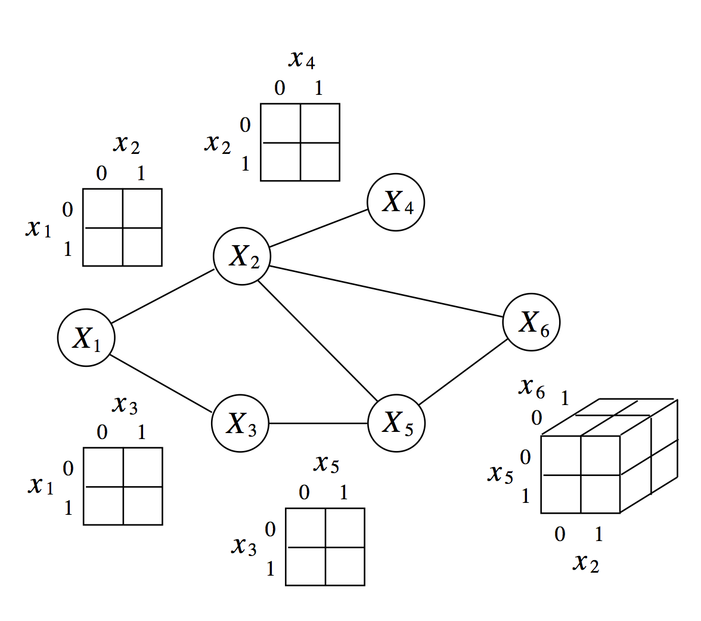
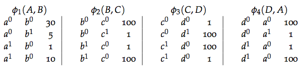
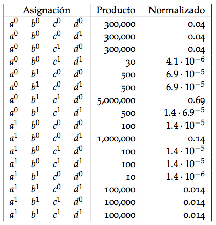
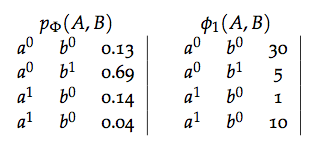
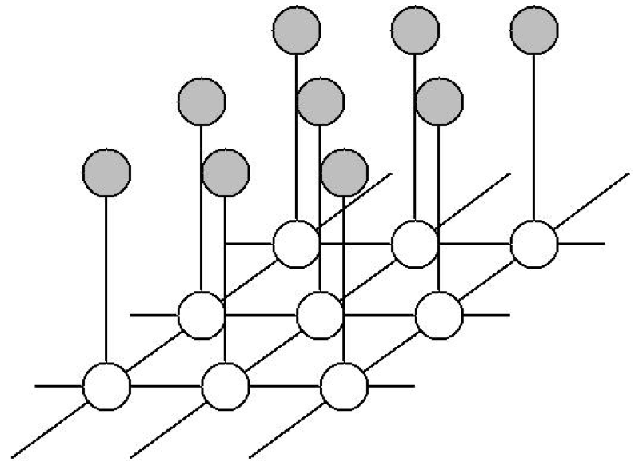
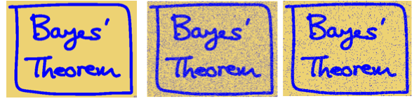
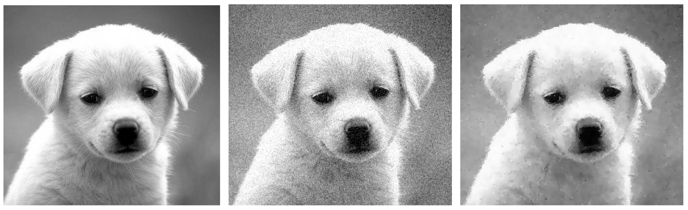
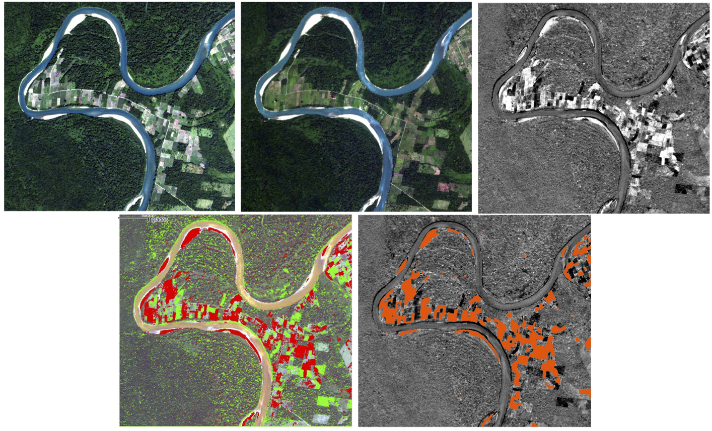
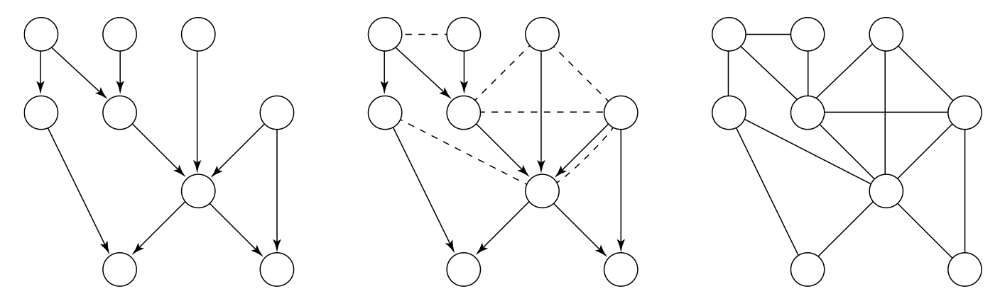
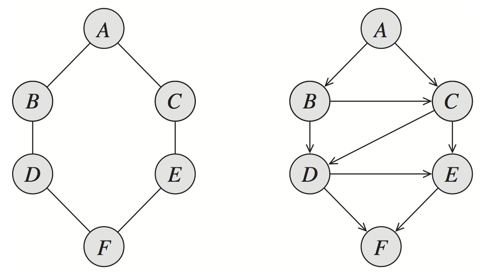

# Redes markovianas

Hasta ahora hemos restringido nuestro estudio a las redes bayesianas, otra
manera usual de representar independencias condicionales y modelos
asociados es a través de gráficas no dirigidas, o modelos de redes markovianas.

Hay dos puntos importantes en los que difieren los modelos dirigidos de los no 
dirigidos:

* Cómo se representan la independencias condicionales: en el caso Markoviano, la 
interpretación es más simple (caminos activos son bidireccionales no 
condicionados).  
* Qué tipo de estructuras de independencia pueden representarse apropiadamente.  
* Cómo se parametriza la conjunta: en general, en redes markovianas no es 
posible utilizar modelos locales de probabilidades condicionales como en los 
modelos dirigidos.

En esta sección utilizaremos los paquetes:

* `gRbase`  
* `gRim`

Y las principales referencias son @bishop, @Whittaker, @soren.

## Definiciones y propiedades

Comenzamos estableciendo conceptos y propiedades necesarios para entender las
redes markovianas.

### Propiedad markoviana por pares

Consideramos variables aleatorias discretas $X_1, \ldots, X_k$ con una
función de distribución conjunta $p(x_1,\ldots, x_k)$. Supondremos,
para simplificar la discusión, que
$$p(x_1,x_2,\ldots, x_k)>0$$
para cualquier combinación de $x_1,\ldots, x_k$. 


Un primer enfoque es construir una gráfica $\mathcal M$  no dirigida de la 
siguiente forma:

<div class="caja">
Decimos que ${\mathcal M}$ tiene la **propiedad Markoviana por pares** respecto 
a la distribución $p$ cuando es una red no dirigida con vértices 
$X_1, \ldots, X_k$
tal que:
$\mathcal M$ no tiene arista entre $X_i$ y $X_j$ si y sólo si
$X_i$ y $X_j$ son independendientes dado el resto de variables aleatorias.
</div>

Es decir, existe un arco solamente cuando existe una relación directa
entre las dos variables no mediada por dependencia entre otras variables. 

**Ejemplos.**  
Consideremos tres variables aleatorias: $X,Y,Z$. Hay tres posibles 
independencias condicionales por pares a considerar: $X\bot Y|Z$, $X\bot Z|Y$ y 
$Y\bot Z|Y$. Si ninguna se cumple, la gráfica es completa:

```{r, fig.height=3.5, fig.width=3.5, message=FALSE,warning=FALSE}
library(gRbase)
library(Rgraphviz)
library(igraph)
library(gRim)

miPlot <- function(x, ...){
  V(x)$size <- 55
  V(x)$label.cex <- 1.5
  V(x)$color <- "salmon"
  plot(x)
}

ug_ej1 <- ug(c("X", "Y"), c("Y", "Z"), c("X", "Z"), result = "igraph")
miPlot(ug_ej1)
```

Si se cumple solamente $X\bot Y|Z$, entonces tenemos

```{r, fig.height=3.5, fig.width=3.5}
ug_ej2 <- ug(c("Y", "Z"), c("X","Z"), result = "igraph")
miPlot(ug_ej2) 
```

Si se cumplen solamente $X\bot Y|Z$ y $X\bot Z|Y$

```{r, fig.height=3.2, fig.width=3.2}
ug_ej3 <- ug(~ Y:Z, ~ X, result = "igraph")
miPlot(ug_ej3) 
```

### Propiedad markoviana global  

¿Qué otras propiedades de independencia condicional se pueden leer de esta 
gráfica? La regla es más fácil que la de redes dirigidas, donde teníamos que 
tener cuidado con caminos activados por un colisionador. En redes no dirigidas, 
el concepto de separación es directo:

Sea $C$ un conjunto de vértices de una red $\mathcal M$. Decimos que dos 
vértices $X$ y $Y$ están **separados por $C$** en $\mathcal M$ si 
todos los caminos no dirigidos entre $X$ y $Y$ pasan por algún vértice de $C$.

<div class="caja">
Decimos que $\mathcal M$ satisface la **propiedad markoviana global** respecto
a $p$ cuando:  
Si $A,B,C$ son subconjuntos disjuntos de los vértices tal que $C$ separa a $A$ 
de $B$, entonces $A\bot B|C$.  
</div>

**Ejemplo.** Consideramos la siguiente gráfica que satiface la propiedad 
markoviana global para $p$:

```{r, fig.width=5, fig.height=5}
ug_ej4 <- ug( c("X", "Y"), c("X","A"), c('Y','A'), c('A','B'), c('Y','B'),
  c('A','Z'), c('Z','W'), c('B','Z'), result = "igraph")
plot(ug_ej4) 
```

Podemos leer, por ejemplo, las independencias $X\bot Z|A,B$, o $Y\bot W|Z$.

<div class="caja">
Para distribuciones positivas, tenemos que la propiedad global markoviana es
equivalente a la propiedad markoviana por pares.
</div>

Esto implica:  
* Para una distribución $p$, podemos construir su red Markoviana asociada
usando la propiedad markoviana por pares.  
* Para leer qué otras independencias satisface $p$, podemos usar la propiedad markoviana global.

### Factores y parametrización de redes markovianas

En redes dirigidas vimos que podíamos parametrizar una red bayesiana a través de
factores obtenidos de  modelos locales de probabilidades condicionales. El caso
no dirigido, como veremos, requiere otro tipo de parametrización con base en 
factores. 

Consideremos la red no dirigida $X\text{--}Z\text{--}Y$. ¿Cómo podemos representar su conjunta (que satisface la independencia de X y Y dado Z y ninguna otra)?

Recordemos que este conjunto de independencias se puede representar de varias
maneras con redes dirigidas. Tenemos

$$X\rightarrow Z \rightarrow Y: p(x)p(z|x)p(y|z)$$
$$X\leftarrow Z \leftarrow Y: p(y)p(z|y)p(x|z)$$
$$X\leftarrow Z \rightarrow Y: p(z)p(x|z)p(y|z)$$

Pero no podemos representarla mediante un colisionador

$$X\rightarrow Z \leftarrow Y: p(x)p(y)p(z|x,y).$$

¿Qué tienen en común las factorizaciones que representan  $X\text{--}Z\text{--}Y$ que es diferente del cuarto caso? En cada uno de los primeros tres
casos, podemos factorizar
$$p(x,y,z)=\psi_1 (x,z)\psi_2(y,z),$$
mientras que no es posible hacer esta factorización en el cuarto caso.
Por otra parte, recordamos ahora que precisamente la ecuación anterior 
es equivalente a independencia condicional de $X$ y $Y$ dado $Z$. 

En realidad, para que la independencia condicional se cumpla no es
necesario tener igualdad en la ecuación de arriba. Basta que
$$p(x,y,z)\propto \psi_1 (x,z)\psi_2(y,z),$$
donde los factores $\psi_1$ y $\psi_2$ sólo tienen que ser funciones
no negativas.

**Ejemplo.** Consideramos la red no dirigida

```{r, fig.width=3.5, fig.height=3.5}
ug_ej5 <- ug(c("X","Y"), c("X", "W"), c("W", "Z"), c("Z","Y"), result = "igraph")
miPlot(ug_ej5) 
```

Sabemos que el conjunto de independencias condicionales que satisface
esta red no se pueden representar de manera perfecta mediante
una red bayesiana. La razón es que cualquier direccionamiento de sus
arcos tiene que producir un colisionador, y si hay un colisionador
entonces tenemos dependencias que se activan al condicionar. 

Usando la idea del ejemplo anterior, podríamos escribir

$$p(x,y,z,w)\propto \psi_1(x,y)\psi_2(y,z)\psi_3(z,w)\psi_4(w,x)$$

donde las funciones $\psi_i$ son no negativas, sin embargo, el lado derecho no
tiene que sumar uno. Normalizando se sigue que
$$p(x,y,z,w)=\frac{\psi_1(x,y)\psi_2(y,z)\psi_3(z,w)\psi_4(w,x)}{Z}$$
donde
$$Z=\sum_{x,y,z,w} \psi_1(x,y)\psi_2(y,z)\psi_3(z,w)\psi_4(w,x)$$
es la constante que normaliza el producto de los factores. 

Bajo una distribución que se factoriza de esta manera,
¿será cierto que $X\bot Z|Y,W$? Un cálculo simple muestra que
así es. Tenemos que
$$p(x|y,z,w)=\frac{p(x,y,z,w)}{p(y,z,w)}$$
La constante de normalización se cancela, así que
$$p(x|y,z,w)= \frac{\psi_1(x,y)\psi_2(y,z)\psi_3(z,w)\psi_4(w,x)}{\psi_2(y,z)\psi_3(z,w)\sum_x \psi_1(x,y)\psi_4(w,x)}$$
entonces
$$p(x|y,z,w)= \frac{\psi_1(x,y)\psi_4(w,x)}{\sum_x \psi_1(x,y)\psi_4(w,x)}.$$
Esta cantidad no depende de $z$, por lo que tenemos
$$p(x|y,z,w)=p(x|y,w),$$
es decir $X\bot Z|Y,W$.

Un argumento similar puede darse para $Y\bot W | X,Z$.  
¿La factorización
implica alguna otra independencia condicional? Dando contraejemplos de 
distribuciones particulares podemos mostrar que no, para entender la razón 
veamos un ejemplo: ¿$Y\bot W |X$?. Usando la factorización,

$$p(y|w,x)=\frac{\psi_1(x,y)\sum_z\psi_2(y,z)\psi_3(z,w)}
{\sum_y \psi_1(x,y) \left(\sum_z  \psi_2(y,z)\psi_3(z,w) \right)},$$
donde vemos que en el lado derecho no podemos eliminar la dependencia
de $w$.

Finalmente, bajo este criterio, una red como

```{r, fig.width=3.5, fig.height=3.5}
ug_ej6 <- ug(c("X","Y"), c("Y", "Z"), c("Z","X"), result = "igraph")
miPlot(ug_ej6) 
```

tiene la factorización vacía
$$p(x,y,z)\propto \psi(x,y,z),$$
pues cualquier otra factorización implicaría independencias condicionales.

Nótese en general que una gráfica completa (donde hay un arco entre
cualquier par de vértices) no puede factorizarse de manera no trivial,
pues otra vez, esto implicaría independencias condicionales adicionales. 

Definimos entonces una **subgráfica completa maximal** (o cliques) $\mathcal C$ 
de $\mathcal M$ cuando es una subgráfica completa a la que no se le puede 
agregar ningún nodo adicional y que siga siendo completa. Por ejemplo, en la gráfica

```{r}
ug_ej7 <- ug(c("X", "Y"), c("Y", "Z"), c("Z", "X"), c('A', 'X'), c('B', 'Y'), 
             c('B', 'Z'), c('B', 'X'), c('A', 'C'), c('X', 'C'), c('C', 'D'), 
             c('D', 'E'), result = "igraph")
plot(ug_ej7) 
```


las subgráficas completas maximales son $\{X,Y,Z,B\}$, $\{ X,A,C\}$, $\{ C,D\}$ y $\{ D,E\}$. Basta especificar los nodos pues todas ellas son completas.

<div class = "caja">
**Distribuciones de Gibbs.** Decimos que $p$ es una distribución de
Gibbs respecto a ${\mathcal M}$ si se puede escribir como
$$p(x)\propto \prod_{c\in {\mathcal C}} \psi_c (x_c),$$
donde ${\mathcal C}$ es el conjunto de cliques de $\mathcal M$,
y cada $\psi_c$ es un factor (no negativo) que sólo depende de las
variables dentro del clique $c$.
</div>

La siguiente figura ejemplifica los de factores sobre cliques.



Obsérvese que de la factorización anterior recuperamos la conjunta
normalizando:
$$p(x)=\frac{ \prod_{c\in {\mathcal C}} \psi_c (x_c)}{Z},$$
donde $Z$ es el factor de normalización (también llamada función de partición)
$$Z=\sum_{x}\prod_{c\in {\mathcal C}} \psi_c (x_c).$$

En las definiciones anteriores hemos escrito el producto de factores:

<div class="caja">
Sean $X$, $Y$ y $Z$ tres conjuntos disjuntos de variables (esto es, conjuntos 
con intersección vacía), y sean $\phi_1(X,Y)$ y $\phi_2(Y,Z)$ dos factores.
Definimos el producto de factores $\phi_1 \times \phi_2$ como el factor 
$\psi:Val(X,Y,Z)\rightarrow \mathbb{R}$:
$$\psi(X,Y,Z) = \phi_1(X,Y)\cdot \phi_2(Y,Z)$$
</div>

Notemos que tanto las densidades de probabilidad condicional como las 
distribuciones conjuntas son factores, por ejemplo cuando calculamos la 
probabilidad conjunta $p(A,B) = p(A)p(B|A)$ estamos realizando un producto de
factores. En redes bayesianas también podemos ver la multiplicación de factores, 
si definimos $\phi_{X_i}(X_i,Pa_{X_i}) = p(X_i|Pa_{X_i})$ tenemos
$$p(X_1,...,X_n) = \prod_i \phi_{X_i}.$$

**Ejemplo.**
Una distribución $p$ es **Gibbs respecto a la gráfica** anterior cuando podemos
factorizar
$$p(x)\propto \psi_1 (x,y,z,b)\psi_2(x,a,c)\psi_3(c,d)\psi_4(d,e)$$

Esta factorización implica, como hemos visto, ciertas relaciones de
independencia condicional. Por ejemplo, podemos demostrar que
$Y$ y $D$ son condicionalmente independientes dada $X$:

$$p(y,d,x)=\left( \sum_e\psi_4(d,e)  \right) 
\left( \sum_{a,c}\psi_3(c,d)\psi_2(x,a,c)  \right)
\left( \sum_{z,b}\psi_1(x,y,z,b)  \right)$$
y vemos que en el cociente con $p(d,x)$, se eliminan los 
factores $\left( \sum_e\psi_4(d,e)  \right) 
\left( \sum_{a,c}\psi_3(c,d)\psi_2(x,a,c)  \right)$. El término
restante no depende de $d$.
}

Ahora vemos que la factorización es precisamente la expresión que
necesitamos para expresar las independencias condicionales que se leen
de la gráfica:

<div class="caja">
**Hammersley-Clifford**. Sea $p$ una distribución positiva. Entonces
$p$ es Gibbs en relación a $\mathcal M$ si y sólo si $\mathcal M$ satisface
la propiedad global de Markov respecto a $p$.
</div>

Entonces, de manera similar a gráficas dirigidas vimos dos maneras de 
caracterizar los modelos gráficos no dirigidos:

1. Dada una gráfica $\mathcal M$, todas las distribuciones que se pueden
expresar como el producto de factores (o potenciales) definidos sobre cliques 
(subgráficas completas maximales).

2. Dada una gráfica $\mathcal M$, todas las distribuciones que satisfacen
todas las independencias que especifica la gráfica.

3. Hammersley-Clifford: Las dos caracterizaciones son equivalentes.

<div class="clicker">
 Para la siguiente gráfica ¿Que 
afirmaciones de independencia están en I($\mathcal{M}$), es decir que 
independencias están inducidas por la gráfica?  

```{r, fig.width=5, fig.height=5, echo=FALSE}
ug_ejercicio <- ug(c("A","D", "B"), c("B","C", "D"), c("B", "F"), c("B", "C", "E"), 
  result = "igraph")
plot(ug_ejercicio) 
```

a. ($A \bot C| B,D$)  
b. ($A\bot E| B$)  
c. ($C\bot F|B$)  
d. ($A \bot F|B,D$)  
e. Ninguna.

</div>


### Factores y parametrización

**Ejemplo (juguete).** Supongamos que hay cuatro estudiantes que se reunen en pares para trabajar en una tarea; por varias razones únicamente se reunen los pares Ana y Carla, Ana y Benito, Benito y Daniel, Carla y Daniel (las parejas de estudio se representan en la gráfica inferior). En este ejemplo el profesor comete un error en clase, y cada estudiante puede haber elicitado el error o haber retenido el error. Cuando se reúnen a estudiar en parejas, un estudiante que encontró el error puede aclararlo a su pareja. Definimos entonces 4 variables aleatorias {$A,B,C,D$}, denotemos $a^0$ si Ana aclaró el error y $a^1$ si lo retiene, similarmente $b^0,b^1,c^0,...$. Debido a que Ana y Daniel nunca son equipo queremos modelar una distribución que satisface ($A\perp D|B,C$) y similarmente ($B \perp C | A,D$).

```{r, fig.width=3.4, fig.height=3.5}
ug_ej7 <- ug(c("A","D"), c("A", "B"), c("B","C"), c("C", "D"), result = "igraph")
miPlot(ug_ej7) 
```

Describimos la relación entre Ana y Benito mediante un factor $\phi_1(A,B):Val(A,B)\rightarrow \mathbb{R}^+$, donde el valor de cada asignación $(a,b)$ corresponde a la $afinidad$ entre los dos valores, un mayor valor $\phi_1(a,b)$ indica mayor compatibilidad entre $a$ y $b$.



<div class="clicker">
 ¿Por qué 
$\phi_1(a,b)\cdot \phi_2(b,c) \cdot \phi_3(c,d)\cdot\phi_4(d,a)$ no es
una distribución de probabilidad?  
a. Puede ser negativo.  
b. No necesariamente está entre 0 y 1.  
c. No suma uno ($\sum_{a b c d}\phi_1(a,b)\cdot \phi_2(b,c) \cdot \phi_3(c,d)\cdot\phi_4(d,a)$).  
d. Faltan factores para determinar la distribución (ej. $\phi_1(a,c)$)  
</div>


De manera similar a las redes bayesianas, debemos combinar los modelos locales para definir el modelo global; sin embargo, la multiplicación de los factores no tiene porque definir una distribución por lo que es necesario normalizar el producto de factores.

En el ejemplo de los estudiantes definimos:
$$ p(a,b,c,d) = \frac{1}{Z}\phi_1(a,b)\cdot \phi_2(b,c) \cdot \phi_3(c,d)\cdot\phi_4(d,a)$$
donde 
$$Z = \sum_{a,b,c,d} \phi_1(a,b)\cdot \phi_2(b,c) \cdot \phi_3(c,d) \cdot \phi_4(d,a)$$
es la constante de normalización que también se conoce como función de partición.

Calculamos la distribución de probabilidad conjunta multiplicando los factores y normalizando como sigue:
$$ p(a,b,c,d) = \frac{1}{Z}\phi_1(a,b)\cdot \phi_2(b,c) \cdot \phi_3(c,d)\cdot\phi_4(d,a)$$
donde 
$$Z = \sum_{a,b,c,d} \phi_1(a,b)\cdot \phi_2(b,c) \cdot \phi_3(c,d) \cdot \phi_4(d,a)$$
es la constante de normalización.

Obtenemos así la siguiente tabla que describe la distribución conjunta de las variables aleatorias:




#### Parametrización
Para representar una distribución necesitamos asociar la estructura de la 
gráfica con un conjunto de parámetros de manera similar a como las funciones de densidad condicional parametrizan las gráficas dirigidas. Sin embargo, la 
parametrización de redes markovianas no es tan intuitiva ya que los factores no corresponden a probabilidades, esto conlleva a que los parámetros sean difíciles 
de entender y por tanto no es fácil elicitarlos de expertos.
Para entender que la relación entre los factores y la distribución de 
probabilidad no se relacioan de manera intutiva comparemos el factor $\phi_1(A,B)$ con la distribución marginal $p_\Phi(A,B)$: 

<div class="clicker">

Si consideramos el factor $\phi_1(A,B)$, nos preguntamos si dicho factor es es proporcional a:  
a. La probabilidad marginal $p(A,B)$.  
b. La probabilidad condicional $p(A|B)$.  
c. La probabilidad condicional $p(A,B|C,D)$.  
d. Ninguna de las anteriores  
</div>

Para entender que la relación entre los factores y la distribución de probabilidad no es intutiva comparemos el factor $\phi_1(A,B)$ con la distribución marginal $p_\Phi(A,B)$: 




<!--

Como discutimos anteriormente, podemos ver los factores como funciones que 
describen _compatibilidad_ entre los diferentes valores de las variables. 
Entonces, podemos parametrizar la gráfica en términos de factores: una primera 
idea es asociar parámetros a las aristas de la gráfica; sin embargo, este 
principio no es suficiente para parametrizar una distribución conjunta como 
veremos en la siguiente discusión.

#### Discusión de parametrización
Consideremos una gráfica completa sobre un conjunto de variables aleatorias que denotamos $X$, esto es, existe una arista que une todos los pares de arcos. Si
todas las variables fueran binarias, cada factor sobre una arista tendría 4 parámetros y el total de parámetros en la gráfica sería $4 {n \choose 2}$. Por 
otra parte, el número de parámetros que se requiere para describir la 
distribución conjunta sobre $n$ variables binarias es $2^n -1$. Por lo tanto 
los factores de pares de variables no tienen suficientes parámetros para 
describir todo el espacio de distribuciones conjuntas.

Una representación más general se obtiene cuando los factores son funciones cuyo dominio es un subconjunto cualquiera de las variables. Antes de introducir una definicón formal definamos el producto de factores como sigue.

-->

## Representación log-lineal

Los modelos log-lineales han sido ampliamente utilizados en ciencias sociales
para el análisis de tablas de contingencia, su desarrollo ha permitido formular
y ajustar patrones de asociación complejas entre los dactores que cruzan en una
tabla de contingencias.

**Ejemplo**. Usaremos la base de datos de lagartijas, tenemos $N=409$ 
observaciones y $d=3$ variables.

```{r}
data(lizard)
```

Un modelo log-lineal permite expresar el log de las probabilidades con 
expresiones de factoriales. Por ejemplo, para un modelo de _saturado_ (donde 
se estiman parámetros para todos los cruces de factores) de 3 variables tenemos:

$$\log p(x) = u + u_X + u_Y + u_Z + u_{X,Y} + u_{X,Z} + u_{Y,Z} + u_{X,Y,Z} $$

donde las $u$ son parámetros desconocidos.

En el ejemplo de lagartijas, si no restringimos las probabilidades del modelo
(es decir, estimamos todos los cruces), tenemos un total de 8 parámetros (7 
pues el último está dado), para cada parámetro la estimación de máxima 
verosimilitud es $p_i=n_i/N$, esto es la proporción
de observaciones en la celda i.

```{r}
prop.table(lizard)
```

Repetimos la estimación utilizando la representación log-lineal:

```{r}
data(lizardRAW) # datos desagregados
m_sat <- dmod(~.^., data = lizardRAW)
m_sat$fit$fit
````

Los modelos log-lineales nos permiten hacer cero algunas interacciones, por
ejemplo podemos ajustar:

$$\log p(x) = u + u_X + u_Y + u_Z + u_{X,Y} + u_{X,Z} $$

```{r}
m_2 <- dmod(~species*height+species*diam, data = lizard)
m_2$fit$fit
```

En las siguientes secciones estudiaremos la relación entre una clase de modelos 
log-lineales y redes markovianas.

### Modelos gráficos log-lineales
Recordemos que algunos de los resultados de redes markovianas se sostenían 
únicamente para conjuntas positivas, por lo que podemos restringirnos a este
conjunto y por tanto podemos representarlas de manera lgoarítmica de la 
siguiente forma:
  
Una distribución de Gibbs sobre $\mathcal M$ se escribe

$$p(x) \propto \prod_{c\in {\mathcal C}} \psi_c (x_c).$$
  
Si todos los factores son positivos $\psi_c>0$, definimos
$u_c=\log (\psi_c)$
  de manera que

$$p(x)\propto \prod_{c\in {\mathcal C}} \exp (u_c (x_c)).$$
  y
$$p(x)= \frac{\prod_{c\in {\mathcal C}} \exp (u_c (x_c))}{Z},$$
  donde
$$Z= \sum_{x} \exp \left(  \sum_{c\in {\mathcal C}}^{} {u_c(x_c)}   \right).$$
  
Podemos también escribir

$$\log (p(x)) = \sum_{c\in {\mathcal C}}^{} u_c(x_c) - \log Z$$

donde $\log Z$ es una constante de normalización.

La última expresión corresponde a un modelo log-lineal. En el resto de esta discusión, consideraremos la expresión log lineal para la conjunta, y supongamos 
que tenemos tres variables binarias que toman los valores $0,1$. Comenzamos con 
el modelo deindependencia (o solamente de efectos principales), que es

$$\log p(x) = u + u_X + u_Y + u_Z$$
  
  donde $u$ representa el término de normalización. Esta gráfica corresponde a la gráfica de $X,Y,Z$ sin arcos. Nótese que esta expresión está sobreparametrizada
(contiene 6 parámetros, pero la conjunta solo depende de 3 parámetros). Esto quiere decir que hay una infinidad de maneras de representar a una misma conjunta por medio de las $u$. Este punto no es crucial, pero podríamos restringir a $u_X(0)=u_Y(0)=u_Z(0)=0$ y así obtenemos otra vez 3 parámetros.

Ahora supongamos que queremos eliminar la independencia entre $X$ y $Z$. 
En lugar de reescribir la expresión (absorbiendo $u_X$ y $u_Z$ en un factor
$u_{X,Z}$), agregamos un término a la expresión anterior:
  
$$\log p(x) = u + u_X + u_Y + u_Z + u_{X,Z}$$
  
$u_{X,Z}$ tiene 4 parámetros (sobreparametrizada), pero podemos eliminar
la sobreparametrización estableciendo por ejemplo $u_{X,Z}(x,z)= 0$ si
$x=0$ o $z=0$, con
lo que nos queda 1 parámetro. En total, tenemos entonces
3+1=4 parámetros, que corresponde a 1 para la marginal de $Z$ y $3$ para la conjunta de $X$ y $Y$.

Ahora agregemos una nueva arista entre $Z$ y $Y$. Podemos escribir

$$\log p(x) = u + u_X + u_Y + u_Z + u_{X,Z} + u_{Y,Z}$$
  
  que con la misma restricción $u_{Y,Z}(y,z)=0$ cuando $y=0$ o $z=0$ resulta en 5 parámetros, que es el número correcto (pues la conjunta se puede parametrizar
                                                                                                                         con 1 parámetro para la marginal de $Z$, y la condicional de $(X,Y)$ dado
                                                                                                                         $Z$ solo requiere 4 parámetros en lugar de 6 debido a la independencia
                                                                                                                         $X\bot Y|Z$).

Finalmente, ¿qué sucede cuando agregamos el arco entre $X$ y $Y$?
  
$$\log p(x) = u + u_X + u_Y + u_Z + u_{X,Z} + u_{Y,Z} + u_{X,Y}+u_{X,Y,Z}.$$
  
  Tenemos que agregar el último término para poder capturar todos los patrones
de dependencia de la gráfica completa de $X$, $Y$,$Z$, pues esta gráfica
contiene un factor $\psi(x,y,z)$. Nótese que si no agregamos este término
$u_{X,Y,Z}$, entonces terminaríamos con 6 parámetros, pero sabemos que para 
parametrizar cualquier conjunta requerimos 8-1=7 parámetros.

Así que el modelo
$$\log p(x) = u + u_X + u_Y + u_Z + u_{X,Z} + u_{Y,Z} + u_{X,Y}$$

tiene restricciones adicionales a las del modelo con gráfica completa, pues
$u_{X,Y,Z}=0$. Este modelo es un modelo log-lineal (en la definición usual),
pero no es un modelo log-lineal *gráfico*, pues expresa independencias
que no se pueden leer de la gráfica.

A los términos $u$ se les llama muchas veces **términos de interacción**.

Siguiendo el proceso de construcción de arriba el tipo de modelos que nos 
interesa es:

<div class="caja">
Un modelo log-lineal gráfico asociado a la gráfica $\mathcal M$ es de 
la forma 
$$\log p(x) = u + \sum_i \phi_i^1 u_i + \sum_{i,j}\phi_{i,j}^2 u_{i,j}+\cdots
+ \sum_{i_1,\ldots, i_s} \phi_{i_1,\ldots, i_s}^s u_{i_1,\ldots, i_s}$$
  donde

1. Las $\phi$ toman el valor 1 o 0.  

2. El modelo es jerárquico: si un término $\phi_{i_1,\ldots, i_t}=1$, entonces
todos los términos $\phi_A=1$ para todo $A\subset {i_1,\ldots, i_t}$.

3. Los términos más altos de la expresión coresponden a cliques en 
$\mathcal M$.
</div>

**Ejemplos**

* La expresión $$u+ u_X+ u_{YZ}$$ no es jerárquica. No puede resultar de la
construcción que hicimos arriba, y por lo tanto tampoco puede ser un modelo 
gráfico.  

* La expresión $$u+ u_X+ u_Y+u_Z + u_{XY} + u_{XYZ}$$ no es jerárquica. No 
puede resultar de la construcción que hicimos arriba, y por lo tanto tampoco 
puede ser un modelo gráfico.  

*La expresión
 $$u + u_X + u_Y + u_Z + u_{X,Z} + u_{Y,Z} + u_{X,Y}$$
es un modelo jerárquico, pero no es gráfico, pues $X,Y,Z$ forman un clique,
 así que el término $u_{X,Y,Z}$ no puede restringirse a ser 0.

<div class="clicker">
 Considera 
$$u+u_1+u_2+u_3+u_4+u_5+u_{12}+u_{23}+u_{25}+u_{35}+u_{34}+u_{45}$$

a. Es un modelo gráfico  
b. Es un modelo jerárquico  
c. Ninguna de las anteriores  

</div>

**Observación:** En primer lugar, nótese que sin la parametrización y las 
restricciones que mostramos arriba, no tienen mucho sentido preguntarse si un 
modelo es jerárquico, pues todos los términos de grado más bajo se pueden 
absorber en el de orden más alto. La pregunta sería entonces: ¿por qué no usar 
con esta parametrización modelos no jerárquicos? Podemos por ejemplo considerar 
el modelo ($X$ y $Y$ binarias):
   $$u+u_X+u_{X,Y}$$
con la restricción de que $u_X(0)=0$ y $u_{X,Y}(0,y)=u_{X,Y}(x,0)=0$. Entonces
nótese que se tiene que cumplir que $p(0,0)=p(0,1)$. Es decir, bajo esta 
parametrización modelos no jerárquicos *incluyen otras restricciones que no 
tienen qué ver con la independencia condicional*. No es que estos modelos no 
sirvan o estén mal, sino que en este punto no nos interesa modelar ese tipo de restricciones. En la práctica, típicamente se usan modelos jerárquicos.

### Ajuste de modelos loglineales

Igual que en la gráficas no dirigidas, podemos escribir de manera fácil la 
verosimilitud bajo ciertos valores de los factores $u$ de datos observados:

$$loglik(\theta, {\mathcal L})=\sum_i \log p(\theta; x^{(i)}),$$
donde $log(p(\theta; x^{(i)})$ es la probabilidad de la observación $x^{(i)}$ 
según el modelo dado por la factorización, y $\theta$ incluye todos los 
parámetros de los factores.

La diferencia más importante es que en general, no podemos usar la 
descomposición que hicimos en redes bayesianas de la verosimilitud. 

<div class="caja">
En redes bayesianas, podíamos descomponer la verosimilitud en factores que 
correspondían a modelos locales, y resolver por separado para cada modelo local. 
En redes markovianas esto no es posible por la presencia del factor de 
normalización (en el que intervienen todos los parámetros de los factores en el
modelo).
</div>

Tomando en cuenta esta diferencia hay varias maneras de estimar una red 
markoviana, uno de los métdos consiste en realizar pruebas de independencia
para inferir la estructura del modelo conjunto. Y otro en utilizar 
heurísticas para optimizar un criterio.

Recordemos que en general no seleccionamos modelos usando la 
log-verosimilitud, sino que usaremos el AIC para seleccionar modelos que 
exploramos mediante una heurística más simple: dada una gráfica inicial no 
dirigida, en cada paso buscamos la eliminación o agregación del arco que resulte 
en la mejor ganancia en AIC.
     
Comenzaremos por ejemplo del _error en clase_. Primero simulamos datos según
los datos del ejemplo, con una variable de ruido adicional:

```{r, message=FALSE}
library(dplyr)

potencial <- expand.grid(d = c(0, 1), c = c(0, 1), b = c(0, 1), a = c(0, 1)) %>%
  mutate(
    valor = c(3e05, 3e5, 3e5, 30, 500, 500, 5e6, 500, 100, 1e6, 100, 100, 10, 
      1e5, 1e5, 1e5),
    indice = 1:n(),
    prob = valor/sum(valor)
    )
set.seed(2805)
muestra <- sample_n(potencial, size = 3000, weight = prob, replace = T) %>%
  select(d, c, b, a)
# añadimos una variable independiente
muestra$e <- sample(c(0, 1), 3000, replace=T)
```

La función _dmod_ sirve para especificar modelos log-lineales.
     
```{r, fig.height=2.5, fig.width=3.5}
library(gRim)

m_init <- dmod(~.^1, data = muestra) # modelo de independencia
plot(m_init)
```

Para usar el AIC o BIC, ponemos manualmente el coeficiente de penalización (2 
para AIC y $\log N$ para BIC):

```{r, warning=FALSE}
mod_misco <- stepwise(m_init, k = log(nrow(muestra)), 
  direction='forward', type='unrestricted')
mod_misco
plot(mod_misco)
```

Las probabilidades ajustadas son (se puede omitir del cálculo en _stepwise_ 
cuando es una tabla muy grande):

```{r, fig.width=4, fig.height=4}
library(ggplot2)

ajuste <- mod_misco$datainfo
ajuste
ajuste_df <- data.frame(ajuste) %>%
  rename_all(~stringr::str_replace(., "data.", "")) %>% 
  group_by(a, b, c, d) %>%
  summarise(freq = sum(Freq)) %>%
  ungroup() %>%
  mutate(prob_aj = freq / sum(freq)) %>% # probabilidad ajustada
  mutate_each(funs(as.numeric(as.character(.))), a:d)

# comparamos con las probabilidades originales
ej_comp <- inner_join(ajuste_df, potencial)

ggplot(ej_comp, aes(x = prob, y= prob_aj)) +
  geom_abline(color = "red", alpha = 0.6) +
  geom_point() 

```

En el siguiente ejemplo, seleccionamos un modelo para datos 
de riesgo de enfermedades del corazón. Tenemos 6 variables: fuma o no,
si hace trabajo mental, si hace trabajo físico, si tiene presión baja,
un indicador de colesterol alto, y un indicador de historia familiar de
enfermedad del corazón:
       
```{r, fig.width=4.5, fig.height=3}
library(gRim)
data(reinis)
reinis
m_init <- dmod(~.^1 , data = reinis)
plot(m_init)
m_reinis <- stepwise(m_init, criterion = 'aic', details = T,
                     direction = 'forward', type = 'unrestricted')
plot(m_reinis)
```

  Un ejemplo simple con datos reales: 
en este caso, queremos entender los patrones de variación de tres variables: 
color de ojos, color de pelo y género.

```{r}
data(HairEyeColor)
(HairEyeColor)
m_init <- dmod(~.^., data=HairEyeColor)
```

* Primero construye un modelo no dirigido que incluya todos los datos.

* Vimos en una tarea anterior que la única indicación de dependencia
entre aceptación y género estaba en un departamento particular (dept A).
Construye entonces dos modelos log-lineales: uno para el departamento A
y otro para el resto. Explica por qué usar dos modelos es mejor
para uno solo para entender estos datos.


## Redes Markovianas en Procesamiento de Imágenes

Una aplicación importante de redes markovianas es en procesamiento de imágenes, 
en esta diciplina las redes markovianas típicamente se conocen como Campos Aleatorios de Markov (_Markov Random Fields_) y se utilizan con distintos 
objetivos, por ejemplo, en la eliminación de ruido (eliminar lo borroso de una imagen), segmentación de imagenes o reconocimiento de objetos.

En la mayor parte de estas aplicaciones el modelo sigue una estructura de red Markoviana a pares donde los nodos corresponden a los pixeles y las aristas a interacciones entre pixeles adyacentes, por lo tanto cada pixel interior tiene exactamente cuatro vecinos. La definición de los potenciales depende de la aplicación, sin embargo es usual que los modelos se especifiquen en términos de _energías_ (log-potenciales negativos) de tal manera que los valores representan penalizaciones y un valor menor corresponde a una configuración de mayor 
probabilidad.

En el caso de elimincación de ruido el objetivo es recuperar el _verdadero_ 
valor de los pixeles dado que algunos pixeles presentan ruido. Denotemos por 
$X_i$ el verdadero valor del pixel $i$ (este es el valor que buscamos inferir) y por $Y_i$ el valor del pixel que observamos (que presenta ruido). En este 
problema suponemos una correlación fuerte entre $X_i$ y $Y_i$, además de haber correlación positiva entre pixeles vecinos $X_i$ y $X_j$. La gráfica 
correspondiente a este modelo se muestra a continución.



La gráfica muestra dos tipos de cliques, cada uno con dos variables. Los cliques 
de la forma $\{X_i, Y_i\}$ a la que asociaremos una función de energía que 
cumple con el efecto de asignar menor energía (y por tanto alentando mayor
probabilidad) cuando el valor de las variables es cercano. Por otra parte, los
cliques de la forma $\{X_i,X_j\}$ donde $i$ y $j$ son índices de pixeles 
vecinos, tienen asociada una función de energía que penaliza diferencias entre
pixeles vecinos.

Veamos un ejemplo sencillo donde la imagen ruidosa esta descrita por una matriz 
de pixeles que toman uno de dos valores $y_i \in  \{-1,1\}$, el índice $i$ 
indica el pixel. Supongamos que la imagen ruidosa se obtiene de una imagen libre 
de ruido que se descibe por una matriz donde los pixeles toman los valores 
$x_i \in \{-1,1\}$, el ruido se añade cambiando el signo de los pixeles de la
imagen original con una probabilidad baja. La figura de abajo es un ejemplo 
donde se cambio el signo de los pixeles con probabilidad 0.10.



Capturamos la relación entre $X_i$ y $Y_i$ asociando la función de energía 
$-\eta x_i y_i$ donde $\eta$ es una constante positiva, observemos que la 
energía es menor cuando $x_i$ y $y_i$ tienen el mismo signo y mayor cuando 
tienen el signo opuesto, ¿Cómo se traduce esto en los potenciales?
En el caso de cliques que relacionan pixeles vecinos $X_i$, $X_j$ elegimos la
función de energía $-\beta x_i x_j$ donde $\beta$ es una constante positiva, el
comportamiento de esta función es análogo a la función que relaciona $X_i$ y 
$Y_i$.

Finalmente, añadimos el término $hx_i$ para cada pixel $i$ cuya función es 
sesgar el modelo hacia valores de pixeles que compartan el mismo signo.
La función de energía completa para el modelo toma la forma:
$$E(x,y) = h\sum_i x_i - \beta \sum_i x_i x_j - \eta \sum_i x_i y_i$$
que determina la distribución conjunta:
$$p(x,y)=\frac{1}{Z}exp(-E(x,y)).$$
Una vez definidas las funciones de energía se asignan a $y$ los valores de los
pixeles observados en la imagen ruidosa que define implícitamente una 
distribución condicional $p(x|y)$ sobre los pixeles libres de ruido. Buscamos
entonces encontrar una imagen $x$ de probabilidad alta (idealmente máxima)
condicional a la imagen observada.  
Para recuperar la imagen utilizamos una técnica iterativa llamada Modas 
Condicionales Iteradas (o ICM por sus siglas en inglés) que es una aplicaciónn de ascenso de gradiente:

1. Se inicializan las variables $\{x_i\}$ igualando $x_i=y_i$ para toda $i$.  
2. Para cada nodo $X_j$ evaluamos la energía total para cada estado $x_j = 1$ y $x_j = -1$.  
3. Actualizamos el valor que toma $X_j$ al estado que minimiza la energía. Repetimos el procedimiento en un nuevo nodo hasta que se satisfaga algún criterio de paro. Este paso puede mantener la probabilidad de constante o incrementarla si cambiamos el valor que toma $X_j$.  
4. Repetimos el paso 2 y 3 hasta satisfacer algún criterio de paro.

La función de energía es en principio arbitraria, sin embargo, existen varias
alternativas estándar para procesamiento de imagenes, por ejemplo, si la imagen 
se encuentra en escala de grises, los pixeles pueden tomar cualquiera de 256
valores (8 bits) y una función de energía apropiada es la siguiemte: 

$$E(x,y) = \sum_i \frac{(x_i - y_i)^2}{2\sigma^2} + \gamma \sum_{\{i,j\}}  min((x_i - x_j)^2, \beta)$$

donde $\sigma^2$ representa la creencia de que la imagen está corrompida por 
ruido con una varianza $\sigma^2$.

```{r, cache=TRUE, warning=FALSE, eval=FALSE}
library(bmp)
library(pixmap)
library(jpeg)

perro <- readJPEG("img/perrito.jpg", native = FALSE)[,,1]
pr <- pixmapGrey(perro)
plot(pr)

perro_mat <- 255 * perro

# Añadir ruido
noise <- function(image, sdev = 20){
  dimension <- dim(image)
  a <- round(c(image) + rnorm(n = length(image), 0, sd = sdev))
  a[a < 0] <- 0
  a[a > 255] <- 255
  image_blur <- array(data = a, dim = dimension)
}
perro_n <- noise(perro_mat) 
pr_n <- pixmapGrey(perro_n / 255)
plot(pr_n)


icm <- function(image, sdev = 25, max.diff = 200, weight.diff = 0.15, 
                iterations = 20){
  
  # sdev: error estándar del ruido gaussiano.
  # max_diff: contribución máxima al potencial de la diferencia entre los valores
  #   de dos pixeles vecinos 
  # weight_diff: es la ponderación asociada al componente del potencial 
  #   debida a la diferencia entre los valores de pixeles vecinos.
  # iter: es el número de iteraciones.

  # Siempre tengo dos imágenes, en cada iteración se alternan entre imagen 
  # fuente e imagen destino.
  
  dimension <- dim(image)
  buffer <- array(0, dim = c(dimension, 2)) 
  buffer[, , 1] <- image
  s <- 2
  d <- 1 
  # Este valor siempre será mayor que el potencial de cualquier configuración
  # de valores de pixeles
  V.max = (dimension[1] * dimension[2]) * ((256 ^ 2) / (2 * sdev) + 
    4 * weight.diff * max.diff)
  for(i in 1:iterations){
    # Switch source and destination buffers.
    if(s == 1){
      s = 2;
      d = 1;
    }
    else{
      s = 1;
      d = 2;
    }
    # Variamos cada pixel individualmente para encontrar los valores que
    # minimizan los potenciales locales.
    for(r in 1:dimension[1]){
      for(c in 1:dimension[2]){
        V.local = V.max
        min.val = -1
        for(val in 0:255){
          # Componente del potencial correspondiente a los datos observados.
          V.data = (val - image[r,c])^2 / (2 * sdev) 
          # Componente del potencial correspondiente a la diferencia entre los
          # pixeles vecinos
          V.diff = 0
          if(r > 1){
            V.diff = V.diff + min((val - buffer[r-1,c,s])^2, max.diff)
          }
          if(r < dimension[1]){
            V.diff = V.diff + min((val - buffer[r+1,c,s])^2, max.diff)
          }
          if(c > 1){
            V.diff = V.diff + min((val - buffer[r,c-1,s])^2, max.diff)
          }
          if(c < dimension[2]){
            V.diff = V.diff + min((val - buffer[r,c+1,s])^2, max.diff)
          }
          V.current = V.data + weight.diff * V.diff
          if(V.current < V.local){
            min.val = val
            V.local = V.current
          }
        }
        buffer[r, c, d] = min.val
      }    
    }
  }
  buffer[,,d]
}

perro_c <- icm(perro_n)
#writeJPEG(perro_n / 255, "img/p_ruido.jpg")
#writeJPEG(perro_c / 255, "img/p_recuperado_2.jpg")

pr_c <- pixmapGrey(perro_c/255)
plot(pr_c)
```



El siguiente es un ejemplo de clasificación de pixeles usando redes markovianas.
En este ejemplo se tienen dos imágenes satelitales (1000x1000 pixeles cada una)
del mismo lugar, tomadas en diferentes tiempos y se busca encontrar cambios.
Los resultados se muestran abajo, la tercera imagen es la imagen de diferencias
(usando IMAD_MAF) y las imágenes de abajo corresponden a dos algoritmos de 
detección de cambios, el primero es mezclas gaussianas y da resultados muy 
ruidosos. El segundo utiliza campos aleatorios de Markov y resulta en cambios
menos ruidosos.



#### Ligas relacionadas a procesamiento de imágenes {-}

* [Boykov, Funka-Lea](http://lvelho.impa.br/ip13/reading/ijcv06.pdf) Graph
Cuts and Efficient N-D Image Segmentation.   

* [Computer Vision Research Group](http://vision.csd.uwo.ca), University of
Western Ontario.  

* [PyMaxflow](https://github.com/pmneila/PyMaxflow), librería de python 
(stereograma y ejemplo binario).  

* [Blake y Kohli](http://www.cs.toronto.edu/~kyros/courses/2503/Handouts/Blake2011.pdf) handouts, Introduction to MRF.  


## Comparación entre modelos gráficos dirigidos y no dirigidos

Hemos estudiado dos tipos de modelos gráficos, cada uno tiene distintos puntos 
fuertes y débiles:

* Especificar un modelo gráfico no dirigido es fácil (producto normalizado de
potenciales), sin embargo los factores no tienen interpretación probabilística.
Especificar un modelo gráfico dirigido es difícil (necesitamos escoger un 
ordenamiento de las variables), pero en este caso los factores son densidades de
probabilidad marginales.   
* Determinar independencias en modelos no dirigidos es fácil (separación) y en
modelos dirigidos es difícil (d-separación).  
* Los modelos dirigidos y no dirigidos son lenguajes distintos, hay densidades 
con propiedades de independencia que sólo se pueden describir con modelos 
dirigidos (colisionadores) y lo mismo es cierto para no dirigidos (diamante).  
* A pesar de estas diferencias, la inferencia en modelos dirigidos usualmente comienza por convertirlos en modelos no dirigidos con menos independencias 
condicionales.

Ahora veremos como se relacionan las redes bayesianas y las redes markovianas, 
para ello veremos como pasar de un tipo de modelo al otro.

### Redes Bayesianas a Redes Markovianas

Podemos ver la relación entre redes Bayesianas y Markovianas desde dos 
perspectivas: 1) Dada una red Bayesiana ${\mathcal B}$ como representar la 
distribución $p_{\mathcal B}$ como una parametrización correspondiente a una red
markoviana, o 2) Dada una gráfica dirigida ${\mathcal G}$ como represento las
indepencias en ${\mathcal G}$ usando una gráfica no dirigida ${\mathcal H}$.

Respecto al primer punto, es fácil notar que las densidades marginales y 
condicionales que definen una red bayesiana son _potenciales_, por tanto una
factorización de una gráfica dirigida en densidades condicionales corresponde 
a una factorización de una distribución de Gibbs donde la constante de 
normalización es $Z=1$.

En cuanto a la representación gráfica, para transformar una red bayesiana en una
red markoviana definimos un clique sobre cada _familia_ (cada nodo y sus padres)
en la red bayesiana. Definir un clique sobre cada familia corresponde en la 
gráfica a conectar los padres de cada nodo (en caso de que no exista esta 
arista) y eliminar la dirección de las aristas. El proceso de transformar una 
red bayesiana en una red markoviana se conoce como moralización debido a que se
_casan_ (o conectan) los padres de una variable, la definición formal es:

<div class="caja">
La gráfica moral ${\mathcal M[G]}$ de una red Bayesiana con estructura 
${\mathcal G}$ sobre $V$ (conjunto de nodos/variables aleatorias) es una 
gráfica no dirigida sobre $V$ que contiene una arista entre $X$ y $Y$ si: 
a) hay una arista dirigida entre ellas (sin importar la dirección), ó b) $X$ y 
$Y$ son padres del mismo nodo.
</div>

Un corolario de la definición anterior es que si ${\mathcal G}$ es la estructura de una red bayesiana, entonces para cualquier distribución $p_{\mathcal B}$ tal que ${\mathcal B}$ es una parametrización de ${\mathcal G}$, tenemos que ${\mathcal M[G]}$ es un mapeo de las independencias de $p_{\mathcal B}$.

**Ejemplo**


Notemos que todas las independencias condicionales que se representan en la 
gráfica no dirigida también se leen en la gráfica dirigida, sin embargo, hay
independencias condicionales en el modelo dirigido que no se representan en el
modelo no dirigido. ¿Qué independencias implicadas en la red Bayesiana hemos 
_perdido_ al moralizar la gráfica?

Del ejemplo anterior concluímos que el proceso de moralizar una gráfica dirigida
puede conllevar que perdamos información de independencias; sin embargo, la
siguiente proposición implica que moralizar es un mecanismo adecuado para 
transformar una gráfica dirigida en una no dirigida.

<div class="caja">
Sea ${\mathcal G}$ una gráfica asociada a una red Bayesiana. La gráfica moralizada ${\mathcal M[G]}$ es un mapeo mínimo de las independencias de ${\mathcal G}$.
</div>

La proposición anterior nos dice que si eliminamos una arista de ${\mathcal M[G]}$ estaríamos implicando relaciones de independencia que no se leen de la gráfica ${\mathcal G}$ y si añadimos aristas estaríamos perdiendo información de independencias de ${\mathcal G}$ que si se representan en ${\mathcal M[G]}$.

Vale la pena destacar que no siempre hay pérdida de información al moralizar una
gráfica dirigida ${\mathcal G}$. Intuitivamente, la pérdida de información 
ocurre cuando se añaden aristas para conectar nodos, decimos que una red 
Bayesiana es **moral** si para cada par de variables $X$, $Y$ que comparten un hijo, existe una arista que une a $X$ y $Y$. 

<div class="caja">
Si la gráfica dirigida ${\mathcal G}$ es moral, entonces su gráfica moralizada ${\mathcal M[G]}$ es un mapeo perfecto de ${\mathcal G}$. Esto es, todas las independencias que leemos en ${\mathcal G}$ se leen también en ${\mathcal M[G]}$.
</div>

Otra manera de leer este resultado es que las independencias en ${\mathcal G}$ que no estan presentes en la gráfica no dirigida que contiene las mismas aristas son las correspondientes a estructuras $v$, a menos que la estructura $v$ este protegida, en este último caso la gráfica dirigida no induce indepencias que no se lean también de la gráfica no dirigida.


### Redes Markovianas a Redes Bayesianas

Consideremos ahora el problema de encontrar una red Bayesiana que se un mapeo minimal de las independencias de la red Markoviana. Veremos que en general la transformación en esta dirección es considerablemente más difícil.

**Ejemplo**



Consideremos la estructura de la red Markoviana de la figura de arriba y 
supongamos que buscamos una mapeo de esta red en una red bayesiana. Una manera 
es enumerar los nodos de la red y definir los padres de cada nodo en términos de
las relacones de independencia que se leen de la red markoviana. Ordenemos los
nodos de la siguiente manera: $A,B,C,D,E,F$, la relación entre $A$ y $B$ es 
fácil, pero veamos que ocurre cuando añadimos a $C$, introducimos $A$ como padre 
de $C$ pues no son independientes; sin embargo $C$ tampoco es independiente de 
$B$ condicional a $A$ por lo que debemos añadir a $B$ como padre de $C$. 
Similarmemte consideramos $D,E,F$ hasta obtener la gráfica dirigida de la 
derecha.

Es claro que hemos introducido aristas hasta formar una gráfica cordal (todos 
los ciclos están particionados en triángulos). Nos podemos preguntar si otro
ordenamiento de los nodos podría conllevar introducir menos aristas, pero la
respuesta es no: cualquier I-mapeo de una red Bayesiana que represente a la red
markoviana debe introducir aristas que triangulan la gráfica produciendo una
gráfica cordal.

<div class = "caja">
Sea ${\mathcal H}$ una estructura de red Markoviana, y sea ${\mathcal G}$ una 
red bayesiana tal que es un mapeo minimal de las independencias de ${\mathcal H}$. Entonces ${\mathcal G}$ no puede tener inmoralidades.
</div>

Un corolario del teorema anterior es que ${\mathcal G}$ es necesariamente cordal. Esto se debe al proceso de triangulación que se requiere para convertir la red markoviana en red bayesiana.

En la transformación de una red no dirigda en una dirigida también perdemos información de independencias al introduci aristas. Volviendo al ejemplo anterior ¿Que relaciones de independencia se leen en la gráfica markoviana que no podemos leer en la red bayesiana?

### Gráficas cordales
Hemos visto que la conversión entre redes bayesianas y markovianas puede 
resultar en la introducción de aristas que conlleva pérdida de informacióon de
independencias implicada por la estructura de la gráfica original. Es 
interesante preguntarnos, ¿Cuándo un conjunto de supuestos de independencia se puede representar de manera perfecta usando ya sea una red markoviana o una red
bayesiana? Resulta que esta es la clase de las gráficas cordales no dirigidas.

<div class="caja">
Sea ${\mathcal H}$ una red markoviana no cordal. Entonces no existe una red Bayesiana ${\mathcal G}$ que sea un mapeo perfecto de ${\mathcal H}$, esto es, 
no existe una red bayesiana de cuya gráfica se puedan leer todas las 
independencias que se leen de la red markoviana.
</div>


