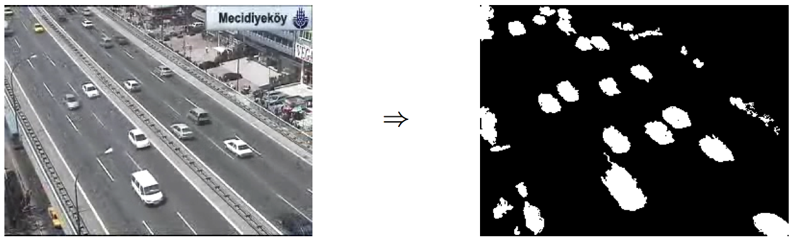
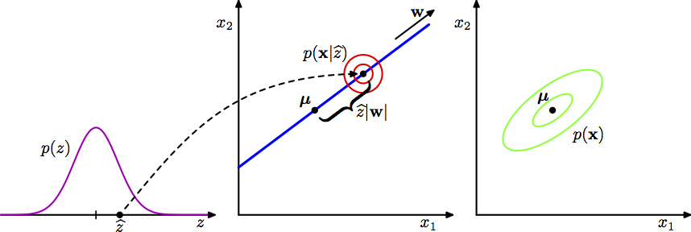

# Variables latentes y algoritmo EM

En esta sección estudiaremos modelos de variable latente y el algoritmo de 
esperanza-maximización.

### Recordatorio de datos faltantes

1. El modelo para los datos completos está parametrizado con $\theta$:
  $$p_{\theta}(y)$$

2. El proceso de censura lo incluimos mediante el vector $I$  de indicadores de 
faltantes ($I_{j}=1$ cuando el dato $j$  está censurado faltante), entonces si
el modelo para el mecanismo de faltantes está parametrizado con $\psi$:
$$p_{\psi} (I|y)$$

3. Entonces generamos los datos según (1) y luego censuramos observaciones 
según (2). Así, el modelo completo para nuestras observaciones es:
$$p_{\theta,\psi} (y,I)=p_{\theta}(y)p_{\psi}(I|y).$$

4. Escribimos $y=(y_{obs},y_{falta})$ para denotar por separado datos 
observados y datos faltantes. De tal manera que la verosimilitud para nuestros 
datos observados está dada  por
$$p_{\theta,\psi}(y_{obs},I),$$
pues sabemos los valores de las variables observadas y qué datos faltan.
Para hacer máxima verosimilitud calculamos esta conjunta. 
$$p_{\theta,\psi} (y_{obs},I)=\int p_{\theta,\psi} (y_{obs}, y_{falta},I)d y_{falta}$$
$$=\int p_{\psi}(I|y_{obs},y_{falta})p_{\theta} (y_{obs}, y_{falta})d y_{falta}.$$
Nótese que esta integral (o suma, dependiendo del caso), promedia los valores
faltantes según el modelo de los datos $p_{\theta}$
De la ecuación de arriba, vemos que en general tendríamos que modelar también el
mecanismo de datos faltantes y estimar todos los parámetros. Esto es difícil no
solamente porque hay más parámetros, sino porque en la práctica _puede ser 
difícil proponer un modelo razonable para datos faltantes_. Preferimos
hacer un supuesto (MCAR, MAR).

5. Si se cumple MAR, entonces tenemos que
$$p_{\psi}(I|y_{obs},y_{falta})=p_{\psi}(I|y_{obs}),$$
y por tanto,
$$p_{\theta,\psi} (y_{obs},I)= p_{\psi}(I|y_{obs})\int p_{\theta} (y_{obs}, y_{falta})dy_{falta}.$$
notamos que los parámetros $\psi$ y $\theta$ están en factores separados y para
encontrar los estimadores de máxima verosimilitud, no es necesario trabajar con 
$\psi$ ni el mecanismo al azar. El mecanismo de faltantes es entonces ignorable. 

## Algoritmo de Esperanza-Maximización (EM)

Recordemos que el problema de maximización de verosimilitud se vuelve más 
difícil en la presencia de datos faltantes.

**Ejemplo.** Escogemos al azar una moneda y luego tiramos un volado con esa 
moneda (modelo Moneda -> Sol):
```{r}
ej_1 <- data.frame(moneda = c('A', 'A', 'B', 'B', 'B', NA), 
  sol = c(1, 0, 0, 0, 1, 0))
ej_1
```

Si parametrizamos con $\theta=P(moneda=A)$, $\theta_A=P(sol|moneda=A)$ y
 $\theta_B=P(sol|moneda=B)$, la log verosimilitud  para los datos completos es
$$\log (\theta\theta_A) + \log(\theta(1-\theta_A)) + 2\log((1-\theta)(1-\theta_B))+
\log((1-\theta)\theta_B)$$
$$= 2\log\theta+3\log(1-\theta)+\log\theta_A+\log(1-\theta_A)+2\log(1-\theta_B)+\log\theta_B$$
En este caso es fácil encontrar los estimadores de máxima verosimilitud. Ahora, 
para incluir la contribución del caso con faltante suponemos MAR y promediamos
los valores faltantes (como indica la fórmula en (5), cambiando la integral por 
suma):

$$p_{\theta}(x^{6}_{sol}=0 )=p_{\theta}(x^{6}_{sol}=0 |x^{6}_{moneda}=A)
p_{\theta}(x^{6}_{moneda}=A) +  p_{\theta}(x^{6}_{sol}=0 |x^{6}_{moneda}=B)
p_{\theta}(x^{6}_{moneda}=B),$$
y ahora buscamos maximizar
$$p_{\theta}(y_{obs})=2\log\theta+3\log(1-\theta)+\log\theta_A+\log(1-\theta_A)+2\log(1-\theta_B)+\log\theta_B + \log((1-\theta_A)\theta + (1-\theta_B)(1-\theta)).$$

Notemos que esta expresión es más difícil de maximizar. El algoritmo EM da un 
algoritmo iterativo para encontrar máximos locales de la verosimilitud 
$p_{\theta} (y_{obs})$. Este algoritmo sigue una estrategia de optimización 
motivada por la noción misma de datos faltantes y considerando la distribución
condicional de los faltantes dado lo observado.

<div class="caja">
El algoritmo de **esperanza-maximización (EM)** es un proceso iterativo
para maximizar verosimilitud en presencia de datos faltantes. Cada iteración 
consiste de dos 
pasos:

* Calcular el valor esperado de la log-verosimilitud promediando sobre datos 
faltantes con una aproximación de la solución ($\theta^{(t)}$).

* Obtener una nueva aproximación maximizando la cantidad resultante en el paso
previo.
</div>

Podemos ver que el algorimto EM que el paso de esperanza consiste en un 
_soft assignment_ de cada valor faltante de acuerdo al modelo de los datos y 
los datos observados.

Denotemos por $\theta^{(t)}$ el maximizador estimado en la iteración $t$ 
($t=0,1,...$). En lugar de tratar directamente con 
$\log p_{\theta}(y_{obs})=\log p(y_{obs}\theta)$ el algoritmo EM trabaja sobre $Q(\theta \vert \theta^{(t)})$ que definimos como la
esperanza de la log-verosimilitud de los datos completos $y=(y_{obs},y_{falta})$
condicional a los datos observados $y_{obs}$:

$$Q(\theta \vert \theta^{(t)})=E\big[\log\mathcal{L}(\theta|y) \big|y_{obs}, \theta^{(t)}\big]$$

$$=E \big[\log p(y|\theta) \big |y_{obs}, \theta^{(t)}\big]$$

$$=\int_{y_{falta}} [\log p(y|\theta)] p(y_{falta}|y_{obs}, \theta^{(t)})dy_{falta}.$$

Es así que en el **paso esperanza** calculamos 
$$Q(\theta|\theta^{(t)})$$
y en el **paso maximización**:
$$\theta^{(t+1)} = argmax_{\theta}Q(\theta|\theta^{(t)})$$


__Ejemplo.__ En nuestro ejemplo anterior, haríamos lo siguiente. Primero 
definimos la función que calcula el esperado de la log verosimilitud:

```{r}
# logLik: verosimilitude de datos completos
logLik <- function(theta){
  2 * log(theta[1]) + 3 * log(1 - theta[1]) + log(theta[2]) + log(1 - theta[2]) +
    log(theta[3]) + 2 * log(1 - theta[3]) 
}

pasoEsperanza <- function(theta_ant){
  function(theta){
    # a = p(moneda=A|sol=1, theta_ant)
    # b = p(moneda=B|sol=1, theta_ant)
    a_0 <- theta_ant[1] * (1 - theta_ant[2])
    b_0 <- (1 - theta_ant[1]) * (1 - theta_ant[3])
    a <- a_0 / (a_0 + b_0)
    b <- b_0 / (a_0 + b_0)
    logLik(theta) + log(theta[1] * (1 - theta[2])) * a + 
      log((1 - theta[1]) * (1 - theta[3])) * b
  }
}
```

Ahora escogemos una solución inicial y calculamos el esperado

```{r}
theta_0 <- c(0.1, 0.1, 0.1)
esperanza_0 <- pasoEsperanza(theta_0)
```

Optimizamos este valor esperado:

```{r}
max_1 <- optim(c(0.5, 0.5, 0.5), esperanza_0, control = list(fnscale = -1))
theta_1 <- max_1$par
theta_1
esperanza_1 <- pasoEsperanza(theta_1)
max_2 <- optim(c(0.5, 0.5, 0.5), esperanza_1,control=list(fnscale=-1) )
theta_2 <- max_2$par
theta_2
esperanza_2 <- pasoEsperanza(theta_2)
max_3 <- optim(c(0.5, 0.5, 0.5), esperanza_2,control=list(fnscale=-1) )
theta_3 <- max_3$par
theta_3
```


Y vemos que recuperamos la misma solución que en el caso de maximizar usando la
función _optim_.

Veamos porque funciona trabajar con $Q(\theta|\theta^{(t)})$. Si escribimos:
$$ p(y_{obs}|\theta)=\frac{p(y|\theta)}{p(y_{falta}|y_{obs},\theta)}.$$

Tomando logaritmos,
$$\log{p}(y_{obs}|\theta)=\log{p}(y|\theta)-log{p}(y_{falta}|y_{obs}, \theta).$$

Y tomando el valor esperado con respecto la distribuión de 
$y_{falta}|y_{obs}$ con parámetro $\theta^{(t)}$ (que consideramos como una 
aproximación de los verdaderos parámetros), obtenemos:

$$E\big[\log p(y_{obs}|\theta)\big | y_{obs}, \theta^{(t)}\big]=
E\big[\log p(y|\theta)\big | y_{obs}, \theta^{(t)}\big] -
E\big[\log p(y_{falta}|\theta)\big | y_{obs}, \theta^{(t)}\big]$$

$$=\int_{y_{falta}}[\log p(y|\theta)] p(y_{falta}|y_{obs}, \theta^{(t)})dy_{falta} - \int_{y_{falta}}[\log{p}(y_{falta}| y_{obs},\theta)]p(y_{falta}|y_{obs},\theta^{(t)})dy_{falta}$$
$$= Q(\theta|\theta^{(t)}) - H(\theta|\theta^{(t)})$$

La igualdad anterior es cierta para cualquier valor de $\theta$, en particular, 
$\theta=\theta^{(t)}$ por lo que:
$$\log{p}(y_{obs}|\theta) -\log{p}(y_{obs}|\theta^{(t)})= Q(\theta|\theta^{(t)}) -
Q(\theta^{(t)}|\theta^{(t)}) - [H(\theta|\theta^{(t)}) - H(\theta^{(t)}|\theta^{(t)})]$$
utilizando la desigualdad de Jensen se puede demostrar que $H(\theta|\theta^{(t)}) \leq  H(\theta^{(t)}|\theta^{(t)})$,  por lo que (en términos de la verosimilutd)
$$\log\mathcal{L}(\theta|y_{obs}) -\log\mathcal{L}(\theta^{(t)}|t_{obs}) \geq Q(\theta|\theta^{(t)}) - Q(\theta^{(t)}|\theta^{(t)})$$
y vemos que si incrementamos $Q(\theta|\theta^{(t)})$ entonces también incrementamos $\mathcal{L}(\theta|y_{obs})$.

### Observaciones del algoritmo EM

* El algoritmo EM es una generalización natural de la estiamación por 
máxima verosimilitud cuando hay presencia de datos faltantes.

* El problema de maximización que ataca EM es más complejo que el problema 
de máxima verosimilitud con datos completos. En el caso usual $\log p(x|\theta)$
tiene un único máximo global que muchas veces se puede encontrar de forma 
cerrada, por su parte la verosimilitud con datos faltantes tiene muchos 
máximos locales y no tiene solución cerrada.

* El algoritmo EM reduce el problema de múltiples máximos a una secuencia de
_subproblemas_ ($Q(\theta|\theta^{(t)}$) cada uno con un único máximo global.  
Estos subproblemas son tales que se garantiza convergencia de las soluciones
$\theta^{(1)}, \theta^{(2)}, ...$ a un máximo, pues a cada paso se incrementa
monótonamente el valor de la log-verosimilitud de los datos observados. 

* El algoritmo EM garantiza convergencia __únicamente__ a un máximo local pues 
la secuencia de $\theta^{(t)}$ depende del valor con el que se inicializa el 
proceso $\theta^{(1)}$. Por tanto, es conveniente repetir el algoritmo con 
varios valores iniciales.

* Una manera de entender el algoritmo EM es pensar que en cada paso de esperanza
_imputas_ los faltantes, sin embargo, en lugar de una imputación dura se realiza
un _soft assignment_ de cada valor faltante. El _soft assignment_ se calcula
obteniendo la probabilidad de cada alternativa para el valor faltante (usando el
parámetro $\theta^{(t)})$) para crear una base de datos ponderada que considera 
todos los posibles escenarios de los faltantes. Al usar los valores esperados
(o datos ponderados) en lugar de realizar una imputación dura el algoritmo 
toma en cuenta la confianza del modelo cada vez que _completa_ los datos.

## Variables latentes
Un caso importante de datos faltantes es cuando una variable está totalmente
censurada. Esto puede suceder por dos razones:

* Alguna variable claramente importante está totalmente censurada (por ejemplo, 
peso en un estudio de consumo de calorías).

* Cuando buscamos añadir estructura a nuestro modelo para simplificar su 
estimación, interpretación o forma. Por ejemplo: hacer grupos de actitudes ante 
la comida y el ejercicio para explicar con una sola variable el consumo de 
comida chatarra (por ejemplo, análisis de factores).

En estos casos, estas variables se llaman _variables latentes_, pues 
consideramos que tienen un efecto que observamos a través de otras variables, 
pero no podemos observar directamente los valores de esta variable.

<div class="clicker">
 ¿Cuál es el supuesto apropiado acerca 
de este tipo de valores censurados (variables latentes)?

a. MCAR   
b. MAR     
c. MNAR  
d. Ninguno de estos

</div>

La siguiente tabla es una clasificación de los modelos de variable latente
de acuerdo a la métrica de las variables latentes y observadas.

Latentes/Observadas|  Métricas | Categóricas
-------------------|-----------|-------------
**Métricas**| Análisis de factores (FA) | Modelos de rasgos latentes (LTM)
**Categóricas** | Modelos de perfiles latentes (LPM) | Modelos de clases latentes (LCM)

<!--
El supuesto apropiado acerca de este tipo de valores censurados es MCAR: 
la censura tiene probabilidad 1, así que es independiente de cualquier otra 
variable.
-->

### Modelos de perfiles latentes: Mezcla de normales
El ejemplo más clásico de variables latentes es el de mezcla de normales.

**Ejemplo.** Modelo de mezcla de dos normales. Consideremos los siguientes 
datos:

```{r}
library(ggplot2)
set.seed(280572)
N <- 800
n <- sum(rbinom(N, 1, 0.6))

x_1 <- rnorm(N - n, 0, 0.5)
x_2 <- rnorm(n, 2, 0.3)
qplot(c(x_1, x_2))
```

Estos datos tienen una estructura bimodal. Es poco apropiado modelar estos datos 
con un modelo normal $(\mu,\sigma^2)$.

Podemos entonces modelar pensando que los datos vienen de dos clases, cada una 
con una distribución normal pero con distintos parámetros. ¿Cómo ajustaríamos 
tal modelo?

<div class="caja">
La variable aleatoria $X$ es una mezcla de normales si
$$p(x)=\sum_{k=1}^K \pi_k \phi_{\theta_k}(x)$$
donde $\phi_{\theta_k}$ es una densidad normal con parámetros 
$\theta_k=(\mu_k, \sigma_k)$ y los ponderadores de la mezcla $\pi_k$ satisfacen
$\sum_i \pi_i = 1$
</div>

Ahora, si vemos la mezcla Gaussiana desde la representación generativa, o 
formulación en variable latente, tenemos el modelo gráfico $\Delta$ -> $X$
donde $\Delta$ es una indicadora de clase. En el caso del modelo de dos clases
tenemos $\delta \in \{0,1\}$ y sea $P(\delta=1)=\pi$, escribimos la conjunta
$$p(\delta, x)=\pi^{\delta}(1-\pi)^{1-\delta}[\delta\phi_{\theta_1}(x)+(1-\delta)\phi_{\theta_2}(x)]$$

y podemos verificar que la distribución marginal es una mezcla gaussiana:
$$p(x)\sum_{\delta}p(x|\delta)p(\delta)$$
$$=\phi_{\theta_1}(x) \pi + \phi_{\theta_2}(x)(1-\pi)$$

Ahora, si conocieramos la clase a la que pertenece cada observación ($\delta^i$)
podríamos escribir la log-verosimilitud completa (sin censura) como
$$\sum_{i=1}^N \log(\delta^i \phi_{\theta_1} (x^i)+ (1-\delta^i)\phi_{\theta_2}(x^i)) + \delta^i \log\pi + (1-\delta^i)\log(1-\pi).$$

Aquí, es fácil ver que la verosimilitud se separa en dos partes, una
para $\delta^i=1$ y otra para $\delta^i=0$, y los estimadores de máxima
verosimilitud son entonces:

$$\hat{\mu}_1=\frac{\sum_i\delta^i x^i}{\sum_i (\delta^i)}$$
$$\hat{\mu}_2=\frac{\sum_i(1-\delta^i) x^i}{\sum_i (1-\delta^i)}$$

$$\hat{\sigma}_1^2=\frac{\sum_i\delta^i (x^i-\mu_1)^2}{\sum_i (\delta^i)}$$
$$\hat{\sigma}_2^2=\frac{\sum_i(1-\delta^i) (x^i-\mu_2)^2}{\sum_i (1-\delta^i)},$$

y $\hat{\pi}$ es la proporción de casos tipo 1 en los datos.
Este problema es entonces trivial de resolver. 

En el caso de variables latentes $\delta^i$ están censuradas y tenemos que 
marginalizar con respecto a $\delta^i$, resultando en:

$$\sum_{i=1}^N \log(\pi \phi_{\theta_1} (x^i)+ (1-\pi)\phi_{\theta_2}(x^i)).$$

donde $\pi$ es la probabilidad de que la observación venga de la primera
densidad.  Este problema es más difícil pues tenemos tanto $\pi$ como $\theta_1$ 
y $\theta_2$ dentro del logaritmo. Podemos resolver numéricamente como sigue:

```{r}
crearLogLike <- function(x){
  logLike <- function(theta){
    pi <- exp(theta[1]) / (1 + exp(theta[1]))
    mu_1 <- theta[2]
    mu_2 <- theta[3]
    sigma_1 <- exp(theta[4])
    sigma_2 <- exp(theta[5])
    sum(log(pi*dnorm(x, mu_1, sd=sigma_1)+(1-pi)*dnorm(x,mu_2,sd=sigma_2)))
  }
  logLike
}
func_1 <- crearLogLike(c(x_1,x_2))
system.time(salida <- optim(c(0.5,0,0,1,1), func_1, control=list(fnscale=-1)))
salida$convergence
exp(salida$par[1]) / (1 + exp(salida$par[1]))
salida$par[2:3]
exp(salida$par[4:5])
```

Y vemos que hemos podido recuperar los parámetros originales.

Ahora implementamos EM para resolver este problema. Empezamos con la
log-verosimilitud para datos completos (que reescribimos de manera más 
conveniente):
$$\sum_{i=1}^N \delta^i\log\phi_{\theta_1} (x^i)+ (1-\delta^i)\log\phi_{\theta_2}(x^i) + \delta^i \log\pi + (1-\delta^i)\log(1-\pi).$$

Tomamos valores iniciales para los parámetros 
$\hat{\mu}_1,\hat{\mu}_2,\hat{\sigma}_1^2, \hat{\sigma}_2^2, \hat{\pi}$ 
y comenzamos con el paso **Esperanza** promediando sobre las variables 
aleatorias, que en este caso son las $\delta^i$. Calculamos entonces
$$\hat{\gamma}^i=E_{\hat{\theta}}(\delta^i|x^i)=P(\delta^i=1|x^i),$$
y usamos bayes para expresar en términos de los parámetros:
$$\hat{\gamma}^i=  \frac{\hat{\pi}\phi_{\hat{\theta_1}}}
{\hat{\pi}\phi_{\hat{\theta_1}}(x_i)+(1-\hat{\pi})\phi_{\hat{\theta_2}}(x_i)}$$

$\hat{\gamma}^i$ se conocen como la _responsabilidad_ del modelo 1 para explicar
la i-ésima observación. 

Utilizando estas _asignaciones_ de los faltantes pasamos al paso 
__Maximización__, donde la función objetivo es:
$$\sum_{i=1}^N \hat{\gamma}^i\log \phi_{\theta_1} (x^i)+ (1-\hat{\gamma}^i)\log\phi_{\theta_2}(x^i) + \hat{\gamma}^i \log\pi + (1-\hat{\gamma}^i)\log(1-\pi).$$

La actualización de $\pi$ es fácil:

$$\hat{\pi}=\frac{1}{N}\sum_i{\gamma^i}.$$

y se puede ver sin mucha dificultad que 

$$\hat{\mu}_1=\frac{\sum_i\hat{\gamma}^i x^i}{\sum_i \hat{\gamma}^i}$$
$$\hat{\mu}_2=\frac{\sum_i(1-\hat{\gamma}^i) x^i}{\sum_i (1-\hat{\gamma}^i})$$

$$\hat{\sigma}_1^2=\frac{\sum_i\hat{\gamma}^i (x^i-\mu_1)^2}{\sum_i \hat{\gamma}^i}$$
$$\hat{\sigma}_2^2=\frac{\sum_i(1-\hat{\gamma}^i) (x^i-\mu_2)^2}{\sum_i (1-\hat{\gamma}^i)},$$

 Implementa EM para el ejemplo de 
mezcla de normales.


## Mezclas gaussianas

Un caso más general es suponer que hay $K$ posibles clases y las distribuciones
de la mezcla son normal multivariadas. De tal manera que 
$$P(\delta_k^i=1)=\pi_k, \sum_{k=1}^K \pi_k =1$$

Entonces, la distribución de los datos observados es la mezcla Gaussiana:

$$p(x)=\sum_{k=1}^K \pi_k p_{\theta_k}(x)$$

donde $p_{\theta_k}$ es normal multivariada con parámetros $\theta_k=\{\mu_k, \Sigma_k\}$,

$$p_{\theta_k}(x)=\frac{1}{(2\pi|\Sigma_k|)^{1/2}}exp\big\{\frac{1}{2}(x-\mu_k)^T \Sigma_k^{-1}(x-\mu_k)\big\}$$

La estimación en el caso multivariado con $K$ clases se realiza con el algoritmo 
EM de manera análoga al caso de dos clases y normal univariada; sin embargo, 
es posible restringir el tipo de mezcla a clases de distribuciones Gaussianas
determinadas por la matriz de covarianzas.

Consideremos la descomposición de espectral de la $k$-ésima matriz de 
covarianzas:

$$\Sigma_k=\lambda_k D_k A_k D_k^T$$

* $A_k$ es una matriz diagonal con $det(A_k)=1$ y entradas diagonales 
proporcionales a los eigenvalores de $\Sigma_k$. $A_k$ controla la **forma** 
(_shape_) del $k$-ésimo cluster.

* $\lambda_k$ es una constante igual al $det(\Sigma_k)$ que controla el 
**volumen** del $k$-ésimo cluster.

* $D_k$ es la matriz ortonormal de eigenvectores y controla la __orientación__
del $k$-ésimo cluster.

Utilizando la descomposición de arriba hay modelos de mezclas Gaussianas que 
se restringen a cluster con propiedades particulares, por ejemplo:

* $\Sigma_k=\lambda I$: clusters esféricos de igual volumen.

* $\Sigma_k=\lambda_k I$: clusters esféricos de distinto volumen.

* $\Sigma_k=\lambda_k A$: clusters elipsoidales de distinto volumen pero misma
forma , orientaciones alineadas con el eje.

...

* $\Sigma_k=\lambda_k D_k A_k D_k^T$ modelo sin restricciones.

Ahora veremos como ajustar estos modelos. En R hay varios paquetes para ajustar 
mezclas gaussianas, dos de ellos son [mclust](http://www.stat.washington.edu/research/reports/2012/tr597.pdf) 
y [mixtools](http://www.jstatsoft.org/v32/i06/paper). También está [flexmix](http://cran.r-project.org/web/packages/flexmix/vignettes/flexmix-intro.pdf)

Veamos un ejemplo usando mclust, en este paquete los modelos disponibles son

```
?mclustModelNames
Mezclas Univariadas  	
"E"	=	equal variance (one-dimensional)  
"V"	=	variable variance (one-dimensional)  
Mezclas multivariadas
"EII"	=	spherical, equal volume  
"VII"	=	spherical, unequal volume  
"EEI"	=	diagonal, equal volume and shape  
"VEI"	=	diagonal, varying volume, equal shape  
"EVI"	=	diagonal, equal volume, varying shape  
"VVI"	=	diagonal, varying volume and shape  
"EEE"	=	ellipsoidal, equal volume, shape, and orientation  
"EEV"	=	ellipsoidal, equal volume and equal shape  
"VEV"	=	ellipsoidal, equal shape  
"VVV"	=	ellipsoidal, varying volume, shape, and orientation
```

La nomenclatura es: E=equal, V=varying, I=identity, y las letras están ordenadas
1ra=volumen, 2a=forma, 3ra=orientación.

En todos los modelos hay $K-1$ parámetros para las probabilidades iniciales 
$\pi_k$ mas $Kp$ parámetros para las medias mas los parámetros de la matriz
de covarianzas:


Los modelos con menos restricciones tienen más parámetros por estimar y por 
tanto necesitan de más datos para alcanzar la misma precisión.

Usaremos los datos [wine](https://archive.ics.uci.edu/ml/machine-learning-databases/wine).

```{r, fig.height=7, warning=FALSE, message=FALSE}
library(mclust)
wine <- read.csv("data/wine.csv", stringsAsFactors=FALSE)[, -1]
w_mclust <- Mclust(wine)
summary(w_mclust)
```

Podemos ver más detalles:

```{r}
summary(w_mclust, parameters = TRUE)
```

Y podemos ver una tabla con el BIC para cada modelo, es importante tomar en 
cuenta que en mclust el BIC se define como:

$$BIC = 2\log l(x;\hat{\theta}) - d\log n$$

$d$ es el número de parámetros y $n$ el número de observaciones. Por tanto, 
buscamos maximizar el BIC.

```{r, fig.height=7, warning=FALSE, message=FALSE}
round(w_mclust$BIC)
w_mclust
```

En la tabla de arriba, los renglones indican el número de conglomerados.

El paquete incluye algunas gráficas auxiliares.

```{r, fig.height=5, fig.width = 5, warning=FALSE, message=FALSE}
plot(w_mclust, what = "BIC")
# hay 3 plots más:
# plot(w_mclust)
```

Y podemos hacer otras gráficas, por ejemplo podemos usar [tourr](http://www.jstatsoft.org/v40/i02/paper) para explorar los datos multivariados.

```{r, fig.width=5, fig.height=4.6, message=FALSE,warning=FALSE, eval=FALSE}
library(tourr)

w_mclust <- Mclust(wine, G = 3, modelNames = "VVI")
summary(w_mclust)

cl_p <- data.frame(cluster = w_mclust$classification, wine)

aps <- 2
fps <- 20

mat <- rescale(wine)
tour <- new_tour(mat, grand_tour(), NULL)
start <- tour(0)
proj_data <- reactive({
  invalidateLater(1000 / fps, NULL);
  step <- tour(aps / fps)
  data.frame(center(mat %*% step$proj), 
             clusters = factor(w_mclust$classification))
})
proj_data %>% ggvis(~X1, ~X2, fill = ~clusters) %>%
  layer_points() %>%
  scale_numeric("x", domain = c(-1, 1)) %>%
  scale_numeric("y", domain = c(-1, 1)) %>%
  set_options(duration = 0)
```

### Observaciones

* Las mezclas Gaussianas son sensibles a datos atípicos (outliers).

* Puede haber inestabilidad si los componentes Gaussianos no están separados
apropiadamente o si los datos son chicos.

* A comparación de otros métodos de _clustering_ el tener un modelo 
probabilístico explícito hace posible verificar supuestos y tener medidas de
ajuste. Por ejemplo, podemos usar BIC para elegir el número de _clusters_.

* _k-medias_ es un caso particular de mezclas gaussianas donde en cada paso
se realizan asignaciones _duras_. 

* Desventajas: los resultados dependen de la inicialización del algoritmo EM, 
puede ser demasiado flexible o inestable.

* Las mezclas gaussianas se pueden extender a mezclas de modelos de regresión
que pueden ser modelos lineales estándar o modelos lineales generalizados.
Esto esta implementado en el paquete _flexmix_ que utiliza el algoritmo EM.


### Aplicación: Background Subtraction

_Background Subtraction_ es una técnica de procesamiento de imágenes donde 
se buscan extraer los objetos en el frente de la imagen. Por ejemplo, puede ser 
de interés  detectar autos, animales o personas de una imagen. Ejemplos:

* Monitoreo de tráfico (contar vehiculos, detectar y seguir vehículos).  

* Reconocimiento de actividades humanas (correr, caminar, brincar).

* Seguimiento de objetos (seguir la bola en el tenis).



Los modelos de mezclas gaussianas son populares para esta tarea: la idea básica
es suponer que la intensidad de cada pixel en una imagen se puede modelar usando 
un modelo de mezclas Gaussianas. Después se determina 
que intensidades corresponden con mayor probabilidad al fondo seleccionando
como fondo las gaussianas con menos varianza y mayor evidencia ($\pi_j$).

En [OpencCV](http://docs.opencv.org/trunk/doc/py_tutorials/py_video/py_bg_subtraction/py_bg_subtraction.html) hay tres algoritmos implementados para sustraer fondo, estos usan variantes de 
mezclas gaussianas:

1. [An Improved Adaptive Background Mixture Model for Real- time Tracking with Shadow Detection](http://www.ee.surrey.ac.uk/CVSSP/Publications/papers/KaewTraKulPong-AVBS01.pdf)

2. [Efficient Adaptive Density Estimation per Image Pixel for the Task of Background Subtraction](http://www.zoranz.net/Publications/zivkovicPRL2006.pdf)

3. [Improved adaptive Gausian mixture model for background subtraction](http://www.zoranz.net/Publications/zivkovic2004ICPR.pdf)

## PCA y Análisis de Factores

Continuamos explorando modelos de variable latente, en particular exploramos
casos de variable latente continua. Una motivación para estos modelos es que
muchos conjuntos de datos tienen la propiedad que los puntos caen en un 
variedad de dimensión mucho menor a la dimensión original de los datos.

Para entender esta idea consideremos una base de datos consrtuida con uno de 
los dígitos de la base de datos [mnist](http://yann.lecun.com/exdb/mnist/), 
esta imagen esta representada por una matriz de $64 \times 64$ pixeles, ahora
insertamos este dígito en una matriz más grande de $100 \times 100$ agregando
espacio en blanco y variamos de manera aleatoria la orientación y ubicación 
del dígito.


Cada una de las imágenes resultantes está representada por un punto en el 
espacio de dimensión $100 \times 100 = 10,000$; sin embargo, en una base
de datos construida de esta manera solamente hay 3 grados de libertad de 
variabilidad, estas corresponden a las rotaciones, trasalación vertical y 
traslación horizontal. 

Para datos reales habrá más grados de libertad debido por una parte a
escalamiento y por otra habrá múltiples grados adicionales debidas a 
deformaciones debidas a la variabilidad en la escritura de un individuo y entre
individuos. Aún así, la la dimensionalidad de los grados de libertad es mucho
menor que la de los datos completos.

```{r, fig.width=9.4, fig.height=2.5}
library(deepnet)
library(RColorBrewer)

mnist <- load.mnist("data/mnist")[["train"]]
ind_tres <- mnist[[3]] == 3
data_tres <- mnist[[2]][ind_tres, ]
par(mfrow=c(1,5))

imageD <- function(vec, main = NULL){
  mat_digit <- matrix(vec, nrow = 28)[, 28:1]
  image(mat_digit, col = brewer.pal(5, "GnBu"), xaxt = "n", yaxt = "n", 
    bty = "n", asp = 1, main = main)
}

for(i in sample(1:nrow(data_tres), 5)){
  imageD(data_tres[i, ])
}
```

El modelo de variable latente más simple supone distribuciones Gaussianas para 
las variables latentes y las observadas, además de usar dependencia lineal 
Gaussiana entre latentes y observables. Este escenario corresponde a PCA
probabilítsico y a análisis de factores.

## Componentes principales

El análisis de componentes principales (PCA) es una técnica que se utiliza 
con distintos objetivos:

1. Reducción de dimensionalidad.

2. Compresión de información con pérdida (_lossy_).

3. Extracción de características o (_features_).

4. Visualización de datos.

Podemos ver PCA desde dos puntos de vista que nos llevan al mismo resultado:

<div class="caja">
* PCA se puede definir como una proyección de los datos en un
espacio de dimensión menor (conocido como subespacio principal), tal que 
la varianza de los datos proyectados es máxima.

* PCA se puede definir como la proyección lineal que minimiza el costo medio 
de proyección, donde el costo promedio es la distancia media al cuadrado
entre los puntos y sus proyecciones.
</div>

### Formulación de máxima varianza

Consideremos un vector de observaciones $(y^1,...,y^n)$ donde $y_i$ es de 
dimensión $d$. Nuestro objetivo es proyectar los datos en un espacio de 
dimensión $M<D$ maximizando la varianza de la proyección.

Comencemos considerando la proyección en un espacio de dimensión uno, denotamos
la dirección de este espacio por $u_1$ y por conveniencia usamos un vector 
unitario ($u_1^Tu_1=1$). La proyección de cada punto $y_i$ es un escalar (pues
$M=1$) cuyo valor es $u_1^Ty_i$. La media de los datos proyectados es 
$u_1^T\bar{y}$ donde 
$$\bar{y}=\frac{1}{N}\sum_{i=1}^N y_i$$
por tanto la varianza de los datos proyectados es
$$\frac{1}{N}\sum_{i=1}^N (u_1^Ty_i-u_1^T\bar{y})^2=u_1^TSu_1$$
donde S es la matriz de covarianzas de los datos:
$$S=\frac{1}{N}\sum_{i=1}^N (y_i-\bar{y})(y_i-\bar{y})^T.$$

Ahora maximizamamos la varianza de la proyección respecto a $u_1$:
$$argmax_{u_1}u_1^TSu_1 + \lambda_1(1-u_1^Tu_1)$$
Derivando encontramos un punto estacionario en 
$$Su_1=\lambda_1u_1$$
por lo que $u_1$ debe ser un eigenvector de S, notamos también que la varianza 
esta dada por:
$$u_1^TSu_1=\lambda_1$$
y por tanto la varianza será máxima si igualamos $u_1$ con el mayor 
eigenvector de $S$, que llamamos primer componente principal.

Si elegimos $M>1$, definimos los componentes de manera incremental, en cada 
paso seleccionamos una nueva dirección eligiendo cada nueva dirección como 
aquella que maximiza la varianza de la proyección sujeta a ser ortogonal a las
direcciones (componentes) ya elegidos. Esto resulta en que la proyección lineal
óptima para la cual la varianza de los datos proyectados es máxima esta
definida por el conjunto de $M$ eigenvectores $u_1,...,u_M$ de la matriz de 
covarianzas $S$.

### Formulación de error mínimo

Ahora discutimos el segundo punto de vista de PCA. Sea $(u_1,...,u_D)$ una 
base ortonormal de vectores, esto es $u_i^Tu_j = 0$ para toda $i$ distinta de 
$j$ y $u_i^Tu_i = 1$.

Como esta es una base de $R^D$ podemos expresar los datos observados como

$$y_i=\sum_{j=1}^D \alpha_{ij}u_j$$

Esto corresponde a una rotación en el sistema de coordenadas. Utilizando la 
propiedad ortonormal obtenemos $\alpha_{ij}={y_i} ^Tu_j$, por tanto:

$$y_i=\sum_{j=1}^D ({y_i} ^Tu_j) u_j$$

Ahora, como buscamos aproximar este punto ($y_i$) usando una representación 
que involucre un número de variables $M<D$, la subespacio de dimensión $M$
se puede representar usando los primeros $M$ vectores de la base, de tal manera 
que podemos aproximar cada punto como:

$$\hat{y}_i=\sum_{j=1}^M x_{ij}{u_j} + \sum_{j=M+1}^D b_j u_j$$

donde los valores $x_{ij}$ dependen del dato que estamos proyectando y las $b_j$
son constantes para todos los datos. Buscamos $(u_1,...,u_D)$, $x_{ij}$ y $b_j$
tal que se minimice la distorsión introducida por la reducción de dimensión, 
donde definimos la distorsión como la distancia al cuadrado entre el punto
original $y_i$ y la aproximación $\hat{y}_i$ promediada sore todos los puntos
de la base de datos:

$$J=\frac{1}{N}\sum_{j=1}^N(y_j-\hat{y}_j)^T(y_j-\hat{y}_j)$$

La minimización (derivar e igualar a cero) nos lleva a:

* $x_{ij}=y_i^Tu_j$, con $j=1,...,M$

* $b_{j}=\bar{y}^Tu_j$, con $j=M+1,...,D$

Sustituyendo $x_{ij}$ y $b_j$ en $y_i=\sum_{j=1}^D ({y_i} ^Tu_j) u_j$ llegamos a
$$y_i-\hat{y}_i=\sum_{j=M+1}^D [(y_n-\bar{y})^Tu_j]u_j$$

y vemos que el error mínimo ocurre en la proyección ortogonal sobre el 
subespacio generado por $\{u1,...,u_M\}$.

Usando lo anterior obtenemos

$$J=\frac{1}{N}\sum_{j=1}^N \sum_{i=M+1}^D [(y_n-\bar{y})^Tu_j]^T[(y_n-\bar{y})^Tu_j]$$
$$J=\frac{1}{D}\sum_{j=1}^D u_i^TSu_i$$

Aún falta minimizar $J$ respecto a $u_i$, esta es una minimización con la 
restricción $u_i^Tu_i=1$, si derivamos respecto a $u_i$ obtenemos

$$Su_i=\lambda_i u_i$$

por lo que cualquier eigenvector de S corresponde a un punto crítico. Si todos
corresponden a un punto crítico ¿cómo elegimos? Notemos que si sustituimos la
solución de $u_i$ en J obtenemos

$$J=\sum_{j=M+1}^D \lambda_j$$

por lo que para obtener el mínimo valor de $J$ hay que seleccionar los $D-M$
eigenvectores corresponidientes a los menores eigenvalores y por tanto los 
eigenvectores que definen el subespacio principal corresponden a los $M$ 
eigenvectores mayores.

### Aplicaciones de PCA
Veamos un par de aplicaciones de PCA, comenzaremos con compresión de imágenes
y luego examinaremos PCA como preprocesamiento.

#### Compresión de datos

Veamos un ejemplo de PCA para compresión de información usando la base de 
datos de mnist, en particular veamos los dígitos tres.

```{r}
data_tres <- mnist[[2]][ind_tres, ]
dim(data_tres)
```

Como cada eigenvector es un vector en el espcio original de $D$ dimensiones 
podemos representarlos como imágenes.

```{r, fig.width=9.4, fig.height=2.5}
data_tres <- mnist[[2]][ind_tres, ]
tres_mean <- apply(data_tres, 2, mean)

S <- cov(data_tres)
eigen_S <- eigen(S)
lambda <- eigen_S$values
u <- eigen_S$vectors

par(mfrow=c(1,5))
imageD(tres_mean)
for(i in 1:4){
  imageD(u[, i])  
}
```

Podemos ver el resto de los eigenvalores en la gráfica de abajo. Graficamos 
también la medida de distorsión $J$ asociada a la elección del número de 
componentes $M$ (dada por la suma de los eigenvalores $M+1$ a $D$).

```{r, fig.width=6, fig.height=4}
D <- length(lambda)
J <- sapply(1:D, function(i){sum(lambda[i:D])})
par(mfrow=c(1,2))
plot(lambda, type = "l")
plot(J, type = "l")
```

Si vemos las fórmulas de arriba podemos escribir el vector de aproximación 
correspondiente a una observación.

$$\hat{y}_i=\sum_{j=1}^M x_{ij}{u_j} + \sum_{j=M+1}^D b_j u_j$$
$$=\sum_{j=1}^M (y_i^Tu_j){u_j} + \sum_{j=M+1}^D (\bar{y}^Tu_j) u_j$$
$$=\bar{y} + \sum_{j=1}^M (y_i^Tu_j-\bar{y}^Tu_j)u_j$$

donde usamos:
$$\bar{y}=\sum_{j=1}^D (\bar{y}^Tu_j)u_j$$

La compresión está en que reemplazamos cada vector de observaciones de dimensión 
$D$ ($y_i$) por un vector de dimensión $M$.

La siguiente figura muestra la compresión para distintos valores de $M$ del
prmer dígito de la base de datos. 

```{r, fig.width=9.4, fig.height=2.5}
tres_1 <- data_tres[3, ]
par(mfrow=c(1,5))
imageD(tres_1)
for(M in c(1, 10, 50, 300)){
  u_M <- u[, 1:M]
  y_M <- tres_1 %*% u_M
  y_approx <- tres_mean + y_M %*% t(u_M)
  imageD(y_approx)
}
```

 Comprime una imagen en blanco y negro.

```{r, eval=FALSE, echo=FALSE}
## load image
library(bmp)
library(pixmap)
library(jpeg)

grey <- readJPEG("img/perrito.jpg", native = FALSE)[,,1]

pr <- pixmapGrey(grey)
plot(pr)

size <- dim(img)

k <- 5 #was calculated with sum(s$d[1:285])/sum(s$d) = 0.9919 -> covers 99% of the data

## calculate mean
columnMeans <- colMeans(grey)

## subtract mean
greyNoMean = t(apply(grey,1,columnMeans,FUN="-"))

s <- svd(greyNoMean)

u_M <- s$v[,1:k]

y_M <- greyNoMean %*% u_M

y_approx <- y_M %*% t(u_M)

pr <- pixmapGrey(y_approx)
plot(pr)
## add mean
y_mean = t(apply(y_approx,1,columnMeans,FUN="+"))
pr <- pixmapGrey(y_mean)
plot(pr)
```


#### Preprocesamiento {-}

Otra aplicación de componentes principales es preprocesamento, en este caso
el objetivo no es reducción de dimensión sino la transformación de un conjunto
de datos con el fin de estandarizar algunas de sus propiedades. Esto puede ser
importante para el correcto funcionamiento de algoritmos o métodos que se desean 
usar después.

Veamos los datos _faithful_ de erupciones del volcán Old Faithful.

```{r}
head(faithful)
```

```{r, eval=FALSE, echo=FALSE}
plot(faithful)

pca_f <- prcomp(faithful, scale = FALSE)
biplot(pca_f)
pca_f <- prcomp(faithful, scale = TRUE)
biplot(pca_f)

S <- cov(faithful)
S_1 <- eigen(S)
L <- diag(S_1$values)
U <- S_1$vectors
y <- t(t(U) %*% (t(faithful) - apply(faithful, 2, mean)))

y <- t(solve(sqrt(L)) %*% t(U) %*% (t(faithful) - apply(faithful, 2, mean)))
```

Notamos que
el tiempo entre erupciones es de un orden de magnitud mayor que la duración de 
la erupción. Por ejemplo, si quisieramos hacer k-medias sería natural 
estandarizar los datos. Sin embargo, con PCA podemos normalizar los datos 
para tener cero media y covarianza unitaria, de tal manera que la correlación 
entre distintas variables es cero.

Para hacer esto escribimos la ecuación de eigenvectores como 
$$SU=UL$$

donde $L$ es una matriz diagonal con los elementos $\lambda_i$ y $U$ es una 
matriz ortogonal cuyas columnas son los vectores $u_i$. Entonces, para cada
observación $y_i$ definimos su valor transformado 

$$z_i=L^{-1/2}U^T(y_i-\bar{y})$$

es claro que el conjunto $(z_1,...,z_N)$ tiene media cero, veamos ahora la 
covarianza:

$$\frac{1}{N}\sum_{j=1}^Nz_jz_j^T=\frac{1}{N}\sum_{j=1}^NL^{-1/2}U^T(y_j-\bar{y})(y_j-\bar{y})^TUL^{-1/2}$$

$$=L^{-1/2}U^TSUL^{-1/2}=L{-1/2}LL^{-1/2}=I$$

Esta operación se conoce como _whitening_ o _sphereing_.

```{r, echo=FALSE,eval=FALSE}
head(faithful)
par(mfrow=c(1, 2))

ggplot(faithful, aes(x = eruptions, y = waiting)) +
  geom_point()

faith_pca <- prcomp(faithful, scale. = TRUE)

faithful$pc1 <- faith_pca$x[, 1]
faithful$pc2 <- faith_pca$x[, 2]
ggplot(faithful, aes(x = pc1, y = pc2)) +
  geom_point()
```

 Implementa _whitening_ en los datos
_faithful_, compara las gráficas de los datos crudos y preprocesados.

## PCA probabilístico y Análisis de Factores

La formulación de PCA esta fundada en una proyección lineal de los datos sobre
un subespacio de dimensión menor. En esta sección veremos que PCA también se 
puede expresar como la solución de máxima verosimilitud de en un modelo 
probabilístico de variable latente.

Para formular PCA probabilístico introducimos una variable latente $X$ que
corresponde al subespacio de componentes principales, suponemos $X\sim N(0, I)$.
Por otra parte, la distribución de la variable aleatoria observada $Y$ 
condicional a la variable latente $X$ es $Y|X\sim N(Wx+\mu, \sigma^2I$

Veremos que las columnas de $W$ (dimensión $D\times M$) generan un subsepacio 
que correponde al subespacio de componentes principales.

El siguiente esquema explica el modelo PCA probabilístico desde el punto de
vista generativo.



Desde este enfoque vemos que primero selecciona aleatoriamente un valor de la 
variable latente ($x$) y después muestreamos el valor observado condicional
a la variable latente, en particular la variable obsevada (de dimensión $D$)
se define usando una transformación lineal del espacio latente mas ruido 
Gaussiano aleatorio:

$$y=Wx + \mu + \epsilon$$

donde $x\sim N(0, I)$ de dimensión $M$ y $\epsilon \sim N(0, \sigma^2I)$ de 
dimensión $D$.

Ahora, si queremos usar máxima verosimilitud para estimar $W$, $\mu$ y 
$\sigma^2$, necesitamos una expresión para la distribución marginal de la 
variable observada:

$$p(y)=\int p(y|x)p(x)dx$$

dado que este corresponde a un modelo Gaussiano lineal su distribución marginal
es nuevamente Gaussiana con media $\mu$ y matriz de covarianzas 
$C=WW^T+\sigma^2I.$

Entonces, la distribución $p(y)$ depende de los parámetros $W$, $\mu$ y 
$\sigma^2$; sin embargo hay una redundancia en la parametrización que 
corresponde a rotaciones en el espacio de coordenadas de las variables latentes.
Para ver esto consideremos $Q$ una matriz ortonormal de dimensión $D \times D$ 
($Q$ es una matriz de rotación),
$$Q^T Q = Q Q^T = I$$
Al observar la igualdad $C=WW^T+\sigma^2I$, notamos que no existe una única $W$ 
que la satisfaga pues si definimos $\tilde{W}=WQ$ tenemos que
$$\tilde{W}\tilde{W}^T=WQQ^TW^T=WW^T$$
y por tanto $C=\tilde{W}{W}^T+\sigma^2I$. Este es un aspecto que consideraremos
más a fondo en la parte de estimación.

#### Máxima verosimilitud {-}

Consideramos la determinación de los parámetros usando máxima verosimilitud:
$$
\begin{aligned}
\log p(y)&=\sum_{i=1}^N\log p(y_j)\\
&=-\frac{ND}{2}-\frac{N}{2}\log(2\pi)\log|C| -\frac{1}{2}\sum_{j=1}^N(y_j-\mu)^TC^{-1}(y_j-\mu)
\end{aligned}
$$

Derivando e igualando a cero obtenemos $\hat{\mu}=\bar{y}$, la maximización 
con respecto a $W$ y $\sigma^2$ es más difícil pero tiene forma cerrada ([Tipping y Bishop 1999](http://research.microsoft.com/pubs/67218/bishop-ppca-jrss.pdf)). 

$$\hat{W}=U_{M}(L_M-\sigma^2I)^{1/2}R$$

donde $U_{M}$ es una matriz de dimensión $D \times M$ cuyas columnas 
corresponden a los $M$ eigenvectores asociados a los mayores eigenvalores de la 
matriz de covarianzas $S$. La matriz $L$ de dimensión $M \times M$ esta 
conformada por los eigenvalores correspondientes. Por último, R res cualquier
matriz ortonormal de dimensión $M \times M$.

Suponemos que los eigenvectores están ordenados en orden decreciente de 
acuerdo a sus eigenvalores correspondientes $u_1,...,u_M$, en este caso las 
columnas de $W$ definen el subespacio de PCA estándar. Por su parte, la solución
de máxima verosimilitud para $\sigma^2$ es:

$$\hat{\sigma^2}=\frac{1}{D-M}\sum_{j=M+1}^D \lambda_j$$

notemos que $\hat{\sigma}^2$ es la varianza promedio asociada a las dimensiones
que no incluimos.

Ahora, como R es ortogonal se puede interpretar como una matriz de rotación en
el espacio de variables latentes. Por ahora, pensemos $R=I$ notamos que las
columnas de $W$ son los vectores de componentes principales escalados por los
parámetros de varianza $\lambda_i-\sigma^2$, para ver la interpretación 
notemos que en la suma de Gaussianas independientes las varianzas son aditivas.
Por tanto, la varianza $\lambda_i$ en la dirección de un eigenvector $u_i$ se 
compone de la contribución $(\lambda_i-\sigma^2)$ de la proyección del espacio 
latente (varianza 1) al espacio de los datos a través de la columna 
correspondiente de $W$ mas la contribución del ruido con varianza isotrópica 
$\sigma^2$.

#### Observaciones {-}

* El método convencional de PCA se suele describir como una proyección de los 
puntos en un espacio de dimensión $D$ en un subespacio de dimensión $M$.

* PCA probabilístco se expresa de manera más natural como un mapeo del espacio
latente al espacio de los datos observados.

* Una función importante de PCA probabilítico es definir una distribución 
Gaussiana multivariada en donde el número de grados de libertad se puede 
controlar al mismo tiempo que podemos capturar las correlaciones más importantes
de los datos. En general una distribución Gaussiana multivariada tiene 
$p(p+1)/2$ parámetros independientes en la matriz de covarianzas por lo que el 
número de parámetros crece de manera cuadrática con $p$. Por otra parte si 
restringimos a una matriz de covarianzas diagonal tenemos solamente $p$ 
parámetros, sin embargo en este último caso no podemos entender las 
correlaciones. PCA probabilístico (y Análisis de Factores) son un punto medio en 
el que las $q$ correlaciones más fuertes se pueden capturar mientras que el 
número de parámetros crece de manera lineal con $p$. En el caso de PCA con $M$ 
componentes: $p\cdot M + 1 - M\cdot(M-1)/2$.

* PCA convencional corrresponde al límite $\sigma^2 \to 0$

* PCA probabilístico se puede escribir en términos de un espacio latente por lo 
que la implementación del algoritmo EM es una opción natural. En casos donde
$M<<D$ la estimación mediante EM puede ser más eficiente. 

* Debido a que tenemos un modelo probabilitico para PCA podemos trabajar con 
faltantes (MCAR y MAR) marginalizando sobre la distribución de los no observados.
El manejo de faltantes es otra ventaja de la implementación EM.

* El algoritmo EM se puede extender al caso de Análisis de factores para el 
cuál no hay una solución cerrada.

### Análisis de factores

El análisis de factores es muy similar a PCA probabilístico, la diferencia 
radica en que en la distribución condicional de $Y|X$ la matriz de covarianza se 
supone diagonal en lugar de isotrópica:

$$Y|X \sim N(Wx + \mu, \Psi)$$

Donde $\Psi$ es una matriz diagonal de dimensión $D \times D$. Al igual que en
PCA probabilístico, el modelo de FA supone que las variables observadas son 
independientes dado las latentes. En escencia el análisis de factores está 
explicando la estructura de covarianza observada representando la varianza  
independiente asociada a cada variable en la matriz $\Psi$ (unicidades) y 
capturando la varianza compartda en $W$ (comunalidades o cargas).

La distribución marginal de las variables observadas es $X\sim N(\mu, C)$
donde 
$$C=WW^T+\Psi.$$
Es fácil notar que de manera similar a PCA probabilístico el modelo es 
invariante a rotaciones en el espacio latente.

El análisis de factores suele ser criticado cuando se busca interpretar los
factores (coordenadas en el espacio latente). El probema resulta de que los
factores no están identificados ante rotaciones. Ante esto, Bisop explica que 
podemos ver el análisis de factores como un modelo de variable latente en el que 
nos interesa el espacio latente más no la elección particular de coordenadas que
elijamos para describirlo.

#### Análisis de factores (descripción tradicional) {-}

Trataremos ahora con análisis de factores, los modelos que veremos se enfocan en
variables observadas y latentes continuas. La idea esencial del análisis de 
factores es describir las relaciones entre varias variables observadas 
($Y=Y_1,...,Y_p$) a través de variables latentes ($X_1,...,X_q$) donde $q < p$.
Como ejemplo consideremos una encuesta de consumo de hogares, donde observamos
el nivel de consumo de $p$ productos diferentes. Las variaciones de los 
componentes de $Y$ quizá se puedan explicar por 2 o 3 factores de conducta del
hogar, estos podrían ser un deseo básico de comfort, o el deseo de alcanzar 
cierto nivel social u otros conceptos sociales. Es común que estos factores 
no observados sean de mayor interés que las observaciones en si mismas.

En la gráfica inferior vemos un ejemplo en educación donde las variables 
_vocab, reading, maze,..._ corresponden a las variables observadas mientras que 
$X_1$ y $X_2$ son las variables latentes. Observamos que añadir _estructura_ al
problema resulta en una simplificación del modelo. 

```{r, warning=FALSE,message=FALSE,echo=FALSE}
library(igraph)
library(bnlearn) 
areas <- colnames(ability.cov$cov)
ug <- empty.graph(areas)
arcs(ug) = matrix(c("general", "picture", "general", 
  "blocks", "general", "maze", "general", "reading", "general", "vocab", 
  "picture", "blocks", "picture", "maze", "picture", "reading", "picture", 
  "vocab", "blocks", "maze", "blocks", "reading", "blocks", "vocab", 
  "maze", "reading", "maze", "vocab", "reading", "vocab"), ncol = 2, 
  byrow = TRUE, dimnames = list(c(), c("from", "to")))
plot(ug)

ug <- empty.graph(c("X1", "X2", areas))
arcs(ug) = matrix(c("X1", "general","X1", "picture", "X1", 
  "blocks", "X1", "maze", "X1", "reading", "X1", "vocab", "X2", "general", "X2",   
  "picture", "X2", "blocks", "X2", "maze", "X2", "reading", "X2", "vocab"), 
  ncol = 2, 
  byrow = TRUE, dimnames = list(c(), c("from", "to")))
plot(ug)
```

En ocasiones, el análisis de factores se utiliza como una técnica de reducción 
de dimensión que esta basada en un modelo. Idealmente, toda la información en 
la base de datos se puede reproducir por un número menor de factores.

#### El modelo {-}

Sea $Y = (Y_1,...,Y_p)^T$ un vector de variables aleatorias observables donde
todas las variables son cuantitativas. Supongamos que cada $Y_j$ en $Y$ ($j=1,...,p$) satisface: 
$$Y_j = \sum_{k=1}^K \lambda_{jk} X_k + u_j$$
donde
* $X_k$ son los factores comunes (variables aleatorias continuas no observables).

* $u_j$ son errores (aleatorios).

* $\lambda_{jk}$ son las _cargas_ de la variable $j$ en el factor $k$, 
(parámetros).

En notación matricial el modelo se escribe:
$$Y_{p\times 1} = \Lambda_{p\times K} X_{K\times 1} + U_{p\times 1}$$
donde $\Lambda, X$ y $U$ no son observadas, únicamente observamos $Y$.

Adicionalmente, tenemos los siguientes supuestos:

* $X \perp U$, esto es, los errores y los factores son independientes.

* $E(X)=E(U)=0$.

* $Cov(X) = I_k$ (modelo ortogonal de factores) ésto se ve en la  gráfica pues 
no hay arcos que unan a $X_1$ y $X_2$.

* $Cov(U) = \Psi$, donde $\Psi$ es una matriz diagonal ($p \times p$).

Típicamente, se asume que $U$ y $X$ son Normales multivariadas. ¿Cómo vemos
que $Y_i \perp Y_j|X$

Lo que buscamos es explicar la relación entre las variables observadas a través 
de las variables latentes, las relaciones que buscamos explicar están resumidas 
en la matriz de varianzas y covarianzas. En nuestro ejemplo la matriz es la 
siguiente:

```{r}
ability.cov$cov
```

y la matriz de correlaciones es:

```{r}
cov2cor(ability.cov$cov)
```

Entonces, volviendo al modelo examinemos que implicaciones tiene en la matriz de
varianzas y covarianzas de las variables aleatorias observables. Denotemos la 
matriz de varianzas y covarianzas por $\Sigma = Var(Y)$ y la expresaremos en 
términos de los parámetros del modelo. 

$$\Sigma = \Lambda \Lambda^T + \Psi$$

Los términos en la diagonal de $\Sigma$ (varianzas de cada variable observada) 
son:

$$Var(Y_j) = \sum_{k= 1}^K \lambda_{jk}^2 + \Psi_{jj}$$
$$= comunalidad + unicidad$$

La __comunalidad__ de la variable $Y_j$ dada por $\sum_{k= 1}^K \Lambda^2(j,k)$ 
es la varianza que comparte esta variable con 
otras variables por medio de los factores, mientras que la __unicidad__ 
$\Psi(j,j)$ es la varianza de la variable $j$ que no comparte con el resto.
Un buen análisis de factores tiene comunalidades altas y unicidades bajas 
(relativamente).

Los términos fuera de la diagonal están dados por:

$$Cov(Y_j, Y_i)= \sum_{k=1}^K\lambda_{jk}\lambda_{ik}$$

  Sea 
$X \sim N(0, 1), u_1 \sim N(0,1),u_2 \sim N(0,2)$. Definimos 
$$Y_1 = X + u_1$$
$$Y_2 = -X+u_2$$

* Comunalidades:

* Unicidades:

* Descomposición de la matriz de varianzas y covarianzas:

**Ejemplo:** Pruebas de habilidad.
```{r}
ability_fa <- factanal(factors = 2, covmat = ability.cov, rotation = "none")
ability_fa
```


#### Estimación del modelo {-}
Antes de adentrarnos en la estimación vale la pena considerar dos aspectos:

1.  **Rotaciones**: Al observar la igualdad $\Sigma = \Lambda\Lambda^T + \Psi$, 
notamos que no existe una única $\Lambda$ que la satisfaga. Sea $Q$ una matriz
ortonormal de dimensión $K \times K$ ($Q$ es una matriz de rotación),
$$Q^T Q = Q Q^T = I$$ 
Si $\Lambda$ es tal que $Y = \Lambda X + U$ y $\Sigma = \Lambda\Lambda^T + \Psi$ entonces,
$$Y=(\Lambda Q)(Q^TX) + U$$
$$\Sigma = (\Lambda Q) (\Lambda Q)^T + \Psi =  \Lambda\Lambda^T + \Psi$$
por lo tanto, $\Lambda_1 = (\Lambda Q)$ y $X_1 = Q^TX$ también son una solución 
para el modelo. Esto nos dice, que cualquier rotación de las cargas nos da una 
solución.
Hay amplia literatura en este tema, típicamente la elección de una rotación 
busca mejorar la interpretación.

2. **¿Cuántos factores?:** No hay una respuesta directa a la pregunta pero para 
aspirar a contestarla respondamos primero: ¿Cuántos factores puedo estimar? 
Contemos el número de parámetros que vamos a estimar y veamos los grados de 
libertad:  
+ Parámetros en $\Sigma:p(p+1)/2$  
+ Parámetros en $\Lambda$ y $\Psi:pK + p$  
+ Restricciones necesarias para fijar la rotación: $K(K-1)/2$  
+ Grados de libertad: $d = p(p+1)/2 - (pK + p - K(K-1)/2)$  
Si $d < 0$, no podemos estimar el modelo, por lo tanto el mayor número de 
factores que puedo estimar depende del número de variables observadas. Por 
ejemplo si $p = 5$, únicamente podemos estimar modelos con 1 ó 2 factores.  
Volviendo a la pregunta original: ¿Cuántos factores debo modelar? La respuesta 
depende del objetivo del análisis de factores, en ocasiones se desea utilizar 
las variables latentes como un _resumen__ de las variables observadas e 
incorporarlas a ánalisis posteriores, en este caso es conveniente analizar el 
porcentaje de la varianza en las variables observadas que se puede explicar con 
los factores, por ejemplo si el tercer factor no contribuye de manera importante 
a explicar la variabilidad observada, el modelo con dos factores sería 
preferible. Por otra parte, si asumimos normalidad 
($X\sim N(0, I), U\sim N(0, \Psi)$) podemos comparar la verosimilitud (o AIC, 
BIC) de los modelos con distinto número de factores y elegir de acuerdo a este 
criterio.

Una vez que fijamos el número de factores, hay varios métodos de estimación, el 
más popular implementa el algoritmo __EM__, sin embargo este método requiere 
supuestos de normalidad. Dentro de los métodos que no requieren supuestos 
adicionales está el método de __factores principales__. 

#### Método del factor principal {-}

En adelante utilzamos la matriz de covarianzas muestral,
$$S = \frac{1}{N} \sum_{n = 1}^N(X_n-\bar{X})(X_n-\bar{X})^T$$
como la estimación de la matriz de covarianzas poblacional $\Sigma$.
Usualmente no es posible encontrar matrices $\hat{\Lambda},\hat{\Psi}$ tales que la igualdad $S = \hat{\Lambda}\hat{\Lambda}^T+\hat{\Psi}$ se cumpla de manera exacta. Por tanto el objetivo es encontrar matrices tales que se minimice $traza(S-\hat{S})^T(S-\hat{S})$ donde $\hat{S} = \hat{\delta}\hat{\delta}^T+\hat{Psi}$.
El algoritmo del método del factor principal funciona de la siguiente manera:

1. Inicializa $\hat{\Psi}$ (cualquier valor)

2. $\hat{\Psi}=$ los $K$ mayores eigenvectores de la matriz 
$$(\hat{S} - \hat{\Psi})$$ Nos fijamos en esta diferencia porque nos interesa
explicar las covarianzas a través de los factores comunes.

3. $\hat{\Psi} = diag(S-\hat{\Lambda}\hat{\Lambda}^T)$

Los pasos 2 y 3 se repiten hasta alcanzar convergencia. Este algoritmo no es muy
popular debido a que la convergencia no está asegurada, se considera lento y los
valores iniciales de $\Psi$ suelen influenciar la solución final.

#### Análisis de factores de máxima verosimilitud {-}

Supongamos ahora que,
$$X \sim N(0, I)$$
$$U \sim N(0,\Psi)$$
Entonces la distribución del vector de variables aleatorias observables $Y$ es
$$Y \sim N(\mu + \Lambda x, \Sigma)$$
donde $\Sigma = \Lambda \Lambda^T + \Psi$ (igual que antes).
Es fácil ver que la distribución condicional de $Y$ es:
$$Y|X \sim N(\mu + \Lambda x, \Psi)$$
por tanto, se cumple las independencias condicionales que leemos en la gráfica.
Ahora, la log verosimilitud es:
$$log L(\Sigma) = - \frac{np}{2} log(2\pi) - \frac{n}{2}log det(\Sigma) - \frac{n}{2}tr(\Sigma^{-1}S)$$
buscamos parámetros$\hat{\Lambda}$ y $\hat{Psi}$ que maximizen esta log-verosimilitud, sin embargo, estos parámetros no se pueden separar facilmente (es decir maximizar individualmente) ya que están relacionados a través de $det(\Sigma)$ y $\Sigma^{-1}$. No hay una forma cerrada para encontrar los parámetros de máxima verosimilitud de la expresión anterior. Recurrimos entonces al algoritmo __EM__, donde en el paso __E__ _rellanamos_ los valores de $X$ y en el paso __M__ estimamos $\Lambda$ y $\Psi$ utilizando que éstos parámetros se pueden separar si conozco $X$.

#### Evaluación del modelo {-}

Volviendo al número de factores, una vez que hacemos supuestos de normalidad podemos calcular la devianza del modelo:
$$D = n*(tr(\hat{\Sigma}^{-1}S) - log det(\hat{\Sigma}^{-1}S) - p)$$ 
y el BIC. Por tanto, podemos comparar modelos con distintos factores utilizando este criterio.
$$d = p - {1}{2}((p-q)^2 - (p+q))$$
y por tanto $BIC = D + d log N$.

```{r}
library(psych)
dev <- function(fit){
  S <- fit$correlation
  n <- fit$n.obs
  p <- nrow(S)
  Sigma <- (fit$loadings) %*% t(fit$loadings) + diag(fit$uniqueness)
  mat.aux <- solve(Sigma) %*% S
  D <- n * (tr(mat.aux) - log(det(mat.aux)) - p)
  return(D)
}
BIC <- function(fit){
  p <- nrow(fit$loadings)
  q <- ncol(fit$loadings)
  v <- p - 1/2 * ((p - q) ^ 2 - (p + q))
  D <- dev(fit)
  BIC <- D + v * log(fit$n.obs) / 2
  return(BIC)
}
ability.fa.1 <- factanal(factors = 1, covmat = ability.cov, 
  rotation = "none")
ability.fa.2 <- factanal(factors = 2, covmat = ability.cov, 
  rotation = "none")
ability.fa.3 <- factanal(factors = 3, covmat = ability.cov, 
  rotation = "none")
BIC(ability.fa.1)
BIC(ability.fa.2)
BIC(ability.fa.3)
```


Veamos también el porcentaje de la varianza observada que se puede explicar con los distintos modelos.

```{r}
ability.fa.1
ability.fa.2 
ability.fa.3
```


Finalmente, volvamos a las rotaciones. La interpretación de los factores se 
facilita cuando cada variable observada _carga_ principalmente en un factor, 
por ello, muchos de los métodos de rotación buscan acentuar esta característica:

* Rotación __varimax__: Resulta en algunas cargas altas y otras bajas para cada 
factor, de manera que las cargas bajas se puedan ignorar en la interpretación.
Su nombre se debe a que maximiza la suma de las varianzas de las cargas al 
cuadrado. En términos de las observaciones (individuos) la rotación varimax
busca una base que represente cada individuo de la manera más económica, esto 
es, cada individuo se puede describir usando una combinación lineal de 
únicamente unos cuantos factores.

* Rotación __promax__: Esta es una rotación _oblicua_, lo que implica que se 
pierde la ortogonalidad de los factores. El resultado de esta rotación es que 
usualmente las cargas se vuelven incluso más extremas que con la rotación 
varimax.

```{r}
ability.varimax <- factanal(factors = 2, covmat = ability.cov, 
  rotation = "varimax")
ability.promax <- factanal(factors = 2, covmat = ability.cov, 
  rotation = "promax")
cbind(ability.varimax$loadings, ability.promax$loadings) # cutoff = 0.1
```

#### Visualización {-}

Cuando realizamos componentes principales es común querer proyectar los datos en las componentes. En el caso de AF no es tan sencillo porque los factores son aleatorios, pero hay métodos para calcular puntajes (scores).

* Método de Bartlett. Supongamos que conocemos $\Lambda$ y $\Psi$, denotemos los puntajes del individuo $i$ en los factores por $x_i$, entonces si $y_i$ es el vector de variables observables del i-ésimo individuo, tenemos que $y_i$ dada $x_i$ se distribuye $N(\Lambda x_i, \Psi)$, por lo que la log-verosimilitud de la observación $y_i$ esta dada por
$$-\frac{1}{2} log|2\pi\Psi| - \frac{1}{2}(y_i- \Lambda f_i)^T \Psi^{-1}(y_i - \Lambda x_i)$$
Derivando e igualando a cero se obtiene: 
$$\hat{x}_i = (\Lambda^T\Psi^{-1}\Lambda)\Lambda^T\Psi^{-1}y_i$$

* Método de Thompson. Consideramos $x_i$ aleatorio, i.e. $X\sim N(0,I)$, entonces $f|y$ se distribuye $N(\Lambda^T\Psi^{-1}y, I-\Lambda^T \Psi^{-1}\Lambda)$ por lo que un estimador natural para $x_i$ es
$$\hat{x}_i = \Lambda^T\Psi^{-1}y_i$$


**Ejemplo.** La base de datos wine contiene medidas en 13 atributos diferentes de 180 vinos.

```{r, fig.height=5}
library(gridExtra)
library(ggplot2)

wine <- read.csv("data/wine.csv", header=T)
head(wine)
pc.wine.1 <- princomp(wine, scores = TRUE)

fa.wine <- factanal(wine, factors = 2, scores = "Bartlett")
fa.pc.wine <- data.frame(fa1 = fa.wine$scores[, 1], pc1 = pc.wine.1$scores[, 1], 
  fa2 = fa.wine$scores[, 2], pc2 = pc.wine.1$scores[, 2])


comp_1 <- ggplot(fa.pc.wine, aes(x = fa1, y = pc1)) + 
  geom_point()
comp_2 <- ggplot(fa.pc.wine, aes(x = fa1, y = pc2)) + 
  geom_point()

grid.arrange(comp_1, comp_2, ncol = 2)

pc.wine.2 <- princomp(wine, scores = T, cor = T)

fa.pc.wine <- data.frame(fa1 = fa.wine$scores[, 1], pc1 = pc.wine.2$scores[, 1], 
  fa2 = fa.wine$scores[, 2], pc2 = pc.wine.2$scores[, 2])

comp_1 <- ggplot(fa.pc.wine, aes(x = fa1, y = pc1)) + 
  geom_point()
comp_2 <- ggplot(fa.pc.wine, aes(x = fa2, y = pc2)) + 
  geom_point()

grid.arrange(comp_1, comp_2, ncol = 2)
par(mfrow=c(1,2))
biplot(pc.wine.1)
biplot(pc.wine.2)

# Ejemplo simulación
x1 <- rnorm(1000)
x2 <- x1 + 0.001 * rnorm(1000)
x3 <- 10 * rnorm(1000) 

x <- data.frame(x1, x2, x3)

fact.x <- fa(x, factors = 1, covar = TRUE, fm ="ml")
pc.x <- princomp(x)
fact.x$loadings
pc.x$loadings

y <- scale(x)

fact.y <- fa(y, factors = 1, fm ="ml")
pc.y <- princomp(y)
fact.y$loadings
pc.y$loadings

fact.y

```

En el ejemplo de simulación vemos que el análisis de componentes principales se alinea con la dirección de máxima varianza $X_3$ mientras que el análisis de factores ignora el componente no correlacionado y captura el componente correlacionado $X_2 + X_1$. Debido a que en FA modelamos diferentes _unicidades_ $u_j$ para cada $Y_j$ el análisis de factores puede verse como un modelo para la estructura de correlación de $Y_j$ en lugar de la estructura de covarianzas.
