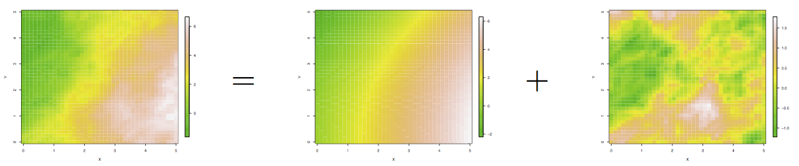
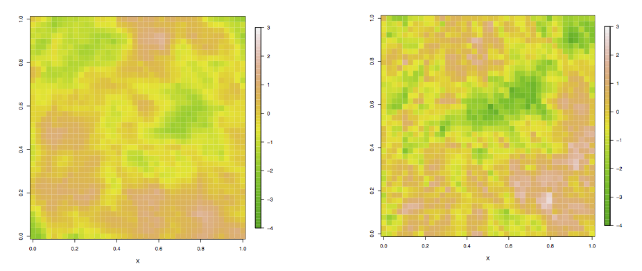

# Estadística espacial

La estadística espacial tiene aplicaciones en áreas como climatología, ecología, 
salud y bienes racíces, esto se debe a que en estas áreas es común contar con 
información espacial que deseamos modelar y es necesario incorporar el efecto 
de la _autocorrelación espacial_ en la estimación y predicción.

La autocorrelación espacial se puede expresar informalmente como (primera ley de 
la geografía de Tobler):

_Todo esta relacionado con todo, pero las cosas cercana <br> están más 
relacionadas que las lejanas._

Usualmente la estadística espacial se divide en tres ramas:

1. **Análisis de datos de variación continua** comprende procesos estocásticos 
cuyos valores pueden ser conocidos en todos los puntos del área de estudio. 

<div class="caja">
El proceso $Y(s)$ es un vector aleatorio en una ubicación $s \in \mathbb{R}^r$ donde $s$ varía de manera continua sobre el dominio $\mathcal{D} \subset \mathbb{R}^r$  (usualmente r= 2).
</div>


```{r, echo = FALSE, fig.align='center', fig.width = 6.5, fig.height=4, warning=FALSE, message=FALSE}
library(MASS)
library(RColorBrewer)
library(classInt)
library(ggplot2)
library(maptools)
library(maps)
library(ggmap)
library(SpatialEpi)
library(fields)
library(spdep)
library(rgdal)
library(spatstat)
library(plyr)
library(reshape2)
library(tidyr)
library(dplyr)
library(ggmap)
library(gridExtra)

ozone <- read.table("data/Ozone_Aug1_2001.txt", header=T)
US <- map_data("state") # maps

class <- classIntervals(ozone$ozone, 9, style = "fixed", 
  fixedBreaks = seq(min(ozone$ozone), max(ozone$ozone), length = 9 + 1))
ozone$o3 <- cut(ozone$ozone, breaks = class$brks, include.lowest = T)

ggplot(data = US, aes(long, lat)) + 
  geom_polygon(colour = 'gray', fill = 'lightgrey', aes(group = group), 
               alpha = 0.6) + 
  coord_map("mercator") +
  labs(title = "Concentración de ozono (08/31/2001)", x = "", y = "", 
    colour = "ppb") + 
  geom_point(data = ozone, aes(x = longitude, y = latitude, colour = o3), 
             alpha = 0.8) +
  scale_colour_brewer(palette="YlOrRd") +
  theme_nothing(legend = TRUE)
```

 ¿Qué preguntas interesantes puedes
responder?


2. **Análisis de datos de variación discreta** (datos sobre áreas): Se refiere 
a la distribución de eventos cuya localización se asocia a zonas delimitadas 
por polígonos.

<div class="caja">
$\mathcal{D}$ es nuevamente un subconjunto fijo de $\mathbb{R}^r$, pero en este 
caso $\mathcal{D}$ esta particionado en un número finito de unidades de area con 
fronteras bien definidas.
</div>

```{r, echo = FALSE, fig.align='center', fig.width = 5, fig.height=4, warning=FALSE}
eire <- readShapePoly(system.file("etc/shapes/eire.shp", package="spdep")[1],
  ID="names", proj4string=CRS("+proj=utm +zone=30 +units=km"))

eire_2 <- spTransform(eire, CRS("+proj=longlat +datum=WGS84"))

sub.eire <- data.frame(id = eire$names, A.blood = eire$A)

shape.fort <- fortify(eire_2, group = "names") 

eire.map <- left_join(shape.fort, sub.eire, by = "id")
cuts <- seq(min(eire.map$A.blood), max(eire.map$A.blood, na.rm = T), 
  length = 10)
eire.map$A.class <- cut(eire.map$A.blood, cuts, include.lowest = TRUE)

ggplot(data = eire.map, aes(long, lat)) + 
  geom_polygon(aes(fill = A.class, group = group))  +
  geom_path(color="gray", size = 0.15, aes(group = group)) +
  scale_fill_brewer(palette="YlOrRd") +
  labs(title = "Muestras de sangre en Iralnda", x = "Eastings",
    y = "Northings", fill = "% tipo A") + 
  theme(legend.title.align = 0.5) +
  coord_map()+
  theme_nothing(legend = TRUE)
```

3. **Análisis de procesos espaciales de puntos**: Conjunto de puntos 
distribuidos en un área fija cuya ubicación fue generada por un mecanismo 
estocástico.

<div class="caja">
$\mathcal{D}$ es aleatorio y sus índices indican la ubicación de eventos 
aleatorios que son el proceso puntual.
</div>

```{r, echo = FALSE, fig.align='center', fig.width = 4, fig.height=4, warning=FALSE}
data(redwood)
redwood.df <- data.frame(x = redwood$x, y = redwood$y)
ggplot(data = redwood.df, aes(x, y)) + 
  geom_point() +
  labs(title = "Ubicación de arboillos \n de secuoya en California") +
  coord_fixed()
```


<div class="clicker">
 Supongamos $Z_1,...,Z_n$ variables 
aleatorias i.i.d. Gaussianas, con media $\mu$ y varianza conocida $\sigma_0^2$.

* Entonces: 
$$\hat{\mu}=\frac{1}{n}\sum_{i=1}^nZ_i$$
es un estimador insesgado para $\mu$ y
$$Var(\hat{\mu})=\frac{\sigma_0^2}{n}$$

* Supongamos ahora que $Z_1,...,Z_n$ son v.a. Gaussianas con media $\mu$ 
desconocida y varianza $\sigma_0^2$, supongamos además que las variables están 
correlacionadas positivamente:
$$Cov(Z_i, Z_j)=\sigma_0^2\rho^{|i-j|}$$
donde $0<\rho<1$. 

1. Sea $\hat{\mu}=\frac{1}{n}\sum_{i=1}^nZ_i$. ¿$\hat{\mu}$ es un estimador
insesgado para $\mu$?

a. Sí 

b. No  

c. No se puede saber

2. $Var(\hat{\mu})$ es

a. Menor a $\frac{\sigma_0^2}{n}$.  

b. Mayor a $\frac{\sigma_0^2}{n}$.  

c. Igual a $\frac{\sigma_0^2}{n}$.  

d. No se puede saber.  


</div>

## Análisis de datos de variación continua

<div class="caja">
$Y(s)$ es un vector aleatorio en una ubicación $s \in \mathbb{R}^r$ 
donde $s$ varía de manera continua sobre el dominio 
$\mathcal{D} \subset \mathbb{R}^r$  (usualmente r= 2).
</div>

Si consideramos un número finito de ubicaciones 
$\{s_1,...,s_n\} \in \mathcal{D}$
entonces $(Y(s_1),...,Y(s_n))$ es un vector aleatorio de dimensión $n$ cuya 
distribución debe reflejar la dependencia espacial entre las variables. Si observamos datos $y_1,...,y_n$ en las ubicaciones $s_1,...,s_n$
entonces $y_1,...,y_n$ es una realización del vector aleatorio 
$(Y(s_1),...,Y(s_n))$. 

Ahora, para especificar la distribución del proceso espacial utilizaremos las 
**distribuciones finito dimensionales**: 
$$p_{s_1,...,s_n}(y_1,...,y_n)$$
para toda $n \geq 1$ y para todo $s_1,...,s_n \in \mathcal{D}$. 

Las distribuciones finito-dimensionales definen una distribución válida sobre el 
proceso estocástico espacial $\{Y(s):s\in \mathcal{D}\}$ si satisfacen las
siguientes condiciones (compatibilidad de Kolmogorov):

* Son invariantes ante permutaciones.

* Son consistentes bajo marginalización.

Un ejemplo de un proceso espacial que satisface las propiedades anteriores es el 
**proceso Gaussiano**.

<div class="caja">
$\{Y(s):s\in \mathcal{D}\}$ es un proceso Gaussiano si para toda 
$n \geq 1$ y $s_1,...,s_n \in \mathcal{D}$ la distribución de $(Y(s_1),...,Y(s_n))$ es normal multivariada.
</div>

Para especificar un proceso Gausiano sólo hace falta especificar las medias y 
las matrices de covarianza para las distribuciones finito dimensionales. Más
aún en el caso del proceso Gaussiano la condición de consistencia de 
Kolmogorov se reduce a que la matriz de covarianzas sea semidefinida positiva.

En general para especificar un proceso espacial $Y(s)$ lo descomponemos en dos 
partes (primera ley de la geoestadística):

$$Y(s) = \mu(s) + \eta(s)$$

donde

* $\mu(s)$ es la media de $Y(s)$. Es una función determinística de $s$ y se le 
llama la **tendencia espacial**. Explica la variación a gran escala en el 
proceso espacial $Y(s)$.

* $\eta(s)$ explica la 
**varianza a pequeña escala** del proceso $Y(s)$. Tiene 
media cero en cada $s$ y explica la dependencia espacial en $Y(s)$ a través de 
la función de covarianza.



## Estimación de $\mu(s)$

Suponemos que $\mu(s)$ es una función suave, continua que varía espacialmente.
Podemos modelar $\mu(s)$ usando polinomios locales, splines o cualquier función
de covariables y parámetros. 

Las covariables pueden incluir las coordenadas geográficas y variables 
que expliquen la variabilidad espacial (por ejemplo, si analizamos contaminación
del aire podemos usar temperatura o dirección del aire.)

Adicionalmente se pueden añadir otras covariables que contribuyan a explicar la 
variación en el proceso (por ejemplo, si estamos analizando concentración de 
contaminantes en el aire podemos incluir covariables como temperatura o 
dirección del viento).

Veamos un ejemplo donde se midió el pH del agua en 250 sitios. 

```{r, fig.width=5, fig.height=4, fig.align='center'}
soil <- read.table("data/Soil_data.txt", header=T)
head(soil)

# Vamos a modelar el PH del agua
class.ph <- classIntervals(soil$pH_water, 9, style = "fixed", 
  fixedBreaks = seq(min(soil$pH_water), max(soil$pH_water), length = 10))
soil$ph <- cut(soil$pH_water, class.ph$brks, include.lowest = TRUE)
```

Comenzamos con un análisis exploratorio:

* Gráficas de los datos y de curvas de nivel nos pueden ayudar en la detección
de atípicos espaciales.

```{r, fig.width=5, fig.height=4, fig.align='center'}
ggplot(soil, aes(x = x, y = y, color = ph)) + 
  geom_point(size = 2.3) +
  scale_colour_brewer(palette="Blues") 
```

```{r, fig.width=5, fig.height=4, fig.align='center'}
library(akima)
# Interpolar los valores observados (akima)
surf.ph <- interp(soil$x, soil$y, soil$pH_water)

# hacer una gráfica
surf.ph.r <- cbind(expand.grid(surf.ph$x, surf.ph$y), c(surf.ph$z))
colnames(surf.ph.r) <- c("x", "y", "z")
surf.ph.r$ph <- cut(surf.ph.r$z, class.ph$brks)
ggplot(surf.ph.r, aes(x = x, y = y, z = z)) + 
  geom_tile(aes(fill = ph)) + scale_fill_brewer(palette = "Blues") + 
  stat_contour() 
```


* Podemos explorar la dependencia espacial de $\mu(s)$ en las coordenadas 
geográficas graficando $Y(s_i)$ contra las coordenadas, o si los datos están
muestreados sobre una cuadrícula graficando la media y mediana de la fila 
contra el ínidce de la fila o columna.

```{r, fig.width=9, fig.height=4, fig.align='center'}
# EDA: gráficas de la media/mediana del pH vs el número de fila y de columna
x.est <- soil %>%
  group_by(x) %>%
  dplyr::summarise(
    media = mean(pH_water), 
    mediana = median(pH_water)
    ) %>%
  gather(variable, valor, -x)

y.est <- soil %>%
  group_by(y) %>%
  dplyr::summarise(
    media = mean(pH_water), 
    mediana = median(pH_water)
    ) %>%
  gather(variable, valor, -y)

x <- ggplot(x.est, aes(x = x, y = valor, color = variable)) + 
  geom_point() + geom_line()

y <- ggplot(y.est, aes(x = y, y = valor, color = variable)) + 
  geom_point() + geom_line()

grid.arrange(x, y, ncol = 2)
```

Podemos modelar $\mu(s)$ como una función lineal de las covariables. Por 
ejemplo, si modelamos $\mu(s)$ como una función lineal únicamente de las
coordenadas tenemos:

$$\mu(s) = \beta_0 + \beta_1 s_x + \beta_2 s_y + \beta_3 s_x^2 + \beta_4 s_y^2 + \beta_5 s_x s_y$$
 
* Cuando se utiliza un polinomio de las coordenadas geográficas es 
conveniente utilizar un polinomio completo, esto es, incluir todos los monomios 
de grado menor o igual al grado del polinomio. Esto garantiza que la superficie 
que ajustamos es invariante a la elección del origen y la orientación de las 
coordenadas (transformaciones lineales).

* Es común centrar las coordenadas geográficas restando la media.


Supongamos que queremos modelar la tendencia espacial utilizando únicamente 
información de las coordenadas, sea $X(s)$ un vector de tamaño $p \times 1$ que
contiene la información geográfica. Entonces, para obtener una estimación 
_provisional_ de  la tendencia espacial de $Y(s)$ podemos ajustar un modelo de 
regresión:
$$Y(s) = \mu(s) + \epsilon(s) = X(s)^T\beta + \epsilon(s)$$
donde $\epsilon(s)$ son iid. Notemos que si queremos incorporar otras 
covariables (además de información de las coordenadas), simplemente las añadimos 
a la matriz $X(s)$.

Volvamos al ejemplo del ph del agua.

```{r, fig.width=5, fig.height=4, fig.align='center'}
#### Estimación de la tendencia espacial
mod.1 <- lm(pH_water ~ x + y, data = soil)

# La tendencia espacial estimada está dada por los valores ajustados y podemos 
# obtener una superficie utilizando interpolación bilineal o predict
surf.ph.r$z <- predict(mod.1, surf.ph.r[, 1:2])

# Discretizamos pH utilzando los mismos cortes que el plot exploratorio
surf.ph.r$z <- predict(mod.1, surf.ph.r[, 1:2])
surf.ph.r$ph <- cut(surf.ph.r$z, class.ph$brks)
ggplot(surf.ph.r, aes(x = x, y = y, z = z)) + 
  geom_tile(aes(fill = ph)) + 
  scale_fill_brewer(palette = "Blues", drop = FALSE)

# Polinomio de segundo orden
mod.1 <- lm(pH_water ~ 1 + x + y + I(x * y) + I(x ^ 2) + I(y ^ 2), data = soil)
surf.ph.r$z <- predict(mod.1, surf.ph.r)
surf.ph.r$ph <- cut(surf.ph.r$z, class.ph$brks)
ggplot(surf.ph.r, aes(x = x, y = y, z = z)) + 
  geom_tile(aes(fill = ph)) + 
  scale_fill_brewer(palette = "Blues", drop = FALSE)


# Polinomio de tercer orden
mod.1 <- lm(pH_water ~ 1 + x + y + I(x * y) + I(x ^ 2) + I(y ^ 2) + I(x ^2 * y) +
  I(x * y ^ 2) + I(x ^ 3) + I(y ^ 3), data = soil)
surf.ph.r$z <- predict(mod.1, surf.ph.r)
surf.ph.r$ph <- cut(surf.ph.r$z, class.ph$brks)
ggplot(surf.ph.r, aes(x = x, y = y, z = z)) + 
  geom_tile(aes(fill = ph)) + 
  scale_fill_brewer(palette = "Blues", drop = FALSE)
```


## Variación de pequeña escala $\eta(s)$
Recordemos que dividimos el proceso espacial en: $Y(s) = \mu(s)+\eta(s)$ donde 
$\mu(s)$ era la tendencia espacial (función determinística de covariables) y $\eta(s)$ es un proceso espacial en $\mathcal{D} \subset \mathbb{R}^r$.

<div class="caja">
Suponemos que $\eta(s)$ es un proceso intrínisicamente estacionario con media 
cero, esto es:

* $E(\eta(s)) = 0$ para toda $s$ en  $\mathcal{D}$

* $\frac{1}{2}Var(\eta(s) - \eta(s'))=\gamma(s-s')$
</div>

Un proceso intríniscamente estacionario es un proceso que satisface las dos 
condiciones enumeradas, con media constante (pero no necesariamente cero). 
Notemos que podemos escribir la segunda condición como 
$$\frac{1}{2}Var(\eta(s) - \eta(s+h))=\gamma(h)$$
y vemos que el lado derecho de la igualdad depende únicamnte de $h$ (donde 
$h \in \mathbb{R}^r$) y no de la elección particular de $s$.

<div class="caja">
La función $2\gamma(h) = Var(\eta(s) - \eta(s+h))$ donde $h \in \mathbb{R}^r$ se conoce como **variograma**, mientras que a $\gamma(h)$ se le denota 
**semivariograma**.
</div>

¿Cómo se relaciona el variograma con la función de covarianzas $C(h)$ (también 
conocida como covariograma)? 

$$
\begin{align}
\nonumber
2\gamma(h) &= Var(\eta(s+h) - \eta(s))\\
\nonumber
&=Var(\eta(s+h)) + Var(\eta(s)) - 2Cov(\eta(s+h), \eta(s))\\
\nonumber
&= C(0) + C(0) -2Cov(\eta(s+h), \eta(s))\\
\nonumber
&=2[C(0) - C(h)]
\end{align}
$$

Vemos entonces que $\gamma(h) = C(0)-C(h)$ y por tanto si conocemos $C$ podemos 
recuperar $\gamma$; sin embargo, para ir de $\gamma$ a $C$ nesesitamos un 
supuesto adicional: si el proceso espacial cumple
$C(h) \rightarrow 0$ cuando $\|h\| \to \infty$ (ergódico), tomando limites en la
igualdad  $\gamma(h) = C(0)-C(h)$ vemos que
$$\lim_{\|h\| \to \infty} \gamma(h) = C(0)$$
y podemos recuperar $C$ de $\gamma$ utilizando la variable auxiliar $u$ de la 
siguiente manera,
$$C(h) = C(0) - \gamma(h) = \lim_{\|u\| \to \infty} \gamma(u) - \gamma(h)$$
El límite del lado derecho no existe siempre (si existe se decieque el proceso 
es estacionario de segundo orden), estudiaremos casos en los que existe.

Veamos que el supuesto de ergodicidad es sensible (intuitivamente) pues nos dice 
que la covarianza entre dos puntos desaparece conforme los puntos se separan en 
el espacio. 

Utilizaremos estos conceptos en la estimación de $\eta(s)$, primero aproximamos 
los residuales como 
$$\hat{\eta}(s_i) = Y(s_i) - \hat{\mu}(s_i)$$ 
para $i = 1,...,n$ donde $\hat{\mu}(s)$ es la tendencia estimada. 

### Semivariograma empírico

Como parte del análisis exploratorio de datos es útil graficar el 
**semivariograma empírico** $\hat{\gamma}(h)$ definido como (si las 
observaciones están en una cuadrilla regular):

$$\hat{\gamma}(h) = \frac{1}{2N(h)}\sum_{i,j:s_i-s_j = h}(\hat{\eta}(s_i)-
\hat{\eta}(s_j))^2$$

donde $N(h)$ es el número de pares $(s_i, s_j)$ tales que $s_i-s_j = h$. 

Si las observaciones no están en una cuadrilla regular definimos regiones de 
tolerancia $T(h)$ (vecindades alrededor de h) para cada $h$:

$$\hat{\gamma}(h) = \frac{1}{2\#T(h)}\sum_{i,j:s_i-s_j \in T(h)}(\hat{\eta}(s_i)-
\hat{\eta}(s_j))^2$$


En la práctica para construir el semivariograma empírico seguimos los siguientes 
pasos:

1. Particionamos el espacio de todas las diferencias 
$\mathcal{H}=\{s-s': s, s' \in \mathcal{D} \}$ en clases (_bins_) $B_m$.

2. Calculamos las diferencias $s_i-s_j$ para toda $i\neq j$ y las asignamos a 
una clase $B_m$.

3. Determinamos $h_m$ el vector diferencia representativo de la clase $B_m$, 
$h_m$ puede ser el promedio de todas las diferencias $s_i-s_j$ que caen en la 
clase $m$.  

4. Determinamos el número de pares ordenados $(s_i,s_j)$ tales que 
$s_i-s_j \in B_m$ y calculamos $N(h_m)=\#B_m$.

5. Para $h_m$ claculamos:

$$\hat{\gamma}(h_m) = \frac{1}{2N(h_m)}\sum_{i,j:s_i-s_j = h}(\hat{\eta}(s_i)-
\hat{\eta}(s_j))^2$$

Grafiquemos el semivariograma empírico para el ejmplo de ph.

```{r, fig.width=4, fig.height=4, fig.align='center'}
library(gstat)
mod.1 <- lm(pH_water ~ x + y, data = soil)
soil$eta.hat <- soil$pH_water - mod.1$fitted.values
# formato para gstat
water.data <- data.frame(x = soil$x, y = soil$y, eta.hat = soil$eta.hat)
coordinates(water.data) = ~ x + y
emp.variog <- variogram(eta.hat ~ 1, water.data)
emp.variog
# plot(emp.variog)
# graficar el semivariograma empírico (notemos que estamos asumiendo
# un proceso isotrópico)
# plot(emp.variog, col = "black", type = "p",pch=20)
ggplot(emp.variog, aes(x = dist, y = gamma)) +
  geom_point() + ylim(0, 0.038) +
  labs(title = expression("Semivariograma empírico"), 
       x = "distancia", y = "semivarianza")
```

Una definición más:

<div class="caja">
Un proceso intrínsicamente estacionario es **isotrópico** si su semivariograma 
$\gamma(h)$ depende del vector de separación $h$ únicamente a través de su norma
$\|h\|$.
</div>

Entonces, para un proceso istrópico $\gamma(h)$ es una función univariada que se
puede escribir como $\gamma(\|h\|)$. Los procesos istrópicos son populares 
debido a su simplicidad y a que existen varias funciones paramétricas que se 
pueden utilizar para definir el semivariograma del proceso.

Nos podemos preguntar si en el ejemplo es razonable suponer que el proceso es
isotrópico.

```{r, fig.width=5, fig.height=4, fig.align='center'}
water.data <- data.frame(x = soil$x, y = soil$y, eta.hat = soil$eta.hat)
coordinates(water.data) = ~ x + y
dir.variog <- variogram(eta.hat ~ 1, water.data, alpha = c(0,45,90,135))
# plot(dir.variog)
# ggplot
dir.variog$direction <- factor(dir.variog$dir.hor, levels = c(0, 45, 90, 135),
  labels = c("E-O", "NE-SO", "N-S", "NO-SE"))
ggplot(dir.variog, aes(x = dist, y = gamma, colour = direction)) + 
  geom_point(size = 1.8) + 
  labs(title = expression("Semivariograma direccional"), 
       x = "distancia", y = "semivariance", colour = "dirección") + geom_line()
# cuando invesigamos anisotropías podemos tener celdas con pocos datos
dir.variog
```

#### Observaciones

1. ¿Cómo elegimos el tamaño de los bins $B_m$? ¿Cuántos bins?  
  Más bins puede ser más informativo; sin embargo, bins con pocas observaciones 
  pueden ser muy ruidosos. Una regla de dedo es definirlos para que contengan 
  al menos 30 observaciones.

```{r, fig.width=5, fig.height=4, fig.align='center'}
set.seed(1362)
soil.2 <- soil[sample(1:nrow(soil), size = 90), ]
water.data <- data.frame(x = soil.2$x, y = soil.2$y, eta.hat = soil.2$eta.hat)
coordinates(water.data) = ~ x + y
emp.variog.1 <- variogram(eta.hat ~ 1, water.data)
emp.variog.1$variogram <- "default"
emp.variog.2 <- variogram(eta.hat ~ 1, water.data, width = 0.1)
emp.variog.2$variogram <- "pocas obs."
emp.variog.3 <- variogram(eta.hat ~ 1, water.data, width = 9)
emp.variog.3$variogram <- "pocos bins"
emp.variogs <- rbind(emp.variog.1, emp.variog.2, emp.variog.3)

ggplot(emp.variogs, aes(x = dist, y = gamma, color = variogram, group = variogram)) +
  geom_point() + 
  geom_line() +
  ylim(0, 0.06) +
  labs(title = expression("Semivariograma empírico"), 
       x = "distancia", y = "semivarianza")
```


2. La variabilidad en el valor de $\hat{\gamma}(h)$ aumenta conforme $\|h\|$ 
aumenta, por lo que $\hat{\gamma}(h)$ es poco confiable para valores grandes de 
$\|h\|$. Es aconsejable establecer una cota superior a la magnitud de $\|h\|$, 
una regla de dedo es usar 1/2 de la máxima distancia.

 Corrobora el punto 2 en el ejemplo de 
ph.

```{r, fig.width=5, fig.height=4, fig.align='center', eval=FALSE, echo=FALSE}
muestra <- function(){
  soil.2 <- soil[sample(1:250, size = 250, replace = TRUE), ]  
  water.data <- data.frame(x = soil.2$x, y = soil.2$y, eta.hat = soil.2$eta.hat)
  coordinates(water.data) = ~ x + y
  emp.variog.1 <- variogram(eta.hat ~ 1, water.data)
}
variograms <- plyr::rdply(500, muestra)

ggplot(variograms, aes(x = dist, y = gamma, group = .n)) +
  geom_line(alpha = 0.15) +
  ylim(0, 0.06) +
  labs(title = expression("Semivariograma empírico"), 
       x = "distancia", y = "semivarianza")
```

### Semivariogramas paramétricos

Modelamos el semivariograma empírico utilizando semivariogramas paramétricos, 
hay varias razones por las cuales esto es conveniente:

* El semivariograma empírico no esta disponible en distancias que no aparecen en
los datos.

* El semivariograma empírico puede ser muy ruidoso por lo que una verisón 
suavizada puede ser más confiable.

* El semivariograma empírico puede no cumplir los supuestos necesarios para 
estimar el proceso.

Hay varias características que debe cumplir el semivariogreama paramétrico, por
ejemplo, es una función no-decreciente de la distancia. Es común que el 
semivariograma empírico se aplane a partir de un cierto punto, indicando que la
dependencia espacial disminuye con la distancia, si es el caso el 
semivariograma paramétrico debe reflejar este escenario. Veamos algunos modelos 
de semivariogramas paramétricos:

#### Esférico

\[\gamma(h;\theta) = \left\{
  \begin{array}{lr}
    0 & : \|h\| = 0 \\
    \tau^2 +\sigma^2\big(\frac{3\|h\|}{2\phi}-\frac{\|h\|^3}{2\phi^3}\big) & : 0 \le \|h\| \le \phi\\
    \tau^2+\sigma^2 & : \|h\| > 0
  \end{array}
\right.
\]
donde $\sigma^2, \phi>0$. 
Esta modelo del semivariograma tiene asociada la siguiente función de 
covarianza:

\[C(h;\theta) = \left\{
  \begin{array}{lr}
    \tau^2 + \sigma^2 & : \|h\| = 0 \\
    \sigma^2\left(1-\big(\frac{3\|h\|}{2\phi}-\frac{\|h\|^3}{2\phi^3}\big)\right) & : 0 < \|h\| \le \phi\\
    0 & : \|h\| > \phi
  \end{array}
\right.
\]


```{r, fig.width=3.5, fig.height=3.5, fig.align='center'}
sph.variog <- function(sigma2, phi, tau2, dist){
  n <- length(dist)
  sph.variog.vec <- rep(0,n)
  for(i in 1:n){
    if(dist[i] < phi){
      sph.variog.vec[i] <- tau2 + (sigma2 * (((3 * dist[i]) / (2 * phi)) - 
          ((dist[i] ^ 3)/(2 * (phi ^ 3)))))
    }
    if(dist[i] >= phi){
      sph.variog.vec[i] <- tau2 + sigma2  
    }
  }
  return(sph.variog.vec)
}

dat <- data.frame(x = seq(0, 10, 1), y = seq(0, 1, 0.1))
ggplot(dat, aes(x = x, y = y)) + 
  labs(title = expression("Semivariograma esférico"), 
       x = "distancia", y = "semivarianza") +
  stat_function(fun = sph.variog, args = list(sigma2 = 1, phi = 1, tau2 = 0), 
    colour = "green3") +
  stat_function(fun = sph.variog, args = list(sigma2 = 1, phi = 8, tau2 = 0), 
    colour = "orange") +
  stat_function(fun = sph.variog, args = list(sigma2 = 0.5, phi = 1, tau2 = 0), 
    colour = "steelblue") +
  stat_function(fun = sph.variog, args = list(sigma2 = 1, phi = 1, tau2 = 0.2), 
    colour = "darkgray") 
```

Un semivariograma paramétrico tiene las siguientes características:

1. Por definición $\gamma(0) = 0$. Sin embargo, en ocasiones vemos que el valor
en cero del semivariograma empírico es $\tau^2\neq 0$. En geostadística 
$$\tau^2=\gamma(0^+)=\lim_{\|h\|\to 0^+} \gamma(t)$$
se conoce como el efecto **nugget** o  pepita. El efecto nugget equivale a 
descomponer $\eta(s)$ como
$$\eta(s)=\eta'(s)+\epsilon$$
donde $\epsilon$ es ruido blanco.
La siguiente figura muestra el efecto del nugget en un proceso simulado, en el
lado izquierdo $\tau^2 = 0$ y en el del lado derecho $\tau^2 = 0.5$.



2. $lim_{\|h\|\to \infty} \gamma(\|h\|) = \tau^2 + \sigma^2$, este valor 
(asintótico normalmente) del semivariograma se conoce como el **silo**, el silo 
menos el nugget se conoce como **silo parcial** y es simplemente $\sigma^2$. El 
silo no siempre exite.

3. El **rango** es el menor valor de $\|h\|$ en el que el semivariograma alcanza 
el silo ($\phi$).

<div class="clicker">
 En el caso del semivariograma gris 
del ejemplo de arriba, ¿Cuál es el nugget, silo parcial y el rango?

a. 0.2, 1.2, 1    
b. 0.2, 1, 1  
c. 0, 1, 1  
d. 0, 1.2, 1  
e. Ninguna de las anteriores  
</div>

#### Gaussiano

\[\gamma(h;\theta) = \left\{
  \begin{array}{lr}
    0 & : \|h\| = 0 \\
    \tau^2 +\sigma^2\big(1-exp\big(-\frac{\|h\|^2}{\phi^2}\big)\big) & : \|h\| > 0
  \end{array}
\right.
\]
donde $\sigma^2, \phi>0$. Con función de covarianza:

\[C(h;\theta) = \left\{
  \begin{array}{lr}
    \tau^2 + \sigma^2 & : \|h\| = 0 \\
    \sigma^2\left(1- \big(1-exp\big(-\frac{\|h\|^2}{\phi^2}\big)\big)\right) & : \|h\| > 0
  \end{array}
\right.
\]

```{r, fig.width=3.5, fig.height=3.5, fig.align='center'}
# existen funciones en los paquetes pero escribirlas puede ser ilustrativo
gau.variog <- function(sigma2,phi,tau2,dist){
  n <- length(dist)
  gau.variog.vec <- rep(0,n)
  for(i in 1:n){
    gau.variog.vec[i] <- tau2 + sigma2 * (1-exp(-dist[i]^2/phi^2))
  }
  gau.variog.vec[0] <- 0 
  return(gau.variog.vec)
}
dat <- data.frame(x = seq(0, 10, 1), y = seq(0, 1, 0.1))
ggplot(dat, aes(x = x, y = y)) + 
  labs(title = expression("Semivariograma gaussiano"), 
       x = "distancia", y = "semivarianza") +
  stat_function(fun = gau.variog, args = list(sigma2 = 1, phi = 1, tau2 = 0), 
    colour = "green3") +
  stat_function(fun = gau.variog, args = list(sigma2 = 1, phi = 8, tau2 = 0), 
    colour = "orange") +
  stat_function(fun = gau.variog, args = list(sigma2 = 0.5, phi = 1, tau2 = 0), 
    colour = "steelblue") +
  stat_function(fun = gau.variog, args = list(sigma2 = 1, phi = 1, tau2 = 0.2), 
    colour = "darkgray") + xlim(0, 20)
```

#### Matérn

\[\gamma(h;\theta) = \left\{
  \begin{array}{lr}
    0 & : \|h\| = 0 \\
    \tau^2 +\sigma^2 \left(1-\frac{\big(2\sqrt{\nu} \frac{\|h\|}{\phi}\big)^{\nu} \mathcal{K}_\nu\big(2\sqrt{\nu}\frac{\|h\|}{\phi}\big)}
    {2^{\nu-1}\Gamma(\nu)}\right) & : \|h\| > 0
  \end{array}
\right.
\]
donde $\sigma^2, \phi>0$.

Notemos que esta función tiene el parámetro adicional $\nu$, este controla el 
suavizamiento del proceso espacial. El semivariograma exponencial es un caso 
especial del Matern con $\nu = 1/2$, el Gaussiano se puede derivar del Matern 
haciendo $\nu \to \infty$.

```{r, fig.width=8, fig.height=3.5, fig.align='center', message=FALSE}
library(geoR)
mat.variog <- function(sigma2, phi, tau2, nu = 1, dist){
  #phi <- 2*phi
  n <- length(dist)
  mat.variog.vec <- rep(0,n)
  for(i in 1:n){ # in fun matern u = 2*sqrt(nu)*dist
    mat.variog.vec[i] <- tau2 + sigma2 * (1 - geoR::matern(2*sqrt(nu)*dist[i], 
      phi, nu)) 
  }
  return(mat.variog.vec)
}
dat <- data.frame(x = seq(0, 10, 1), y = seq(0, 1, 0.1))
mat_1 <- ggplot(dat, aes(x = x, y = y)) + 
  labs(x = "distancia", y = "semivarianza") +
  stat_function(fun = mat.variog, args = list(sigma2 = 1, phi = 1, tau2 = 0, 
    nu = 1/4), colour = "green3") +
  stat_function(fun = mat.variog, args = list(sigma2 = 1, phi = 8, tau2 = 0, 
    nu = 1/4), colour = "orange") +
  stat_function(fun = mat.variog, args = list(sigma2 = 0.5, phi = 1, tau2 = 0, 
    nu = 1/4), colour = "steelblue") +
  stat_function(fun = mat.variog, args = list(sigma2 = 1, phi = 1, tau2 = 0.2, 
    nu = 1/4), colour = "darkgray") 
mat_2 <- ggplot(dat, aes(x = x, y = y)) + 
  labs(x = "distancia", y = "semivarianza") +
  stat_function(fun = mat.variog, args = list(sigma2 = 1, phi = 1, tau2 = 0, 
    nu = 10), colour = "green3") +
  stat_function(fun = mat.variog, args = list(sigma2 = 1, phi = 8, tau2 = 0, 
    nu = 10), colour = "orange") +
  stat_function(fun = mat.variog, args = list(sigma2 = 0.5, phi = 1, tau2 = 0, 
    nu = 10), colour = "steelblue") +
  stat_function(fun = mat.variog, args = list(sigma2 = 1, phi = 1, tau2 = 0.2, 
    nu = 10), colour = "darkgray") + xlim(0, 20)

grid.arrange(mat_1, mat_2, ncol = 2)
```

Vimos distintos modelos de variogramas paramétricos, ¿Cuál es la diferencia 
práctica entre ellos? Producen distintos tipos de dependencia espacial y 
distintos procesos espaciales.

```{r, fig.width = 7.5, message=FALSE}
grid.xy <- expand.grid(x = seq(0, 2, 0.02), y = seq(0, 2, 0.02))

# Esférico
esf_sin <- gstat(formula = z ~ 1, locations = ~ x + y, beta = 1, dummy = TRUE, 
  model = vgm(psill = 1, model = "Sph", range = 1), nmax = 20)
# make 4 simulaciones
set.seed(23)
esf <- predict(esf_sin, newdata = grid.xy, nsim = 4)
esf_df <- melt(esf, id.vars = c("x", "y"))
cuts <- seq(min(esf_df$value) - 1, max(esf_df$value) + 1, length = 10)
esf_df$data_cat <- cut(esf_df$value, breaks = cuts, include.lowest = TRUE)
esf_df$tipo <- "Sin nugget"

# Esférico con nugget
esf_con <- gstat(formula = z ~ 1, locations = ~ x + y, beta = 1, dummy = TRUE, 
  model = vgm(psill = 1, model = "Sph", range = 1, nugget = 0.2), nmax = 20)
# hacemos 4 simulaciones
set.seed(23)
esf <- predict(esf_con, newdata = grid.xy, nsim = 4)
esf_df_2 <- melt(esf, id.vars = c("x", "y"))
esf_df_2$data_cat <- cut(esf_df_2$value, breaks = cuts, include.lowest = TRUE)
esf_df_2$tipo <- "Con nugget"
esf_df_3 <- rbind(esf_df, esf_df_2)

ggplot(esf_df_3, aes(x = x, y = y, color = data_cat)) +
  geom_point(size = 1.8) +
  scale_colour_brewer(palette = "Blues", drop = FALSE) + 
  facet_grid(tipo ~ variable) +
  labs(title = "Esférico")

# Gaussiano
grid.xy <- expand.grid(x = seq(0, 2, 0.02), y = seq(0, 2, 0.02))
gau_sin <- gstat(formula = z ~ 1, locations = ~ x + y, beta = 1, dummy = TRUE, 
  model = vgm(psill = 1, model = "Gau", range = 1, nugget = 0.0001), nmax = 20)
# make 4 simulations
set.seed(23)
gau <- predict(gau_sin, newdata = grid.xy, nsim = 4)
gau_df <- melt(gau, id.vars = c("x", "y"))
cuts <- seq(min(gau_df$value)-0.5, max(gau_df$value)+0.5, length = 10)
gau_df$data_cat <- cut(gau_df$value, breaks = cuts, include.lowest = TRUE)
gau_df$tipo <- "Sin nugget"

# Gaussiano con nugget
gau_con <- gstat(formula = z ~ 1, locations = ~ x + y, beta = 1, dummy = TRUE, 
  model = vgm(psill = 1, model = "Gau", range = 1, nugget = 0.05), nmax = 20)
set.seed(23)
gau <- predict(gau_con, newdata = grid.xy, nsim = 4)
gau_df_2 <- melt(gau, id.vars = c("x", "y"))
gau_df_2$data_cat <- cut(gau_df_2$value, breaks = cuts, include.lowest = TRUE)
gau_df_2$tipo <- "Con nugget"

gau_df_3 <- rbind(gau_df, gau_df_2)

ggplot(gau_df_3, aes(x = x, y = y, color = data_cat)) +
  geom_point(size = 1.8) +
  scale_colour_brewer(palette = "Blues", drop = FALSE) + 
  facet_grid(tipo ~ variable) +
  labs(title = "Gaussiano")


```


### Estimación de $\eta(s)$ 
Veremos la estimación de $\eta(s)$ utilizando técnicas de geosestadística
clásica y de máxima verosimilitud.

#### Geoestadística clásica

Una vez que elegimos el modelo paramétrico que vamos a usar (esférico, 
gaussiano, etc.) etsimamos los valores de los parámetros usando mínimos 
cuadrados ponderados (donde se da un mayor peso a observaciones cercanas pues la
varianza suele ser menor).
$$WSS(\theta) = \sum_{m=1}^k \frac{N(h_m)}{(\gamma(h_m:\theta))^2}(\hat{\gamma}(h_m) -\gamma(h_m:\theta))^2$$
El estimador de $\theta$ se encuentra minimizando de manera iterativa la suma de 
cuadrados ponderada ($WSS(\theta)$).

Ajustemos los semivariogramas paramétricos a nuestros datos usando WLS.

```{r, fig.width=4, fig.height=4, fig.align='center', warning=FALSE}
#### Variograma esférico
sph.variog.w <- fit.variogram(emp.variog, vgm(psill= 0.02, model="Sph",
  range = 20, nugget = 0.012),fit.method = 2)
sph.variog.w
print(plot(emp.variog, sph.variog.w))
# Estimaciones
sigma2.sph <- sph.variog.w$psill[2]
phi.sph <- sph.variog.w$range[2]
tau2.sph <- sph.variog.w$psill[1]
dist.vec <- emp.variog$dist # vector de distancias
sph.variog.2 <- sph.variog(sigma2.sph,phi.sph,tau2.sph,dist.vec)

# Gaussiano
gau.variog.w <- fit.variogram(emp.variog, vgm(psill= 0.02, model="Gau",
  range = 20, nugget = 0.012), fit.method = 2)
gau.variog.w
print(plot(emp.variog, gau.variog.w))
sigma2.gau <- gau.variog.w$psill[2]
phi.gau <- gau.variog.w$range[2]
tau2.gau <- gau.variog.w$psill[1]
gau.variog.2 <- gau.variog(sigma2.gau, phi.gau, tau2.gau, dist.vec)

# Matern
mat.variog.w <- fit.variogram(emp.variog, vgm(psill = 0.02, model = "Mat",
  range = 20, nugget = 0.012, kappa = 1), fit.method = 2)
mat.variog.w
print(plot(emp.variog, mat.variog.w))

sigma2.mat <- mat.variog.w$psill[2]
phi.mat <- 2*mat.variog.w$range[2]
tau2.mat <- mat.variog.w$psill[1]
nu.mat <- mat.variog.w$kappa[2]
mat.variog.2 <- mat.variog(sigma2.mat,phi.mat,tau2.mat,nu.mat,dist.vec)

# Evaluación de los modelos
### Calculamos la suma de cuadrados ponderada (WSS)
weights.sph <- emp.variog$np/((sph.variog.2)^2)
squared.diff.sph <- (emp.variog$gamma - sph.variog.2)^2
wss.sph <- sum(weights.sph * squared.diff.sph)
wss.sph

weights.gau <- emp.variog$np/((gau.variog.2)^2)
squared.diff.gau <- (emp.variog$gamma-gau.variog.2)^2
wss.gau <- sum(weights.gau * squared.diff.gau)
wss.gau

weights.mat <- emp.variog$np/((mat.variog.2)^2)
squared.diff.mat <- (emp.variog$gamma-mat.variog.2)^2
wss.mat <- sum(weights.mat * squared.diff.mat)
wss.mat

ggplot(emp.variog, aes(x = dist, y = gamma)) + 
  geom_point() +
  labs(title = expression("Semi-variogramas"), 
       x = "distancia", y = "semivarianza") +
  stat_function(fun = gau.variog, args = list(sigma2 = sigma2.gau, phi = phi.gau, tau2 = tau2.gau), colour = "green3") +
  stat_function(fun = sph.variog, args = list(sigma2 = sigma2.sph, phi = phi.sph, tau2 = tau2.sph), colour = "orange") +
  stat_function(fun = mat.variog, args = list(sigma2 = sigma2.mat, phi = phi.mat, 
    tau2 = tau2.mat, nu = nu.mat), colour = "steelblue") +
  ylim(0, 0.038) + xlim(0, 45)
```

Una vez que tenemos la estimación de los parámetros del semivariograma debemos 
recalcular la tendencia, par esto usaremos Mínimos cuadrados generalizados (GLS):
$$ Y = X\beta+ \epsilon$$
donde $\epsilon\sim N_n(0, \Sigma)$, si conocemos $\Sigma$ el estimador de 
$\beta$ es:
$\hat{\beta}_{GLS} = (X'\Sigma^{-1}X)^{-1}X'\Sigma^{-1}Y$.

De esta manera, el procedimiento de geostadística clásica es como sigue:

1. Obtenemos un estimador provisional de $\beta$ usando OLS.

2. Calculamos los residuales usando $\hat{\beta}_{OLS}$ y ajustamos un 
semivariograma paramétrico usando WLS.

3. Construimos la matriz de covarianzas utilizando la función de covarianzas 
$C(h:\theta)$ al semivariograma paramétrico que elegimos $\gamma(h:\theta)$, 
$\hat{\Sigma}_{ij} = C(\|s_i-s_j\|:\hat{\theta})$.

4. Volvemos a estimar $\beta$ usando la matriz estimada $\hat{\Sigma}$: $\hat{\beta}_{GLS} = (X'\hat{\Sigma}^{-1}X)^{-1}X'\hat{\Sigma}^{-1}Y$ 

5. Se puede proceder iterativamente y recalcular los residuales:
$$\hat{\eta}(s_i)=Y(s_i)-X(s_i)'\hat{\beta}_{GLS}$$
para después reètir 3 y 4.

#### Métodos de máxima verosimilitud

Los métodos de máxima verosimilitud implican supuestos ditrsibucionales, lo más 
común en estadística espacial es suponer que $Y(s)$ es un proceso Gaussiano. 
Escribimos nuevamente:

$$
\begin{align}
\nonumber
Y(s) = \mu(s) + \eta(s)\\
\nonumber
\mu(s) = X(s)'\beta
\end{align}
$$

de manera que $\eta(s)$ se modela como un proceso Gaussiano de media cero y 
covarianza $Cov(\eta(s'),\eta(s)) = C(s',s:\theta)$. Este supuesto implica 
$Y \sim MVN(X\beta, \Sigma)$, y podemos escribir la verosimilitud:
$$\mathcal{L} = \frac{1}{(2\pi)^{n/2}}\frac{1}{(\| \Sigma(\theta) \|^{1/2}}exp\left(-\frac{1}{2}(Y-X\beta)'\Sigma(\theta)^{-1}(Y-X\beta)\right)$$
donde $\Sigma(\theta)_{ij}=C(s_i,s_j:\theta)$. 

De tal manera que buscamos estimar $\beta$ y $\theta$, esto no se puede hacer de
manera directa por lo que utilizamos métodos iterativos (como Newton-Raphson, o 
el método de puntajes de Fisher). 

Algunos aspectos importantes:

* Podemos comparar la verosimilitud (o el AIC, BIC) de los modelos y tener así 
un criterio adicional para seleccionar el modelo paramétrico.

* En el proceso iterativo de estimación podemos utilizar como valores iniciales
$\theta^{(0)}$ las estimaciones de geostadística clásica (WLS).

* El MLE puede no existir, la función podría ser multimodal.

* Es conveniente utilizar varios valores iniciales para evaluar la convergencia.

* Las estimaciones de los parámetros de covarianza $\theta$ son sesgados, y esto
podría ser problemático en muestras chicas.

Una solución al problema del sesgo de $\hat{\theta}$ es utilizar máxima 
verosimilitud restringida (REML), esta consiste en realizar la máxima 
verosimilitud en contrastes de $(Y_1,...,Y_n)$ en lugar de en los observados 
$(Y_1,...,Y_n)$. En la práctica se han observado mejoras en el sesgo; sin 
embargo, REML puede conllevar mayor error cuadrático medio comparado a máxima
verosimilitud usual.

```{r}
water.geo <- as.geodata(soil, coords.col = c(1,2), data.col = 7)
water.ml <- likfit(water.geo, trend = "1st", cov.model="spherical", 
  ini=c(sigma2.sph, phi.sph), nugget = tau2.sph, fix.nugget = FALSE, 
  lik.met="ML")
water.reml <- likfit(water.geo, trend = "1st", cov.model="spherical", 
  ini=c(sigma2.sph, phi.sph), nugget = tau2.sph, fix.nugget = FALSE, 
  lik.met="REML")
data.frame(method = c("Classical", "ML", "REML"), 
  sigma2 = c(sigma2.sph, water.ml$sigmasq, water.reml$sigmasq), 
  phi = c(phi.sph, water.ml$phi, water.reml$phi), 
  tau2 = c(tau2.sph, water.ml$tausq, water.reml$tausq), 
  AIC = c(NA, water.ml$AIC, water.reml$AIC), 
  BIC = c(NA, water.ml$BIC, water.reml$BIC))
```

 Compara el AIC y BIC del modelo con
polinomio de segundo grado para la tendencia contra el modelo con
polinomio de tercer grado.

## Kriging: Predicción espacial
Dado un proceso espacial $\{Y(s),s\in\mathbb{R}^r\}$ para el cual hemos 
recolectado datos en $n$ ubicaciones $s_1,...,s_n$ buscamos predecir una función 
$g(Y(s))$ condicional a los datos observados. Iniciemos con el caso simple 
$g(Y(s_0)) = Y(s_0)$, es decir, queremos predecir el valor del proceso en una 
nueva ubicación $s_0$. Para hacer las estimaciones de $Y(s_0)$ utilizaremos un
método de interpolación conocido como kriging.

Las características principales de kriging son:

1. Las ecuaciones de kriging reflejan que las observaciones se deben ponderar 
distinto: las observaciones cercanas a la predicción deben contribuir más.

2. La dependencia espacial está incluida en las ecuaciones de kriging por medio
de los variogramas (o función de covarianzas).

3. Los valores interpolados se modean con un proceso Gaussiano.

Vamos a plantear el problema desde un enfoque de pérdida. Sea $\hat{Y}(s_0)$ la
predicción de $Y(s_0)$ y sea:
$$L[Y(s_0), \hat{Y}(s_0)]$$
la pérdida incurrida cuando predecimos ${Y}(s_0)$ usando $\hat{Y}(s_0)$, 
entonces un predictor óptimo es el que minimiza la pérdida esperada también 
conocida como **riesgo de Bayes**:
$$E(L[Y(s_0), \hat{Y}(s_0)]|Y)$$

donde $Y=(Y(s_1),...,Y(s_n))'$ es el vector de observaciones de un proceso 
espacial $Y(s)$.

Ahora, si escogemos como función de pérdida la pérdida cuadrática 
$$L[Y(s_0), \hat{Y}(s_0)] = (Y(s_0) - \hat{Y}(s_0))^2$$
entonces el predictor que minimiza el riesgo de Bayes es:
$$\hat{Y}(s_0) = E[Y(s_0)|Y]$$
En general, no es fácil estimar $E[Y(s_0)|Y]$, pero si 
$\{Y(s),s\in\mathbb{R}^r\}$ es un proceso gaussiano $E[Y(s_0)|Y]$ es una función
lineal de $Y$ y kriging consiste en encontrar el parámetro $\lambda$ tal que
$$\hat{Y}(s_0)=\sum_{i=1}^n \lambda_i Y(s_i)$$
minimizando $E[(Y(s_0) - \hat{Y}(s_0))^2]$.


Hay tres tipos de kriging dependiendo de los supuestos que realicemos de la tendencia 
$\mu(s)$.

1. **Kriging simple**. Suponemos que la tendencia espacial $\mu(s)$ es conocida, suponemos además que conocemos la función de covarianza (incluyendo parámetros). Bajo estos supuestos, $\hat{Y}(s_0)$ tiene la forma
$$\hat{Y}(s_0)=\sum_{i=1}^n \lambda_i Y(s_i) + k$$
y $E[(Y(s_0) - \hat{Y}(s_0))^2]$ se minimiza con: 
$$\lambda = (C(s_0,s_1),...,C(s_0,s_n))'\Sigma^{-1}$$
$$k = \mu(s_0)-\sum_{i=1}^n\lambda_i\mu(s_i)$$
por lo tanto, el predictor lineal optimo de kriging simple es:
$$\hat{Y}(s_0) = \mu(s_0) + c'\Sigma^{-1}(Y-\mu)$$
donde $\mu=(\mu(s_1),...,\mu(s_n))'$ y $c = (C(s_0,s_1),...,C(s_0,s_n))'$.

El error cuadrático medio de predicción (minimizado) es:
$$\sigma_{sk}^2(s_0) = E((Y(s_0) - \hat{Y}(s_0))^2) =E((Y(s_0) - \mu(s_0) - c'\Sigma^{-1}(Y-\mu)$$
$$=Var(Y(s_0)) - c'\Sigma^{-1}c$$
$\sigma_{sk}^2(s_0)$ se interpreta como la varianza de kriging y se utiliza para construir intervalos de confinaza de la predicción.

```{r}
# supongamos que queremos predecir en x0, y0
x0 <- 13
y0 <- 13
# utilizaremos el objeto water.geo que creamos antes
# especificamos las opciones para el kriging, sk = simple kriging 
kc.sk.control <- krige.control(type.krige = "sk", trend.d = "cte", 
  trend.l="cte",beta = 5.8, cov.model="spherical", cov.pars = c(0.02, 20.0),
  nugget = 0.0001)
# Ponemos las coordenadas del punto en el que haremos kriging:
loc.sk <- matrix(c(x0,y0),nrow=1,ncol=2)
kc.sk.s0 <- krige.conv(water.geo,locations=loc.sk,krige=kc.sk.control)
kc.sk.s0$predict 
kc.sk.s0$krige.var
```

2. **Kriging ordinario**. Suponemos que la tendencia espacial $\mu(s)$ es 
consatnte y desconocida, suponemos además que conocemos la función de 
covarianza. El predictor lineal optimo de kriging ordinario se obtiene 
utilizando multiplicadores de Langrange, buscamos:
$$\hat{Y}(s_0) = \sum_{i=1}^{n} \lambda_i Y(s_i)$$
sujeto a $\sum_{i=1}^n\lambda_i = 1$, la restricción adicional viene de la media
desconocida pero constante, en este obtenemos tenemos:
$$\lambda'=(c + I(1-I\Sigma^{-1}c(I'\Sigma^{-1}I)^{-1})'\Sigma^{-1}$$

```{r, fig.width=4.5, fig.height=4, fig.align='center', warning=FALSE}
# Primero estimaremos los parámetros usand WLS y covarinza esférica
# Vamos a estimar una media constante (aunque desconocida) por lo que no hace
# falta estimarla por separado, es decir usar lm 
water.data <- data.frame(x = soil$x, y = soil$y, pH = soil$pH_water)
coordinates(water.data) = ~ x + y
emp.variog.water <- variogram(pH ~ 1, water.data)
plot(emp.variog.water)
# Ajustamos un variograma esférico usando WLS
sph.variog.water <- fit.variogram(emp.variog.water, vgm(psill=0.01, "Sph", 
  range=35, nugget = 0.01), fit.method = 2)
sph.variog.water
sigma2.wls <- sph.variog.water$psill[2]
phi.wls <- sph.variog.water$range[2]
tau2.wls <- sph.variog.water$psill[1]
# especificamos las opciones para el kriging, ok = ordinary kriging 
kc.ok.control <- krige.control(type.krige = "ok", trend.d = "cte", 
  trend.l = "cte", cov.model = "spherical", cov.pars=c(sigma2.wls, phi.wls),
  nugget = tau2.wls)
# Ponemos las coordenadas del punto en el que haremos kriging:
loc.ok <- matrix(c(x0,y0),nrow=1,ncol=2)
kc.ok.s0 <- krige.conv(water.geo, locations = loc.ok, krige = kc.ok.control)
kc.ok.s0$predict 
kc.ok.s0$krige.var
```

3. **Kriging universal**. Suponemos que la tendencia espacial es desconocida de 
la forma $\mu(s)=X(s)\beta$ donde $X(s)$ es un vector con $p$ covariables y 
$\beta$ es el vector de parámetros desconocidos. Suponemos además que conocemos 
la función de covarianza. Entonces, minimizando con multiplicadores de Lagrange:
$$\hat{Y}(s_0) = \sum_{i=1}^{n} \lambda_i Y(s_i)$$
sujeto a $\lambda'X = X(s_0)$ y obtenemos:
$$\lambda'=(c+X(X'\Sigma^{-1}X)(X(s_0)-X'\Sigma^{-1}c))'\Sigma^{-1}$$

```{r, fig.width=4, fig.height=4, fig.align='center', warning=FALSE}
# Primero ajustamos un modelo lineal a los datos para obtener los residuales eta.hat
mod.water.lin <- lm(pH_water ~ x + y, data = soil)
trend.water.lin <- mod.water.lin$fitted.values
res.water.lin <- soil$pH_water - trend.water.lin

# Derivamos la estimación WLS del semivariograma esférico
water.res.data <- data.frame(x = soil$x, y = soil$y, res.water.lin = res.water.lin)
coordinates(water.res.data) = ~ x + y
emp.variog.res.water <- variogram(res.water.lin ~ 1, water.res.data)
plot(emp.variog.res.water)
sph.variog.res.water <- fit.variogram(emp.variog.res.water, vgm(psill = 0.03, 
  "Sph", range = 15, nugget = 0.012), fit.method = 2)
sigma2.sph <- sph.variog.res.water$psill[2]
phi.sph <- sph.variog.res.water$range[2]
tau2.sph <- sph.variog.res.water$psill[1]

# Calculamos las estimaciones REML
water.reml.sph <- likfit(water.geo, trend = ~ soil$x + soil$y, 
  cov.model="spherical",ini=c(sigma2.sph, phi.sph), nugget=tau2.sph, 
  fix.nug = FALSE, lik.met="REML")
water.reml.sph
sigma2.reml <- water.reml.sph$sigmasq
phi.reml <- water.reml.sph$phi
tau2.reml <- water.reml.sph$tausq

# Definimos los parámetros para universal kriging
# Como estamos asumiendo un polinomio lineal como tendencia cambiamos el 
# valor de trend.d trend.l
kc.uk.control <- krige.control(type.krige = "ok", trend.d = "1st", 
  trend.l = "1st", cov.model = "spherical",
cov.pars=c(sigma2.reml, phi.reml), nugget = tau2.reml)
loc.uk <- matrix(c(x0,y0), nrow=1, ncol=2)
kc.uk.s0 <- krige.conv(water.geo,locations=loc.uk,krige=kc.uk.control)
# estimaciones de beta:
kc.uk.s0$beta.est
# predicción
kc.uk.s0$predict
kc.uk.s0$krige.var

# Predecimos en un grid
x <- seq(0, 45, 1)
y <- seq(0, 120, 1)
grid.xy <- expand.grid(list(x, y))
head(grid.xy)
kc.uk.grid <- krige.conv(water.geo,locations=grid.xy,krige=kc.uk.control)
grid.xy$preds.uk <- kc.uk.grid$predict
grid.xy$preds.uk.c <- cut(grid.xy$preds.uk, class.ph$brks, include.lowest = TRUE)
ggplot(grid.xy, aes(x = Var1, y = Var2, colour = preds.uk.c)) +
  geom_point(size = 2.3) +
  scale_colour_brewer(palette = "Blues")

# varianzas
grid.xy$se.uk <- sqrt(kc.uk.grid$krige.var)
ggplot(grid.xy, aes(x = Var1, y = Var2, colour = se.uk)) +
  geom_point(size = 2.3)
```


